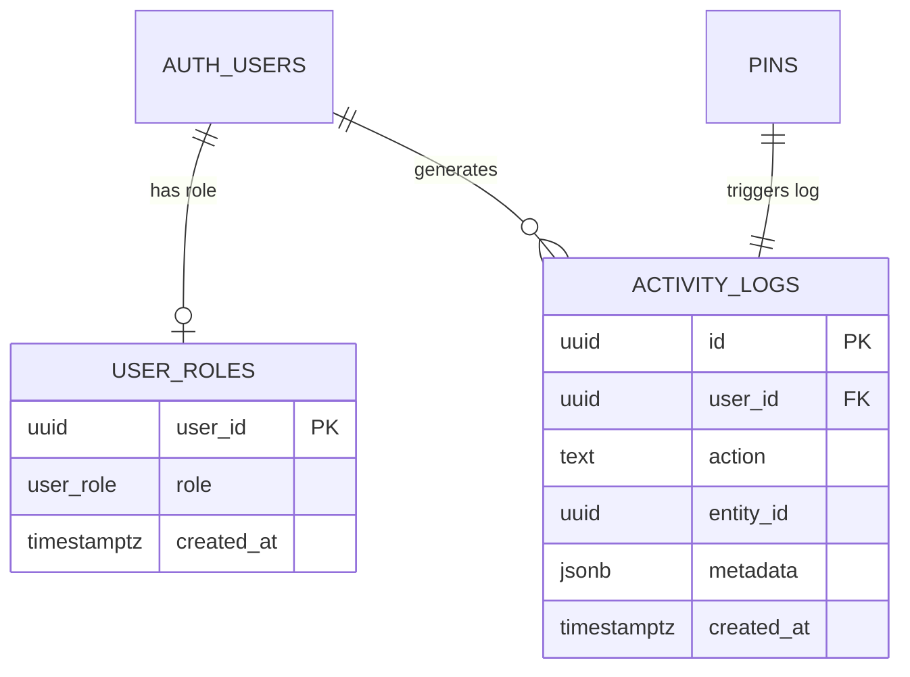

# Design Document: Admin Command Center

## Overview

The Admin Command Center adds a role-based administration layer to the YUPP travel pin board. It spans three architectural phases:

1. **Data Layer** — Supabase-managed RBAC (`user_role` enum, `user_roles` table with RLS) and audit logging (`activity_logs` table with RLS, `log_pin_creation` trigger on `pins`).
2. **Security Layer** — Next.js middleware extended to guard `/admin` routes with auth + role checks.
3. **Presentation Layer** — A dedicated `/admin` layout with sidebar navigation and a dashboard page displaying the 50 most recent activity logs.

All database objects are created via Supabase SQL migrations. The middleware is extended in-place. The admin UI is server-rendered using the App Router.

## Architecture

```mermaid
graph TD
    subgraph Browser
        A[Admin User]
    end

    subgraph "Next.js Server"
        MW[middleware.ts<br/>Auth + Role Guard]
        AL[/admin layout.tsx<br/>Sidebar Nav]
        DP[/admin page.tsx<br/>Dashboard SSR]
    end

    subgraph "Supabase"
        AUTH[auth.users]
        UR[user_roles<br/>+ RLS]
        PINS[pins table]
        TRIG[log_pin_creation<br/>trigger]
        LOGS[activity_logs<br/>+ RLS]
    end

    A -->|Request /admin| MW
    MW -->|getUser()| AUTH
    MW -->|query role| UR
    MW -->|allow| AL
    AL --> DP
    DP -->|fetch logs via<br/>server client| LOGS
    PINS -->|AFTER INSERT| TRIG
    TRIG -->|INSERT| LOGS
    UR -->|FK| AUTH
    LOGS -->|FK| AUTH
```

**Key design decisions:**

- **Middleware-level auth**: Role checks happen in middleware before any page code runs, preventing unauthorized rendering.
- **RLS everywhere**: Both `user_roles` and `activity_logs` have RLS policies so even direct Supabase API access is locked down.
- **Trigger-based audit**: Pin creation logging is a database trigger, not application code, ensuring no audit gaps regardless of how pins are inserted.
- **Service role for middleware**: The middleware uses the service role client to query `user_roles` because the anon client's RLS only allows self-reads, and middleware needs to verify the role before the request proceeds.

## Components and Interfaces

### 1. SQL Migration — RBAC Schema

**File:** `supabase/migrations/<timestamp>_admin_rbac.sql`

Creates the `user_role` enum, `user_roles` table, and RLS policies.

```sql
-- Enum
CREATE TYPE user_role AS ENUM ('admin', 'support', 'user');

-- Table
CREATE TABLE user_roles (
  user_id UUID PRIMARY KEY REFERENCES auth.users(id) ON DELETE CASCADE,
  role user_role NOT NULL DEFAULT 'user',
  created_at TIMESTAMPTZ NOT NULL DEFAULT now()
);

-- RLS
ALTER TABLE user_roles ENABLE ROW LEVEL SECURITY;

CREATE POLICY "Users can read own role"
  ON user_roles FOR SELECT
  USING (auth.uid() = user_id);

-- No INSERT/UPDATE/DELETE policies → denied for non-service-role clients
```

### 2. SQL Migration — Audit Logging Schema

**File:** `supabase/migrations/<timestamp>_admin_audit.sql`

Creates the `activity_logs` table, RLS policies, trigger function, and trigger.

```sql
-- Table
CREATE TABLE activity_logs (
  id UUID PRIMARY KEY DEFAULT gen_random_uuid(),
  user_id UUID REFERENCES auth.users(id) ON DELETE SET NULL,
  action TEXT NOT NULL,
  entity_id UUID,
  metadata JSONB DEFAULT '{}',
  created_at TIMESTAMPTZ NOT NULL DEFAULT now()
);

-- RLS
ALTER TABLE activity_logs ENABLE ROW LEVEL SECURITY;

CREATE POLICY "Admins can read activity logs"
  ON activity_logs FOR SELECT
  USING (
    EXISTS (
      SELECT 1 FROM user_roles
      WHERE user_roles.user_id = auth.uid()
        AND user_roles.role = 'admin'
    )
  );

-- Trigger function
CREATE OR REPLACE FUNCTION log_pin_creation()
RETURNS TRIGGER AS $$
BEGIN
  INSERT INTO activity_logs (user_id, action, entity_id, metadata)
  VALUES (
    NEW.user_id,
    'pin_created',
    NEW.id,
    jsonb_build_object('title', NEW.title, 'source_url', NEW.source_url)
  );
  RETURN NEW;
END;
$$ LANGUAGE plpgsql SECURITY DEFINER;

-- Trigger
CREATE TRIGGER trg_log_pin_creation
  AFTER INSERT ON pins
  FOR EACH ROW
  EXECUTE FUNCTION log_pin_creation();
```

### 3. Middleware Extension

**File:** `src/middleware.ts` (modified)

The existing middleware is extended with an admin route guard inserted after the `/planner` redirect and before the session refresh.

```typescript
// Pseudocode for the admin guard block:
if (request.nextUrl.pathname.startsWith('/admin')) {
  const { data: { user } } = await supabase.auth.getUser();
  if (!user) {
    return NextResponse.redirect(new URL('/', request.url));
  }

  const serviceClient = createServiceRoleClient();
  const { data: userRole } = await serviceClient
    .from('user_roles')
    .select('role')
    .eq('user_id', user.id)
    .single();

  if (!userRole || userRole.role !== 'admin') {
    return NextResponse.redirect(new URL('/', request.url));
  }
}
```

**Rationale for service role client in middleware:** The anon-key Supabase client with RLS only lets users read their own role. In middleware, we need to verify the role server-side before allowing the request. The service role client bypasses RLS, enabling the role lookup. This is safe because middleware runs exclusively on the server.

### 4. Admin Layout

**File:** `src/app/admin/layout.tsx`

A server component that renders a sidebar with navigation links and a content area.

```typescript
interface AdminLayoutProps {
  children: React.ReactNode;
}

export default function AdminLayout({ children }: AdminLayoutProps) {
  // Renders:
  // - <aside> sidebar with nav links: Dashboard (/admin), Users (/admin/users), Global Pins (/admin/pins)
  // - <main> content area rendering {children}
  // - All styled with Tailwind utility classes
}
```

### 5. Admin Dashboard Page

**File:** `src/app/admin/page.tsx`

A server component that fetches and displays the 50 most recent activity logs.

```typescript
// Server Component
export default async function AdminDashboard() {
  const supabase = await createClient(); // from src/utils/supabase/server.ts
  const { data: logs } = await supabase
    .from('activity_logs')
    .select('*')
    .order('created_at', { ascending: false })
    .limit(50);

  // Renders a table with columns: Time, User ID, Action, Pin Title
  // Pin Title extracted from metadata.title
  // Empty state if logs is empty or null
}
```

### 6. TypeScript Types

**File:** `src/types/index.ts` (extended)

```typescript
export type UserRole = 'admin' | 'support' | 'user';

export interface UserRoleRow {
  user_id: string;
  role: UserRole;
  created_at: string;
}

export interface ActivityLog {
  id: string;
  user_id: string | null;
  action: string;
  entity_id: string | null;
  metadata: Record<string, unknown>;
  created_at: string;
}
```

## Data Models

### user_roles Table

| Column     | Type          | Constraints                                      |
|------------|---------------|--------------------------------------------------|
| user_id    | UUID          | PK, FK → auth.users(id) ON DELETE CASCADE        |
| role       | user_role     | NOT NULL, DEFAULT 'user'                         |
| created_at | TIMESTAMPTZ   | NOT NULL, DEFAULT now()                          |

**RLS Policies:**
- SELECT: `auth.uid() = user_id` (users read own role only)
- INSERT/UPDATE/DELETE: denied (service role only)

### activity_logs Table

| Column     | Type          | Constraints                                      |
|------------|---------------|--------------------------------------------------|
| id         | UUID          | PK, DEFAULT gen_random_uuid()                    |
| user_id    | UUID          | FK → auth.users(id) ON DELETE SET NULL, nullable  |
| action     | TEXT          | NOT NULL                                         |
| entity_id  | UUID          | nullable                                         |
| metadata   | JSONB         | DEFAULT '{}'                                     |
| created_at | TIMESTAMPTZ   | NOT NULL, DEFAULT now()                          |

**RLS Policies:**
- SELECT: only users with `role = 'admin'` in `user_roles`
- INSERT/UPDATE/DELETE: denied (service role / trigger only)

### user_role Enum

```
'admin' | 'support' | 'user'
```

### Entity Relationships



## Correctness Properties

*A property is a characteristic or behavior that should hold true across all valid executions of a system — essentially, a formal statement about what the system should do. Properties serve as the bridge between human-readable specifications and machine-verifiable correctness guarantees.*

### Property 1: Default role assignment

*For any* user_id inserted into the `user_roles` table without an explicit role value, the resulting row's role column SHALL equal `'user'`.

**Validates: Requirements 2.3**

### Property 2: User role self-read isolation

*For any* two distinct authenticated users A and B, when user A queries the `user_roles` table, the result set SHALL contain only user A's row and SHALL NOT contain user B's row.

**Validates: Requirements 3.2**

### Property 3: User roles write denial

*For any* authenticated user using a non-service-role client, and *for any* write operation (INSERT, UPDATE, or DELETE) on the `user_roles` table, the operation SHALL be rejected.

**Validates: Requirements 3.3**

### Property 4: Activity logs admin-only read access

*For any* authenticated user with a role in `user_roles`, querying `activity_logs` SHALL return rows if and only if the user's role is `'admin'`. Users with role `'support'` or `'user'` SHALL receive an empty result set.

**Validates: Requirements 5.2**

### Property 5: Activity logs write denial

*For any* authenticated user (regardless of role) using a non-service-role client, and *for any* write operation (INSERT, UPDATE, or DELETE) on the `activity_logs` table, the operation SHALL be rejected.

**Validates: Requirements 5.3**

### Property 6: Pin creation audit trail preservation

*For any* pin inserted into the `pins` table with a random title, source_url, and user_id (including NULL), the system SHALL create exactly one corresponding `activity_logs` row where: `user_id` matches the pin's `user_id`, `action` equals `'pin_created'`, `entity_id` matches the pin's `id`, and `metadata` contains `title` and `source_url` matching the inserted pin's values.

**Validates: Requirements 6.1, 6.2, 6.3, 4.3**

### Property 7: Unauthenticated admin route redirect

*For any* request path starting with `'/admin'`, if the requester is not authenticated, the middleware SHALL return a redirect response to `'/'`.

**Validates: Requirements 7.1, 7.2**

### Property 8: Admin middleware role gate

*For any* authenticated user requesting *any* path starting with `'/admin'`, the middleware SHALL allow the request to proceed if and only if the user has a role of `'admin'` in the `user_roles` table. For all other roles (`'support'`, `'user'`) or missing/failed role lookups, the middleware SHALL redirect to `'/'`.

**Validates: Requirements 8.1, 8.2, 8.3, 8.4**

### Property 9: Dashboard log ordering and limit

*For any* set of N activity log records (N ≥ 0), the Admin Dashboard fetch SHALL return at most 50 records, and those records SHALL be ordered by `created_at` descending (most recent first).

**Validates: Requirements 10.2**

### Property 10: Metadata title extraction

*For any* activity log row with a `metadata` JSONB field containing a `title` key, the Admin Dashboard SHALL extract and display the value of `metadata.title` as the Pin Title column value.

**Validates: Requirements 10.4**

## Error Handling

### Middleware Errors

| Scenario | Behavior |
|---|---|
| Supabase env vars missing | Skip admin guard, fall through to existing behavior (session refresh only) |
| `getUser()` returns no user on `/admin` route | Redirect to `/` |
| Service role client creation fails (missing `SUPABASE_SERVICE_ROLE_KEY`) | Redirect to `/` (fail closed) |
| `user_roles` query returns error | Redirect to `/` (fail closed) |
| `user_roles` query returns no row | Redirect to `/` (treat as unauthorized) |

**Design principle:** All middleware failures on admin routes fail closed — redirect to home rather than allowing access.

### Dashboard Errors

| Scenario | Behavior |
|---|---|
| `activity_logs` query returns error | Display empty state with error indication |
| `activity_logs` query returns empty array | Display "No activity recorded yet" message |
| `metadata` field is null or missing `title` | Display "—" as fallback for Pin Title |
| `user_id` is null in a log row | Display "Anonymous" or "—" for User ID |

### Database Errors

| Scenario | Behavior |
|---|---|
| Trigger function `log_pin_creation()` fails | Pin insertion still succeeds (trigger is AFTER INSERT, but uses SECURITY DEFINER to ensure write access to activity_logs) |
| Duplicate `user_id` in `user_roles` | Rejected by PRIMARY KEY constraint |
| Invalid enum value for `role` | Rejected by PostgreSQL enum type constraint |

## Testing Strategy

### Property-Based Tests (fast-check + Vitest)

Property-based testing is appropriate for this feature because:
- The middleware logic is a pure decision function (auth state + role → allow/redirect) with a meaningful input space
- The audit trigger is a data preservation function (pin data → log data) testable via round-trip properties
- RLS policies are universal security invariants that should hold for all users/roles

**Library:** `fast-check` (already in devDependencies)
**Minimum iterations:** 100 per property test
**Tag format:** `Feature: admin-command-center, Property {N}: {title}`

Properties 7 and 8 (middleware) are the primary candidates for unit-level PBT since the middleware logic can be extracted into a pure function and tested with generated inputs (random paths, auth states, roles).

Property 6 (audit trail preservation) is testable as a PBT at the integration level with mocked Supabase, generating random pin data and verifying the trigger function logic.

Properties 9 and 10 (dashboard) are testable with generated activity log data to verify ordering and extraction logic.

Properties 1–5 (RLS/schema) are integration-level tests against a real Supabase instance and are better suited to example-based integration tests (1–3 examples each) rather than PBT due to the cost of database round-trips.

### Unit Tests (Vitest)

- **Middleware admin guard**: Test with mocked Supabase clients for auth states and role lookups
- **Dashboard data fetching**: Test the query construction and response handling with mocked Supabase
- **Layout rendering**: Verify sidebar nav links and content area structure
- **Type guards**: Verify TypeScript types match expected shapes
- **Empty/error states**: Verify fallback rendering for missing data

### Integration Tests

- **RLS policies**: Verify user_roles and activity_logs RLS with real Supabase (2–3 examples per policy)
- **Trigger**: Insert a pin and verify the activity_log row is created with correct data
- **End-to-end admin flow**: Authenticated admin user navigates to /admin and sees activity logs

### Test File Locations

| Test | File |
|---|---|
| Middleware PBT | `src/__tests__/middleware.admin.pbt.test.ts` |
| Middleware unit | `src/__tests__/middleware.admin.test.ts` |
| Dashboard unit | `src/app/admin/__tests__/page.test.ts` |
| Layout unit | `src/app/admin/__tests__/layout.test.ts` |
| Audit trigger PBT | `src/__tests__/audit-trigger.pbt.test.ts` |
