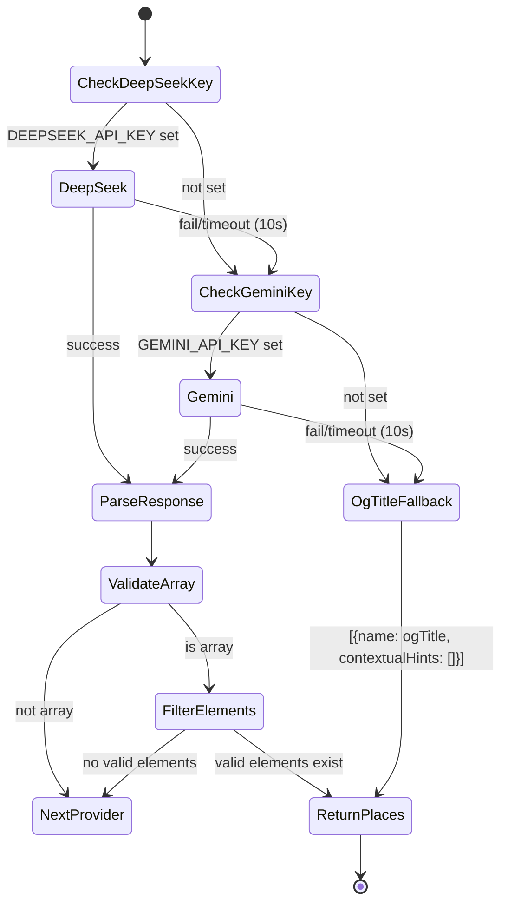

# Design Document: AI Multi-Platform Commander

## Overview

This feature transforms YUPP's single-location scraping pipeline into a multi-location extraction engine supporting Instagram, Douyin, and Xiaohongshu. It introduces dual-LLM orchestration (DeepSeek primary, Gemini backup) to extract multiple points of interest from social media captions, batch-geocodes all discovered places, and plots them simultaneously on the map.

The core change replaces the current `scrapeUrl → geocodeLocation → addPin` single-place flow with a `scrapeUrl → extractPlacesWithAI → batchGeocode → addPins` multi-place pipeline. The scraper gains platform detection for Chinese social media domains, the AI extractor handles structured place extraction with a three-tier fallback chain (DeepSeek → Gemini → og:title), and MagicBar orchestrates parallel geocoding with progress feedback.

Additionally, the planner's drag-and-drop sensors are split from a single `PointerSensor` into separate `MouseSensor` + `TouchSensor` to preserve desktop instant-drag while maintaining touch scroll compatibility.

## Architecture

```mermaid
flowchart TD
    A[MagicBar] -->|URL| B[scrapeUrl]
    B -->|Platform Detection| C{Platform?}
    C -->|instagram.com| D[Instagram Scraper]
    C -->|v.douyin.com| E[Douyin Scraper]
    C -->|xiaohongshu.com / xhslink.com| F[Xiaohongshu Scraper]
    C -->|Unknown| G[Generic Scraper]
    
    D & E & F & G -->|caption + metadata| H[extractPlacesWithAI]
    
    H -->|caption| I[DeepSeek Client]
    I -->|fail/timeout| J[Gemini Client]
    J -->|fail/timeout| K[og:title Fallback]
    
    I & J & K -->|ExtractedPlace[]| L[ScrapeResult]
    
    L -->|extractedPlaces| A
    A -->|batch| M[Promise.allSettled]
    M -->|per place| N[geocodeLocation]
    N -->|success| O[addPin to Store]
    
    O --> P[MapView renders markers]
```

### Key Architectural Decisions

1. **AI extraction lives in `scrapeUrl` server action**: The LLM calls happen server-side where API keys are available. The caption is extracted during scraping and immediately fed to the AI extractor before returning the `ScrapeResult`.

2. **Fallback chain is sequential, not parallel**: DeepSeek is attempted first (cost-effective), Gemini only on failure. This minimizes API costs while maintaining reliability.

3. **Batch geocoding lives in MagicBar (client-side orchestration)**: `Promise.allSettled` ensures one failed geocode doesn't block others. MagicBar already owns the scrape→geocode→pin flow.

4. **Sensor split is isolated to `usePlannerDnd`**: Replacing `PointerSensor` with `MouseSensor` + `TouchSensor` is a contained change in one hook file.

## Components and Interfaces

### New Module: `src/actions/extractPlaces.ts`

The AI extraction module responsible for the DeepSeek → Gemini → og:title fallback chain.

```typescript
// Core extraction function
export async function extractPlacesWithAI(
  caption: string,
  ogTitle: string
): Promise<ExtractedPlace[]>

// Internal: call DeepSeek API
async function callDeepSeek(prompt: string): Promise<string>

// Internal: call Gemini API
async function callGemini(prompt: string): Promise<string>

// Internal: parse and validate LLM response
export function parseLLMResponse(raw: string): ExtractedPlace[]

// Internal: build the extraction prompt
export function buildExtractionPrompt(caption: string): string

// Internal: detect platform from URL hostname
export function detectPlatform(url: string): Platform
```

### Modified Module: `src/actions/scrapeUrl.ts`

- Add `detectPlatform()` call early in `scrapeUrl()` to identify the source platform.
- After extracting the caption/description, call `extractPlacesWithAI(caption, ogTitle)`.
- Return the new `ScrapeResult` shape with `extractedPlaces` array instead of singular `location`/`contextualHints`.

### Modified Module: `src/components/MagicBar.tsx`

- Replace single `geocodeLocation` call with `Promise.allSettled` batch geocoding over `extractedPlaces`.
- Add new processing states: `'scanning'` (AI extraction) and `'pinning'` (batch geocoding).
- Display progress text and final count summary.
- Handle empty `extractedPlaces` with error message.

### Modified Module: `src/hooks/usePlannerDnd.tsx`

- Replace single `PointerSensor` with `MouseSensor` (distance: 5px, no delay) + `TouchSensor` (delay: 200ms, tolerance: 8px).
- Keep `KeyboardSensor` unchanged.

### Modified Module: `src/types/index.ts`

- Add `ExtractedPlace` interface.
- Update `ScrapeResult` to use `extractedPlaces: ExtractedPlace[]` instead of `location: string` and `contextualHints: string[]`.
- Add `Platform` type.

### Unchanged Modules

- `src/components/MapView.tsx` — marker creation and drag bridge logic remain untouched. The `draggable: true` config and `elementsFromPoint` bridge are preserved.
- `src/store/useTravelPinStore.ts` — `addPin` is called multiple times (once per geocoded place) but its interface doesn't change.
- `src/actions/geocodeLocation.ts` — called per-place with existing interface; no changes needed.

## Data Models

### New Type: `ExtractedPlace`

```typescript
export interface ExtractedPlace {
  name: string;
  contextualHints: string[];
}
```

### New Type: `Platform`

```typescript
export type Platform = 'instagram' | 'douyin' | 'xiaohongshu' | 'unknown';
```

### Updated Type: `ScrapeResult`

```typescript
export interface ScrapeResult {
  success: true;
  title: string;
  description: string | null;
  imageUrl: string | null;
  sourceUrl: string;
  platform: Platform;
  extractedPlaces: ExtractedPlace[];  // replaces location + contextualHints
}
```

The `location: string` and `contextualHints: string[]` fields are removed from `ScrapeResult`. All downstream consumers (MagicBar) switch to iterating over `extractedPlaces`.

### Platform Detection Mapping

| Hostname Pattern | Platform |
|---|---|
| `instagram.com` | `'instagram'` |
| `v.douyin.com` | `'douyin'` |
| `xiaohongshu.com` | `'xiaohongshu'` |
| `xhslink.com` | `'xiaohongshu'` |
| anything else | `'unknown'` |

### AI Extraction Prompt Template

```
Extract all restaurants, attractions, or points of interest from this social media caption. Return ONLY a valid JSON array of objects: [{ "name": "Place Name", "contextualHints": ["City", "Neighborhood"] }]. Return an empty array if none found.

Caption: {caption}
```

### Fallback Chain State Machine



### Environment Variables

| Variable | Required | Purpose |
|---|---|---|
| `DEEPSEEK_API_KEY` | Optional | DeepSeek API authentication |
| `GEMINI_API_KEY` | Optional | Gemini API authentication |
| `BROWSERLESS_URL` | Required (existing) | Remote browser for scraping |
| `GOOGLE_PLACES_API_KEY` | Required (existing) | Geocoding via Google Places |

## Correctness Properties

*A property is a characteristic or behavior that should hold true across all valid executions of a system — essentially, a formal statement about what the system should do. Properties serve as the bridge between human-readable specifications and machine-verifiable correctness guarantees.*

### Property 1: Platform detection correctness

*For any* URL string whose hostname matches one of the known platform patterns (`instagram.com` → `'instagram'`, `v.douyin.com` → `'douyin'`, `xiaohongshu.com` or `xhslink.com` → `'xiaohongshu'`), `detectPlatform` SHALL return the corresponding platform identifier. *For any* URL whose hostname does not match any known pattern, `detectPlatform` SHALL return `'unknown'`.

**Validates: Requirements 2.1, 2.2, 2.3, 2.4, 2.5**

### Property 2: Extraction prompt contains template and caption

*For any* non-empty caption string, `buildExtractionPrompt(caption)` SHALL produce a string that contains the required template text ("Extract all restaurants, attractions, or points of interest") AND contains the original caption as a substring.

**Validates: Requirements 3.3, 6.1, 6.2**

### Property 3: LLM response parsing round-trip

*For any* valid array of `ExtractedPlace` objects (each with a string `name` and a `contextualHints` string array), serializing the array to JSON (optionally wrapped in markdown code fences) and then calling `parseLLMResponse` SHALL produce an equivalent array of `ExtractedPlace` objects.

**Validates: Requirements 3.4, 4.4, 6.3**

### Property 4: Invalid LLM responses are rejected

*For any* string that is either not valid JSON or parses to a JSON value that is not an array, `parseLLMResponse` SHALL return an empty array (indicating failure to extract places).

**Validates: Requirements 3.5, 6.4**

### Property 5: Invalid elements are filtered from parsed arrays

*For any* JSON array containing a mix of valid `ExtractedPlace` objects (with a string `name` field) and invalid objects (missing `name` or `name` is not a string), `parseLLMResponse` SHALL return only the elements that have a valid string `name` field.

**Validates: Requirements 6.5**

### Property 6: og:title fallback produces correct shape

*For any* non-empty og:title string, when both LLM providers fail, `extractPlacesWithAI` SHALL return an array containing exactly one `ExtractedPlace` with `name` equal to the og:title and `contextualHints` as an empty array.

**Validates: Requirements 5.3**

## Error Handling

### AI Extraction Errors

| Error Condition | Handling |
|---|---|
| DeepSeek API key missing | Skip DeepSeek, proceed to Gemini |
| Gemini API key missing | Skip Gemini, proceed to og:title fallback |
| Both API keys missing | Use og:title fallback, log warning |
| DeepSeek timeout (>10s) | Abort request, proceed to Gemini |
| Gemini timeout (>10s) | Abort request, proceed to og:title fallback |
| DeepSeek returns invalid JSON | Proceed to Gemini |
| Gemini returns invalid JSON | Proceed to og:title fallback |
| LLM returns non-array JSON | Treat as invalid, proceed to next provider |
| LLM returns array with invalid elements | Filter out invalid elements, keep valid ones |

### Batch Geocoding Errors

| Error Condition | Handling |
|---|---|
| Individual geocode returns `error` | Skip that place, continue with others |
| Individual geocode returns `needs_user_input` | Skip that place, continue with others |
| All geocodes fail | Display error: "Couldn't pin any of the extracted spots" |
| Empty `extractedPlaces` array | Display error: "No places found in this post." |

### Network and Infrastructure Errors

| Error Condition | Handling |
|---|---|
| `BROWSERLESS_URL` not configured | Return `ScrapeError` (existing behavior) |
| Browser connection failure | Return `ScrapeError` (existing behavior) |
| Page navigation timeout | Return `ScrapeError` (existing behavior) |
| Login wall detected | Return `ScrapeError` (existing behavior) |

## Testing Strategy

### Property-Based Tests (using `fast-check`)

Property-based tests validate the correctness properties defined above. Each test runs a minimum of 100 iterations with randomly generated inputs.

| Property | Test File | What's Generated |
|---|---|---|
| Property 1: Platform detection | `src/actions/__tests__/extractPlaces.pbt.test.ts` | Random URLs with known/unknown hostnames |
| Property 2: Prompt construction | `src/actions/__tests__/extractPlaces.pbt.test.ts` | Random caption strings |
| Property 3: Parsing round-trip | `src/actions/__tests__/extractPlaces.pbt.test.ts` | Random ExtractedPlace arrays, optionally code-fenced |
| Property 4: Invalid response rejection | `src/actions/__tests__/extractPlaces.pbt.test.ts` | Random non-JSON strings and non-array JSON values |
| Property 5: Element filtering | `src/actions/__tests__/extractPlaces.pbt.test.ts` | Arrays with mixed valid/invalid elements |
| Property 6: og:title fallback | `src/actions/__tests__/extractPlaces.pbt.test.ts` | Random og:title strings with mocked failing LLMs |

Configuration:
- Library: `fast-check` (already in devDependencies)
- Minimum iterations: 100 per property
- Tag format: `Feature: ai-multi-platform-commander, Property N: {description}`

### Unit Tests (Example-Based)

| Test | File | Purpose |
|---|---|---|
| ScrapeResult shape validation | `src/types/__tests__/types.test.ts` | Verify new interface compiles correctly |
| Empty extractedPlaces on no AI results | `src/actions/__tests__/extractPlaces.test.ts` | Verify empty array when AI finds nothing |
| Fallback chain order | `src/actions/__tests__/extractPlaces.test.ts` | Mock providers, verify DeepSeek → Gemini → og:title order |
| Timeout enforcement | `src/actions/__tests__/extractPlaces.test.ts` | Mock slow responses, verify 10s abort |
| Env var skip behavior | `src/actions/__tests__/extractPlaces.test.ts` | Unset keys, verify providers are skipped |
| MagicBar batch geocoding | `src/components/__tests__/MagicBar.test.ts` | Mock scrape + geocode, verify multiple pins created |
| MagicBar empty places error | `src/components/__tests__/MagicBar.test.ts` | Verify "No places found" error message |
| MagicBar progress states | `src/components/__tests__/MagicBar.test.ts` | Verify scanning/pinning/success text |
| Sensor configuration | `src/hooks/__tests__/usePlannerDnd.test.ts` | Verify MouseSensor + TouchSensor + KeyboardSensor, no PointerSensor |

### Integration Tests

| Test | Purpose |
|---|---|
| Full scrape → extract → geocode pipeline | End-to-end with mocked browser and LLM APIs |
| MapView marker preservation | Verify draggable markers and bridge logic still work after refactor |
