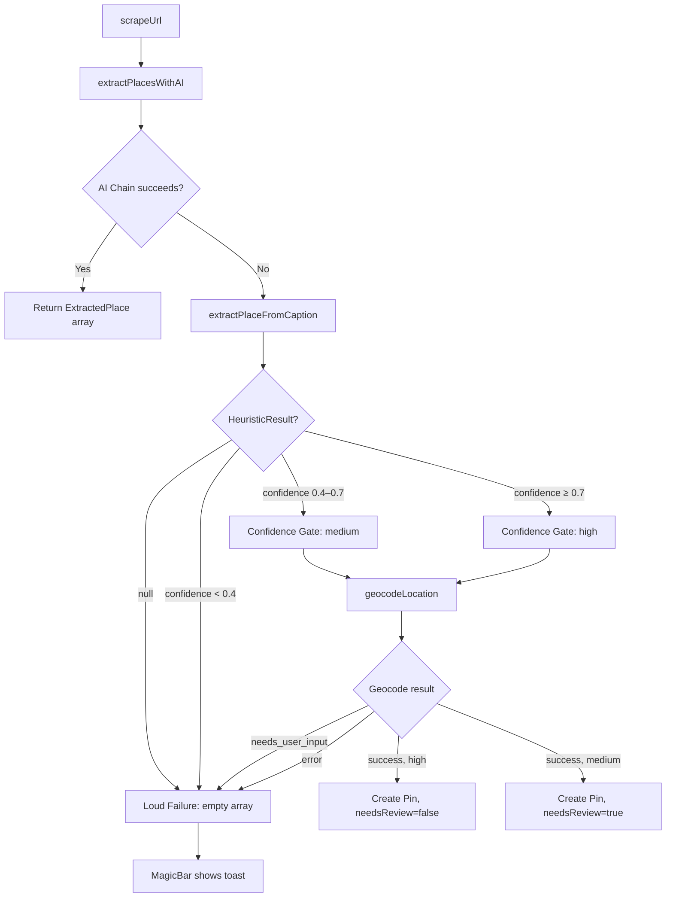
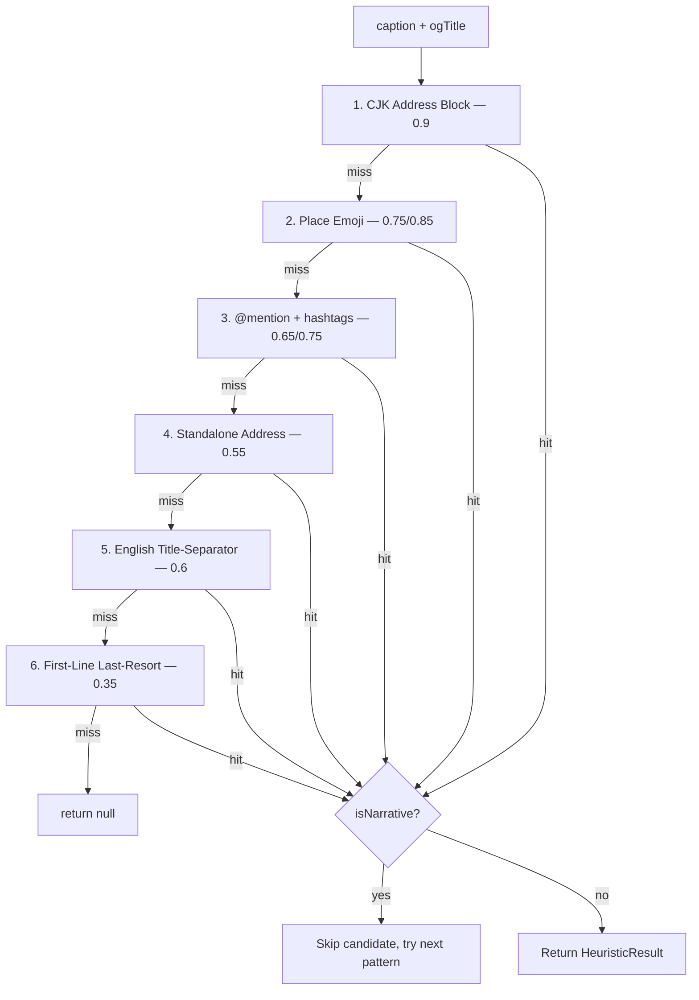

# Design Document: Caption Heuristic Rewrite

## Overview

This design replaces the broken `extractPlaceNameFromCaption` function in `src/utils/extractPlacesUtils.ts` with a new `extractPlaceFromCaption` function that returns a structured `HeuristicResult | null` with confidence scoring. The rewrite addresses three fundamental problems: wrong pattern priority (emotional first-lines chosen over structured CJK blocks), no quality filtering (narrative text accepted as place names), and no confidence signaling (junk always passed to geocoder).

The new function evaluates 6 detection patterns in strict priority order, each producing a confidence score. A narrative signal filter (`isNarrative`) gates every candidate. The orchestrator in `extractPlacesWithAI` consumes the confidence score to decide between three outcomes: create pin (high), create pin with `needsReview` flag (medium), or fail loudly with a user-facing toast (low/null).

The design is scoped to the heuristic fallback path only — the AI chain (Custom LLM → Gemini → DeepSeek) is untouched.

## Architecture



### Pattern Priority Pipeline



## Components and Interfaces

### New Types (`src/types/index.ts`)

```typescript
/** Identifies which detection pattern matched. */
export type PatternId =
  | 'cjk_address_block'
  | 'place_emoji_pin'
  | 'mention_with_hashtags'
  | 'standalone_address'
  | 'english_title_separator'
  | 'first_line_short';

/** Structured result from the heuristic extractor. */
export interface HeuristicResult {
  name: string;
  address: string | null;
  districtHint: string | null;
  confidence: number; // [0.1, 1.0]
  pattern: PatternId;
}
```

### Updated Pin Type (`src/types/index.ts`)

Add optional field to existing `Pin` interface:

```typescript
export interface Pin {
  // ... existing fields ...
  needsReview?: boolean; // Flags medium-confidence heuristic pins
}
```

### Updated ScrapeError (`src/types/index.ts`)

Extend the error type to support a discriminated error code:

```typescript
export interface ScrapeError {
  success: false;
  error: string;
  errorCode?: 'no_places_found' | 'network_error' | 'scrape_error';
}
```

### Heuristic Module (`src/utils/extractPlacesUtils.ts`)

Exports:

| Export | Signature | Description |
|---|---|---|
| `extractPlaceFromCaption` | `(caption: string, ogTitle?: string) => HeuristicResult \| null` | Main entry point. Pure, synchronous. |
| `isNarrative` | `(line: string) => boolean` | Predicate rejecting emotional/descriptive lines. Pure. |
| `CONFIDENCE_HIGH` | `0.7` | Threshold constant for auto-create. |
| `CONFIDENCE_MEDIUM` | `0.4` | Threshold constant for needs-review. |

The old `extractPlaceNameFromCaption` is removed entirely.

### Orchestrator Changes (`src/actions/extractPlaces.ts`)

The `extractPlacesWithAI` function's fallback path changes from:

```typescript
// OLD
const captionName = extractPlaceNameFromCaption(caption);
const fallbackName = captionName ?? ogTitle;
return [{ name: fallbackName, contextualHints: [] }];
```

to:

```typescript
// NEW
const heuristicResult = extractPlaceFromCaption(caption, ogTitle);

// Log heuristic invocation
console.log('[heuristic]', {
  pattern: heuristicResult?.pattern ?? 'none',
  confidence: heuristicResult?.confidence ?? 0,
  captionLength: caption.length,
  hasOgTitle: !!ogTitle,
});

if (!heuristicResult || heuristicResult.confidence < CONFIDENCE_MEDIUM) {
  return []; // Loud failure path
}

const contextualHints: string[] = [];
if (heuristicResult.address) contextualHints.push(heuristicResult.address);
if (heuristicResult.districtHint) contextualHints.push(heuristicResult.districtHint);

return [{
  name: heuristicResult.name,
  contextualHints,
  _heuristicConfidence: heuristicResult.confidence,
  _heuristicPattern: heuristicResult.pattern,
  _needsReview: heuristicResult.confidence < CONFIDENCE_HIGH,
}];
```

### MagicBar Changes (`src/components/MagicBar.tsx`)

When `extractedPlaces` is empty, display the loud failure toast:

```typescript
if (scrapeResult.extractedPlaces.length === 0) {
  addToast(
    "We couldn't identify a place in this post. Try pasting the place name directly.",
    "error"
  );
  // ...
}
```

This path already exists in MagicBar but the message is updated to match the spec.

### Pin Creation with needsReview

In MagicBar's `processUrl`, when creating a pin from a heuristic result that carries `_needsReview: true`, set `needsReview: true` on the pin. This requires threading the metadata through `ExtractedPlace` (via optional internal fields prefixed with `_`) or through a parallel data structure.

Design decision: Extend `ExtractedPlace` with optional internal fields rather than creating a parallel type. These fields are only set by the heuristic path and ignored by the AI path:

```typescript
export interface ExtractedPlace {
  name: string;
  contextualHints: string[];
  _heuristicConfidence?: number;
  _heuristicPattern?: PatternId;
  _needsReview?: boolean;
}
```

### geocodeLocation Changes (`src/actions/geocodeLocation.ts`)

Add optional `heuristicConfidence` parameter to the input type for logging:

```typescript
export async function geocodeLocation(input: {
  location: string;
  contextualHints?: string[];
  partialData?: { title: string; imageUrl: string | null };
  heuristicConfidence?: number; // NEW: for downstream logging
}): Promise<GeocodeResult> {
```

When `heuristicConfidence` is provided and `geocodeLocation` returns `status: 'needs_user_input'`, the orchestrator treats it as a loud failure instead of prompting the user.

## Data Models

### HeuristicResult

| Field | Type | Description |
|---|---|---|
| `name` | `string` | Extracted place name, stripped of trailing punctuation/emoji. |
| `address` | `string \| null` | Full address line if detected (CJK block, standalone address, emoji+address). |
| `districtHint` | `string \| null` | Parenthesized district or hashtag district (e.g., "尖沙咀"). |
| `confidence` | `number` | Score in [0.1, 1.0]. Determines pin creation outcome. |
| `pattern` | `PatternId` | Which detection rule matched. Used for logging/analytics. |

### Confidence Thresholds

| Threshold | Value | Outcome |
|---|---|---|
| `CONFIDENCE_HIGH` | 0.7 | Create pin, `needsReview = false` |
| `CONFIDENCE_MEDIUM` | 0.4 | Create pin, `needsReview = true` |
| Below medium | < 0.4 | Loud failure, no pin created |

### Pattern Confidence Map

| Pattern | Base Confidence | Elevated Confidence | Condition for Elevation |
|---|---|---|---|
| `cjk_address_block` | 0.9 | — | — |
| `place_emoji_pin` | 0.75 | 0.85 | Next line has CJK address markers |
| `mention_with_hashtags` | 0.65 | 0.75 | Caption has district hashtag |
| `standalone_address` | 0.55 | — | — |
| `english_title_separator` | 0.6 | — | — |
| `first_line_short` | 0.35 | — | — |

### Narrative Signal Criteria

`isNarrative(line)` returns `true` when ANY of:

1. Line contains ≥ 3 emoji codepoints (excluding Place_Emoji set)
2. Line contains ≥ 2 consecutive `!` or `?` (including `‼️`, `⁉️`)
3. Line ends with a CJK sentence particle: 啦, 呀, 喔, 吧, 嘅, 咗, 囉, 嘛, 啊, 哦, 呢, 吖
4. Line has more punctuation+emoji characters than CJK/Latin alphabetic characters

### Place Emoji Set

📍, 🏠, 🍽, 🍴, 🏨, 🏩, 🏪, 🏬, 🏭, 🏯, 🏰, 🏟, ⛪, 🕌, 🕍, ⛩, 🗼, 🗽, 🛍, 🎯, 🏖, 🏝, ⛰, 🌊

### CJK Address Markers

市 (city), 區/区 (district), 路 (road), 街 (street), 號/号 (number), 巷 (lane), 弄 (alley), 道 (way), 村 (village), 鎮/镇 (town)

### Region Prefixes (stripped from @mentions)

`hk_`, `tw_`, `sg_`, `jp_`, `kr_`, `th_`, `vn_`, `my_`, `ph_`, `id_` — any 2–3 letter ISO-like prefix followed by `_`.

