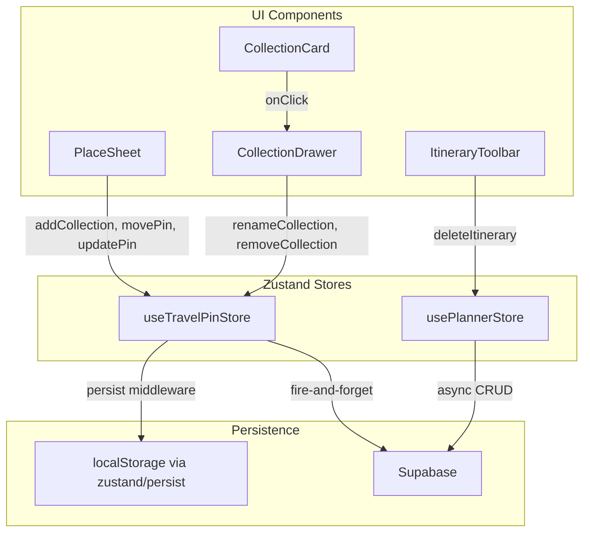

# Design Document: CRUD UI Triggers

## Overview

This feature connects four missing CRUD UI triggers to existing and new Zustand store actions across the travel pin board application. The changes span two stores (`useTravelPinStore`, `usePlannerStore`) and four UI components (`PlaceSheet`, `CollectionDrawer`, `CollectionCard`, `ItineraryToolbar`).

The scope is intentionally narrow: add two new store actions (`updatePin`, `renameCollection`), wire inline UI affordances for collection creation and pin editing in PlaceSheet, add management actions (rename/delete) to CollectionDrawer, and gate itinerary deletion behind a confirmation dialog. All new UI follows the existing neutral/minimalist Tailwind + Lucide aesthetic and reuses existing patterns (inline forms, local state toggles, fire-and-forget Supabase persistence).

## Architecture

The application follows a unidirectional data flow pattern:



### Design Decisions

1. **Local-first with fire-and-forget sync**: `useTravelPinStore` uses `zustand/persist` for localStorage and does fire-and-forget Supabase writes for authenticated users. New actions (`updatePin`, `renameCollection`) follow this same pattern — update local state synchronously, then attempt Supabase persistence without blocking the UI.

2. **Inline UI over modals**: Collection creation, pin editing, and collection renaming all use inline form patterns (local boolean state toggles like `isCreatingCollection`, `isEditing`, `isRenaming`) rather than modal dialogs. This matches the existing `ItineraryToolbar` rename pattern and keeps the user in context.

3. **Confirmation dialog only for destructive + irreversible actions**: Itinerary deletion gets a confirmation dialog because it deletes cloud data. Collection deletion already has a safety net (pins move to "Unorganized"), and pin removal already uses `window.confirm`. The itinerary delete dialog will be a custom styled component rather than `window.confirm` to clearly communicate the destructive nature.

4. **Unorganized collection is immutable**: Both `removeCollection` and `renameCollection` guard against the "unorganized" sentinel ID, consistent with the existing `removeCollection` pattern.

## Components and Interfaces

### New Store Actions

#### `updatePin` (useTravelPinStore)

```typescript
updatePin: (id: string, updates: Partial<Pin>) => void
```

- Merges `updates` into the pin matching `id` via spread: `{ ...existingPin, ...updates }`
- No-ops if no pin matches the given `id`
- For authenticated users, fires a Supabase `update` on the `pins` table with the changed fields
- Logs errors to console on Supabase failure; local state update is retained

#### `renameCollection` (useTravelPinStore)

```typescript
renameCollection: (id: string, newName: string) => void
```

- Updates `collection.name` for the matching `id`
- No-ops if `id === 'unorganized'`
- For authenticated users, fires a Supabase `update` on the `collections` table
- Logs errors to console on Supabase failure; local state update is retained

### UI Component Changes

#### PlaceSheet — Inline Collection Creation

New local state:
- `isCreatingCollection: boolean` — toggles the inline creation form
- `newCollectionName: string` — controlled input value

New UI elements:
- A `Plus` icon button at the bottom of the collection dropdown list
- An inline `<input>` + "Save" button that replaces the Plus button when `isCreatingCollection` is true
- On submit: calls `addCollection(name)`, then `movePin(pin.id, newCollection.id)`, closes dropdown, resets state
- On empty/whitespace submit: no-op, keeps input visible

#### PlaceSheet — Edit Pin

New local state:
- `isEditing: boolean` — toggles edit mode
- `editTitle: string` — controlled input for title
- `editDescription: string` — controlled textarea for description

New UI elements:
- A `Pencil` icon button near the title area
- In edit mode: `<input>` replaces the `<h2>` title, `<textarea>` replaces the description `<p>`
- A "Save Changes" button that calls `updatePin(pin.id, { title, description })` and exits edit mode

#### CollectionDrawer / CollectionCard — Management Actions

New props on `CollectionCard`:
- `onRename: (id: string, newName: string) => void`
- `onDelete: (id: string) => void`
- `isDefault: boolean` — true for "unorganized", hides the menu

New local state in `CollectionCard`:
- `menuOpen: boolean` — toggles the MoreVertical dropdown
- `isRenaming: boolean` — toggles inline rename input
- `renameValue: string` — controlled input

New UI elements:
- A `MoreVertical` icon button on each non-default CollectionCard
- A dropdown with "Rename" and "Delete" options
- Inline rename: `<input>` pre-populated with current name + confirm/cancel buttons
- Delete: `window.confirm` prompt before calling `removeCollection`

#### ItineraryToolbar — Delete Confirmation Dialog

New local state:
- `showDeleteConfirm: boolean` — toggles the confirmation dialog
- `deletingId: string | null` — the itinerary ID pending deletion

New UI elements:
- A styled overlay + dialog panel (not `window.confirm`)
- Shows itinerary name and warns about permanent deletion
- "Delete" (red, destructive) and "Cancel" buttons
- On confirm: calls `deleteItinerary(id)`, closes dialog
- On cancel: closes dialog, no state changes

## Data Models

### Existing Types (unchanged)

```typescript
interface Pin {
  id: string;
  title: string;
  description?: string;
  imageUrl: string;
  sourceUrl: string;
  latitude: number;
  longitude: number;
  collectionId: string;
  createdAt: string;
  placeId?: string;
  primaryType?: string;
  rating?: number;
  address?: string;
  user_id?: string;
}

interface Collection {
  id: string;
  name: string;
  createdAt: string;
  user_id?: string;
  isPublic?: boolean;
}

interface Itinerary {
  id: string;
  userId: string;
  name: string;
  tripDate: string | null;
  createdAt: string;
}
```

### Store Interface Additions

```typescript
// Added to TravelPinStore interface
updatePin: (id: string, updates: Partial<Pin>) => void;
renameCollection: (id: string, newName: string) => void;
```

No new types are introduced. The `Partial<Pin>` pattern for `updatePin` leverages TypeScript's built-in utility type to allow updating any subset of pin fields.


## Correctness Properties

*A property is a characteristic or behavior that should hold true across all valid executions of a system — essentially, a formal statement about what the system should do. Properties serve as the bridge between human-readable specifications and machine-verifiable correctness guarantees.*

### Property 1: Whitespace collection names are rejected

*For any* string composed entirely of whitespace characters (spaces, tabs, newlines, etc.), submitting it as a new collection name SHALL NOT result in `addCollection` being called, and the store's collection list SHALL remain unchanged.

**Validates: Requirements 1.6**

### Property 2: updatePin merge correctness

*For any* pin in the store and *for any* valid `Partial<Pin>` update object, calling `updatePin(id, updates)` SHALL produce a pin where every field present in `updates` matches the update value, and every field NOT present in `updates` matches the original pin value.

**Validates: Requirements 2.1, 2.2**

### Property 3: updatePin no-op on non-existent ID

*For any* store state containing pins and *for any* ID that does not match any existing pin, calling `updatePin(id, updates)` SHALL leave the entire pins array unchanged (same length, same content).

**Validates: Requirements 2.3**

### Property 4: removeCollection moves pins to Unorganized

*For any* non-default collection containing any number of pins, calling `removeCollection(id)` SHALL result in all pins that previously belonged to that collection having `collectionId === "unorganized"`, and the collection SHALL no longer exist in the collections array.

**Validates: Requirements 3.6**

### Property 5: renameCollection updates name and preserves other fields

*For any* non-default collection and *for any* non-empty string as the new name, calling `renameCollection(id, newName)` SHALL update only the `name` field of the matching collection while preserving `id`, `createdAt`, `user_id`, and `isPublic` unchanged.

**Validates: Requirements 3.9**

### Property 6: renameCollection no-op on Unorganized

*For any* string as the new name, calling `renameCollection("unorganized", newName)` SHALL leave the entire collections array unchanged — the "Unorganized" collection's name SHALL remain "Unorganized".

**Validates: Requirements 3.10**

## Error Handling

### Store-Level Errors

| Scenario | Behavior |
|---|---|
| `updatePin` called with non-existent ID | No-op, no error thrown |
| `renameCollection` called with `"unorganized"` ID | No-op, no error thrown |
| `removeCollection` called with `"unorganized"` ID | No-op (existing behavior) |
| Supabase update fails for `updatePin` | Local state retained, error logged to console |
| Supabase update fails for `renameCollection` | Local state retained, error logged to console |
| Supabase delete fails for `removeCollection` | Local state retained, error logged to console |

### UI-Level Errors

| Scenario | Behavior |
|---|---|
| Empty/whitespace collection name submitted | Input stays visible, no store call made |
| Empty/whitespace rename value submitted | Input stays visible, no store call made |
| Pin edit with no actual changes | `updatePin` still called (idempotent merge), no harm |
| PlaceSheet dismissed during edit mode | Edit mode resets, unsaved changes discarded |
| CollectionPicker dismissed during creation | Creation state resets, input cleared |

## Testing Strategy

### Property-Based Tests (fast-check, minimum 100 iterations each)

The store actions (`updatePin`, `renameCollection`) and validation logic are pure functions with clear input/output behavior, making them ideal for property-based testing. The project already uses `fast-check` with `vitest`.

Each property test will:
- Use `fast-check` arbitraries to generate random pins, collections, and update payloads
- Run a minimum of 100 iterations (`{ numRuns: 100 }`)
- Reference the design property in a comment tag
- Tag format: `Feature: crud-ui-triggers, Property {N}: {title}`

Properties to implement:
1. Whitespace collection name rejection — generate whitespace strings, verify no store mutation
2. updatePin merge correctness — generate pins + partial updates, verify merge semantics
3. updatePin no-op on missing ID — generate store state + non-matching IDs, verify no change
4. removeCollection moves pins to Unorganized — generate collections with pins, verify reassignment
5. renameCollection name update + field preservation — generate collections + names, verify selective update
6. renameCollection no-op on Unorganized — generate names, verify immutability of default collection

### Unit Tests (example-based)

- PlaceSheet: inline collection creation flow (button visibility, input toggle, form submission, dropdown close)
- PlaceSheet: edit pin flow (Pencil button, edit mode toggle, input/textarea rendering, Save Changes call)
- CollectionDrawer/CollectionCard: MoreVertical menu visibility (shown on custom, hidden on default)
- CollectionDrawer/CollectionCard: rename flow (inline input, submit, cancel)
- CollectionDrawer/CollectionCard: delete flow (confirmation prompt, confirm/cancel paths)
- ItineraryToolbar: delete confirmation dialog (dialog appears on delete click, confirm calls deleteItinerary, cancel closes dialog, itinerary name displayed)

### Integration Tests

- Supabase persistence for `updatePin` (authenticated user, mock Supabase client)
- Supabase persistence for `renameCollection` (authenticated user, mock Supabase client)
- Supabase delete for `removeCollection` (authenticated user, mock Supabase client)
- Error handling: Supabase failure retains local state and logs error
