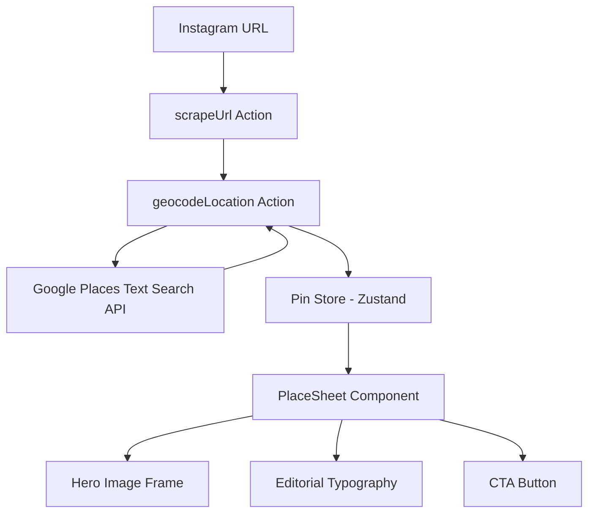

# Design Document: Discovery Experience Polish

## Overview

This design specifies the exact code changes needed across three pillars of the YUPP Discovery experience:

1. **Intelligence** — Upgrade the `pickProminentPlace` function in `geocodeLocation.ts` to use confidence-based selection: contextual hint matching on `formattedAddress`, stricter rating thresholds (>4.2 rating + >50 user ratings), and proper ambiguity detection. Add `userRatingCount` to the Google Places field mask and response type.

2. **Hierarchy** — Adjust PlaceSheet typography to pixel-perfect editorial values: description `leading-[22px]` / `tracking-[0.1px]`, and CTA button `rounded-[28px]` pill shape. Other typography values (title, address) are already correct in the current code.

3. **Imagery** — The hero image frame already implements the 4:5 portrait-safe container with blurred backdrop, object-contain primary image, and gradient overlay. No changes needed for Requirement 10.

The changes are surgical — three files are modified, no new files are created (aside from tests).

## Architecture

The feature touches three layers of the existing Next.js application:



**No new modules or services are introduced.** All changes are modifications to existing functions, types, and component styles.

### Change Summary by File

| File | Changes |
|------|---------|
| `src/actions/geocodeLocation.ts` | Update `FIELD_MASK` to include `places.userRatingCount`. Update `GooglePlacesResponse` type to include `userRatingCount`. Rewrite `pickProminentPlace` to: (1) check `formattedAddress` for contextual hints first, (2) apply rating >4.2 AND userRatingCount >50 threshold, (3) move ambiguity check before default fallback. |
| `src/types/index.ts` | No changes needed — `GeocodeResult` already has `address` field, `Pin` already has `address` field. |
| `src/components/PlaceSheet.tsx` | Fix description `leading-[20px]` → `leading-[22px]`, `tracking-[0.2px]` → `tracking-[0.1px]`. Fix divider margins `my-[20px]` → `mt-[24px] mb-[24px]`. Fix CTA `rounded-[16px]` → `rounded-[28px]`, `bg-[#111111]` → `bg-black`, `text-[15px]` → `text-[16px]`. |

## Components and Interfaces

### 1. `pickProminentPlace` — Updated Selection Logic

The current function checks contextual hints against `displayName` and uses a >4.0 rating threshold. The new logic changes the priority order and thresholds:

```
Current order:
  1. Ambiguity check (same name + close coords)
  2. Contextual hint match on displayName OR formattedAddress
  3. Rating > 4.0 on first result
  4. Default to first result

New order:
  1. Contextual hint match on formattedAddress only (Req 1.1)
  2. Rating > 4.2 AND userRatingCount > 50 on first result (Req 2.1)
  3. Ambiguity check — same displayName + coords within 0.05° (Req 4.1)
  4. Default to first result
```

**Key behavioral changes:**
- Contextual hints now match against `formattedAddress` only (not `displayName`), per Requirement 1.1
- Rating threshold raised from >4.0 to >4.2, and now requires `userRatingCount > 50` (Req 2.1)
- Ambiguity check moves after hint/rating checks — if a hint or rating match succeeds, we skip ambiguity detection entirely

**Function signature remains unchanged:**
```typescript
function pickProminentPlace(
  places: GooglePlace[],
  contextualHints?: string[],
): GooglePlace | null
```

### 2. `GooglePlacesResponse` — Type Update

```typescript
// Add to the place object interface:
userRatingCount?: number;  // maps to places.userRatingCount in field mask
```

### 3. `FIELD_MASK` — Constant Update

```typescript
// Current:
'places.location,places.displayName,places.formattedAddress,places.primaryType,places.rating,places.id'

// New (append userRatingCount):
'places.location,places.displayName,places.formattedAddress,places.primaryType,places.rating,places.id,places.userRatingCount'
```

### 4. PlaceSheet CSS Adjustments

**Description text** (both the caption and the "Saved from" fallback):
- `leading-[20px]` → `leading-[22px]`
- `tracking-[0.2px]` → `tracking-[0.1px]`

**Description divider:**
- `my-[20px]` → `mt-[24px] mb-[24px]`

**CTA button:**
- `rounded-[16px]` → `rounded-[28px]` (pill shape)
- `bg-[#111111]` → `bg-black` (#000000 per Req 9.1)
- `text-[15px]` → `text-[16px]`

## Data Models

### GooglePlacesResponse (internal to geocodeLocation.ts)

```typescript
interface GooglePlacesResponse {
  places?: Array<{
    id: string;
    displayName: { text: string; languageCode: string };
    formattedAddress?: string;
    location: { latitude: number; longitude: number };
    primaryType?: string;
    rating?: number;
    userRatingCount?: number;  // NEW — from places.userRatingCount field mask
  }>;
}
```

### Pin, GeocodeResult, EnrichedData (src/types/index.ts)

No changes needed. The existing types already support all required fields:
- `Pin.address?: string` — already present
- `GeocodeResult` success variant — already includes `address: string`
- `EnrichedData` — no new fields required (userRatingCount is only used internally for selection, not persisted)


## Correctness Properties

*A property is a characteristic or behavior that should hold true across all valid executions of a system — essentially, a formal statement about what the system should do. Properties serve as the bridge between human-readable specifications and machine-verifiable correctness guarantees.*

The `pickProminentPlace` function is a pure function with clear input/output behavior and a large input space (varying place arrays, ratings, addresses, hints, coordinates). Property-based testing is well-suited here. The PlaceSheet CSS changes are UI rendering concerns tested via example-based tests only.

### Property 1: Contextual hint matching on formattedAddress

*For any* array of Google Places results and *for any* contextual hint string, if exactly one place's `formattedAddress` contains the hint (case-insensitive), then `pickProminentPlace` SHALL return that place. If no place's `formattedAddress` contains any hint, then the result SHALL NOT be determined by hint matching (i.e., the function falls through to rating-based or default selection).

**Validates: Requirements 1.1, 1.3**

### Property 2: Rating-based prominence selection

*For any* array of Google Places results where no contextual hint matches any `formattedAddress`, if the first result has `rating > 4.2` AND `userRatingCount > 50`, then `pickProminentPlace` SHALL return the first result. If the first result has `rating <= 4.2` OR `userRatingCount <= 50` (or either is missing), then the function SHALL NOT select based on rating alone.

**Validates: Requirements 2.1, 2.2**

### Property 3: Ambiguity detection

*For any* two Google Places results where the top two share the same `displayName` (case-insensitive) AND their coordinates differ by less than 0.05° in both latitude and longitude, AND no contextual hint matches AND no rating-based selection applies, then `pickProminentPlace` SHALL return null.

**Validates: Requirements 4.1**

## Error Handling

### Geocoder Errors

The existing error handling in `geocodeLocation.ts` is unchanged:

- **Empty location string** → `{ status: 'error', error: 'Location string is empty' }`
- **Missing API key** → `{ status: 'error', error: 'GOOGLE_PLACES_API_KEY is not configured' }`
- **API HTTP error** → `{ status: 'error', error: 'Google Places API returned status {code}' }`
- **Timeout** → `{ status: 'error', error: 'Google Places request timed out after 10 seconds' }`
- **Zero results** → `{ status: 'needs_user_input', partialData }` (Req 4.3)
- **Ambiguous results** → `{ status: 'needs_user_input', partialData }` (Req 4.1, 4.2)

### Address Fallback

When `formattedAddress` is undefined on the winning place, the `address` field falls back to `displayName.text` (Req 3.3). This is already implemented in the current code.

### PlaceSheet

No new error handling needed. The component already handles `pin === null` (drawer closed) and missing optional fields (`address`, `description`, `primaryType`, `rating`).

## Testing Strategy

### Property-Based Tests (fast-check + vitest)

The project already uses `fast-check` v4.7.0 with `vitest`. Property tests go in `src/actions/__tests__/geocodeLocation.pbt.test.ts`.

Each property test:
- Runs minimum 100 iterations (`{ numRuns: 100 }`)
- Tests the `pickProminentPlace` function directly (it must be exported for testing)
- Tags follow format: `Feature: discovery-experience-polish, Property {N}: {title}`

**Property 1: Contextual hint matching** — Generate arrays of 2-5 places with random `formattedAddress` values. Generate a hint that matches exactly one address. Verify that place is returned. Also generate hints that match no address and verify fallthrough.

**Property 2: Rating-based selection** — Generate places with no hint matches. Vary `rating` around the 4.2 boundary (e.g., `fc.double({ min: 3.0, max: 5.0 })`) and `userRatingCount` around 50 (e.g., `fc.integer({ min: 0, max: 200 })`). Verify selection only when both thresholds are exceeded.

**Property 3: Ambiguity detection** — Generate two places with the same `displayName` and coordinates within 0.05°. Ensure no hint match and no rating match. Verify null is returned. Also generate pairs with different names or distant coordinates and verify non-null.

### Example-Based Tests (vitest)

**Geocoder integration tests** (`src/actions/__tests__/geocodeLocation.test.ts`):
- Mock `fetch` to return canned Google Places responses
- Test address field populated from `formattedAddress` (Req 3.2)
- Test address fallback to `displayName.text` (Req 3.3)
- Test zero results → `needs_user_input` (Req 4.3)
- Test `FIELD_MASK` includes `places.userRatingCount` (Req 5.1)

**PlaceSheet CSS tests** (optional — these are visual changes best verified by visual inspection):
- Verify description has `leading-[22px]` and `tracking-[0.1px]` classes
- Verify CTA button has `rounded-[28px]`, `bg-black`, `text-[16px]` classes
- Verify divider has `mt-[24px] mb-[24px]` classes

### What Is NOT Tested

- **Requirement 10 (Portrait Frame)** — Already correctly implemented. No code changes, no tests needed.
- **Requirement 6 (Title Typography)** — Already correctly implemented. No changes.
- **Requirement 7 (Address Display)** — Already correctly implemented. No changes.
- **Visual appearance** — CSS pixel values are verified by class name presence, not by rendered pixel output. Visual regression testing is out of scope.
