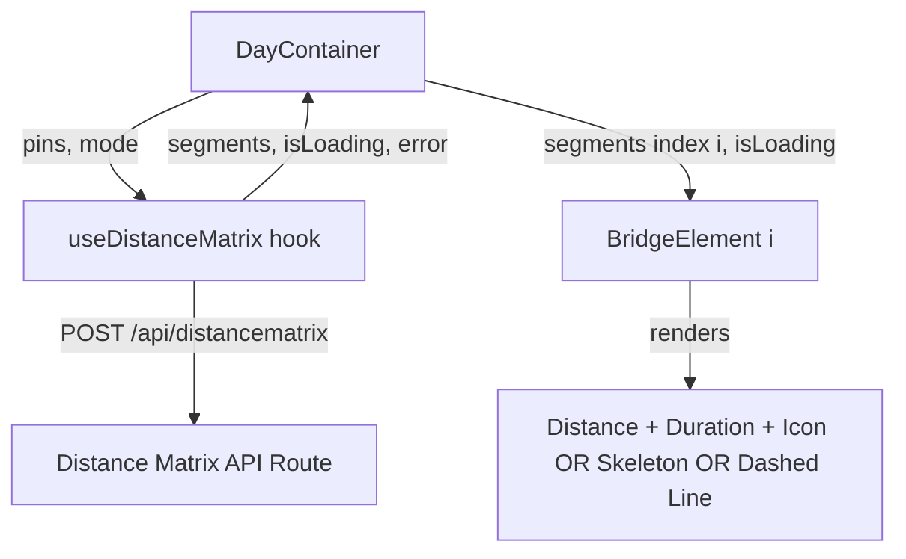

# Design Document

## Overview

This feature wires the existing `useDistanceMatrix` hook into `DayContainer` and upgrades `BridgeElement` from a static "Calculating…" placeholder to a data-driven connector that shows live travel distance, duration, mode icons, and loading states. The scope is intentionally narrow: two component changes and zero new API work.

### Key Design Decisions

1. **Hook called at DayContainer level** — Each day independently fetches its own distance data. This keeps re-renders scoped to a single day when pins are reordered.
2. **Default travel mode hardcoded initially** — `'driving'` is passed as the default mode. A future mode-toggle feature can be layered on without changing the data flow.
3. **Graceful degradation** — BridgeElement renders a clean dashed line when no segment data is available (loading, error, or fewer than 2 pins), so the UI never looks broken.

## Architecture



Data flows top-down:
1. `DayContainer` passes its `pins` array and a `mode` string to `useDistanceMatrix`.
2. The hook returns `{ segments, isLoading, error }`.
3. `DayContainer` maps over pins and passes `segments[i]` and `isLoading` to each `BridgeElement` rendered between pin `i` and pin `i+1`.
4. `BridgeElement` picks one of three visual states based on its props.

## Components and Interfaces

### BridgeElement (updated)

```typescript
interface BridgeElementProps {
  distance?: DistanceSegment;
  isLoading?: boolean;
}
```

Render logic (priority order):
1. `isLoading === true` → pulsing skeleton placeholder (Tailwind `animate-pulse`)
2. `distance` is defined → mode icon + duration + distance text
3. Neither → neutral dashed connector line (current fallback)

Mode icon mapping:
- `'driving'` → 🚗
- `'transit'` → 🚶

### DayContainer (updated)

Changes to the existing component:
- Import and call `useDistanceMatrix(pins, 'driving')` at the top of the component body.
- When rendering `BridgeElement` between pin `i` and pin `i+1`, pass:
  - `distance={segments[i]}` (may be `undefined` if segments array is shorter)
  - `isLoading={isLoading}`

No new components are introduced.

### useDistanceMatrix (unchanged)

The hook's interface and implementation remain as-is:

```typescript
function useDistanceMatrix(
  pins: PlannedPin[],
  mode: 'transit' | 'driving'
): { segments: DistanceSegment[]; isLoading: boolean; error: string | null }
```

## Data Models

No new data models are introduced. The feature uses existing types:

| Type | Location | Role |
|------|----------|------|
| `PlannedPin` | `src/types/index.ts` | Input to `useDistanceMatrix` |
| `DistanceSegment` | `src/hooks/useDistanceMatrix.ts` | Per-pair distance/duration data |
| `BridgeElementProps` | `src/components/planner/BridgeElement.tsx` | New props interface for BridgeElement |

`DistanceSegment` shape (existing, unchanged):
```typescript
{ distance: string; duration: string; mode: 'transit' | 'driving' }
```


## Correctness Properties

*A property is a characteristic or behavior that should hold true across all valid executions of a system — essentially, a formal statement about what the system should do. Properties serve as the bridge between human-readable specifications and machine-verifiable correctness guarantees.*

### Property 1: Bridge count invariant

*For any* day with N pins where N ≥ 2, the DayContainer SHALL render exactly N − 1 BridgeElement components.

**Validates: Requirements 6.1**

### Property 2: Segment-to-bridge alignment

*For any* array of N pins (N ≥ 2) and any segments array of length M (0 ≤ M ≤ N − 1), the BridgeElement at index `i` SHALL receive `segments[i]` when `i < M`, and `undefined` when `i ≥ M`.

**Validates: Requirements 1.3, 6.2, 6.3**

### Property 3: BridgeElement displays segment data faithfully

*For any* valid `DistanceSegment` with arbitrary `distance` and `duration` strings, the rendered BridgeElement output SHALL contain both the exact `distance` string and the exact `duration` string.

**Validates: Requirements 4.3, 4.4**

## Error Handling

| Scenario | Handler | Behavior |
|----------|---------|----------|
| `useDistanceMatrix` returns `error` (non-null) | `DayContainer` | Segments array is empty; BridgeElements fall back to dashed line (no error banner — silent degradation). |
| API returns HTTP error | `useDistanceMatrix` (existing) | Sets `error` state, `isLoading` becomes false, `segments` stays empty. |
| Fetch aborted (pin reorder during flight) | `useDistanceMatrix` (existing) | AbortController cancels in-flight request; new request fires for updated pin order. |
| `segments.length < N-1` during loading | `DayContainer` | Bridges beyond available segments receive `undefined` → render dashed fallback. |
| `isLoading` true with stale `distance` prop | `BridgeElement` | Loading state takes priority; stale data is not displayed. |

No new error handling code is needed in the hook or API route. All error paths are handled by existing logic. The only new consideration is that `BridgeElement` must prioritize `isLoading` over a stale `distance` prop.

## Testing Strategy

### Property-Based Tests (fast-check, minimum 100 iterations each)

Property-based tests validate the three correctness properties above using generated inputs:

- **Property 1 (Bridge count)**: Generate random pin arrays of length 2–20. Extract bridge count from the segment-mapping logic. Assert count === N − 1.
- **Property 2 (Segment alignment)**: Generate random N (2–20) and M (0 to N−1). Build pin and segment arrays. Assert each bridge index receives the correct segment or undefined.
- **Property 3 (Data display)**: Generate random `DistanceSegment` objects with arbitrary distance/duration strings. Render BridgeElement and assert both strings appear in output.

Each test tagged: `Feature: distance-matrix-display, Property {N}: {title}`

### Unit Tests (example-based)

| Test | Validates |
|------|-----------|
| DayContainer calls `useDistanceMatrix` with pins and mode when ≥ 2 pins | Req 1.1 |
| DayContainer does not trigger fetch with 0 or 1 pin | Req 1.2 |
| DayContainer passes `isLoading` to all BridgeElements | Req 1.4 |
| BridgeElement renders dashed line with no props | Req 2.3, 5.1, 5.2 |
| BridgeElement shows skeleton when `isLoading=true` | Req 3.1 |
| BridgeElement hides stale data when `isLoading=true` | Req 3.2 |
| BridgeElement shows 🚗 for driving mode | Req 4.1 |
| BridgeElement shows 🚶 for transit mode | Req 4.2 |

### Test Library

- **Framework**: Vitest (already configured)
- **PBT library**: fast-check (already in devDependencies)
- **DOM testing**: jsdom (already in devDependencies)
