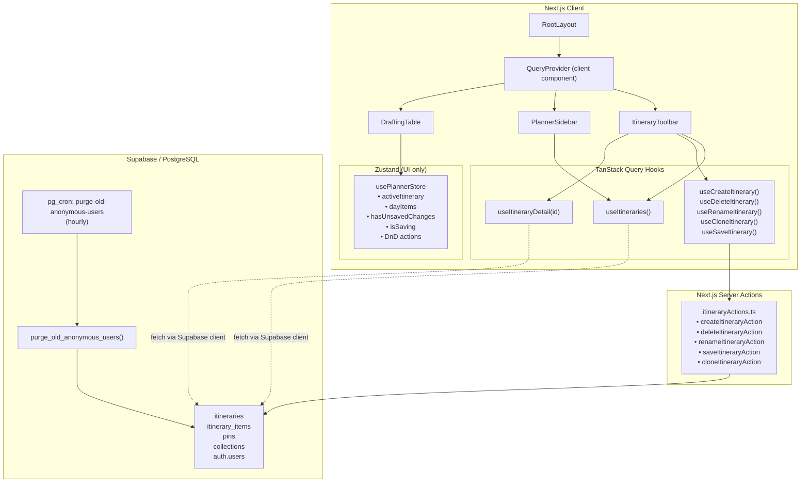

# Design Document: Enterprise State TTL

## Overview

This design covers two independent but complementary upgrades to the YUPP Travel planner:

1. **TanStack Query Integration** — Introduces `@tanstack/react-query` (v5) as the server-state layer, replacing the data-fetching responsibilities currently embedded in the Zustand `usePlannerStore`. A `QueryClientProvider` wraps the app, custom hooks encapsulate itinerary queries and mutations, and the Zustand store is slimmed down to pure UI state (drag-and-drop ordering, active selection, unsaved-change flags).

2. **Supabase pg_cron TTL** — A SQL migration adds a PostgreSQL function and hourly cron job that purges anonymous users older than 48 hours. Existing `ON DELETE CASCADE` constraints propagate the deletion to dependent rows in `pins`, `collections`, `itineraries`, and `itinerary_items`.

The two pillars are independently deployable. The TanStack Query migration is a client-side refactor with no schema changes. The TTL migration is a server-side SQL change with no client code.

## Architecture



**Key architectural decisions:**

- **Query hooks fetch directly via the Supabase browser client** rather than going through server actions for reads. This keeps reads fast (no server-action round-trip) and leverages TanStack Query's built-in caching. Writes continue to go through server actions for validation and RLS enforcement.
- **Zustand retains local mutation actions** (`addPinToDay`, `reorderPinInDay`, etc.) because these are optimistic, in-memory operations that feed the drag-and-drop UI. The save mutation hook reads `dayItems` from Zustand when persisting.
- **The TTL function deletes from `auth.users`** and relies on cascade constraints rather than manually deleting from each child table. This is simpler and guaranteed consistent.

## Components and Interfaces

### QueryProvider (`src/components/QueryProvider.tsx`)

A `'use client'` component that creates a `QueryClient` with the configured defaults and wraps children in `QueryClientProvider`. The `QueryClient` is instantiated inside a `useState` to avoid re-creation on re-renders (standard Next.js pattern for client providers).

```typescript
// Pseudocode interface
interface QueryProviderProps {
  children: React.ReactNode;
}
// Defaults:
//   staleTime: 300_000 (5 min)
//   retry: 2
//   refetchOnWindowFocus: false
```

### Query Hooks (`src/hooks/useItineraryQueries.ts`)

| Hook | Query Key | Returns | Notes |
|------|-----------|---------|-------|
| `useItineraries()` | `['itineraries']` | `UseQueryResult<Itinerary[]>` | Fetches from `itineraries` table, ordered by `created_at` desc |
| `useItineraryDetail(id)` | `['itinerary', id]` | `UseQueryResult<{ itinerary: Itinerary; dayItems: Record<number, PlannedPin[]> }>` | Enabled only when `id` is truthy |

### Mutation Hooks (`src/hooks/useItineraryMutations.ts`)

| Hook | Delegates To | Invalidates | On Error |
|------|-------------|-------------|----------|
| `useCreateItinerary()` | `createItineraryAction` | `['itineraries']` | Toast via `useToastStore` |
| `useDeleteItinerary()` | `deleteItineraryAction` | `['itineraries']` | Toast |
| `useRenameItinerary()` | `renameItineraryAction` | `['itineraries']` | Toast |
| `useCloneItinerary()` | `cloneItineraryAction` | `['itineraries']` | Toast |
| `useSaveItinerary()` | `saveItineraryAction` | `['itinerary', id]` | Toast |

### Refactored Zustand Store (`src/store/usePlannerStore.ts`)

**Removed state:** `itineraries` array.
**Removed actions:** `fetchItineraries`, `createItinerary`, `deleteItinerary`, `renameItinerary`, `cloneItinerary`, `loadItinerary`, `saveItinerary`.
**Retained state:** `activeItinerary`, `dayItems`, `hasUnsavedChanges`, `isSaving`, `isLoadingItinerary`.
**Retained actions:** `addPinToDay`, `reorderPinInDay`, `movePinBetweenDays`, `removePinFromDay`, `addDay`.

A new `setItineraryData` action is added so that when `useItineraryDetail` resolves, the component can hydrate Zustand's `dayItems` and `activeItinerary` in one call.

### SQL Migration (`supabase/migrations/0006_anonymous_ttl.sql`)

```sql
-- Enable pg_cron
CREATE EXTENSION IF NOT EXISTS pg_cron WITH SCHEMA pg_catalog;

-- Purge function
CREATE OR REPLACE FUNCTION public.purge_old_anonymous_users()
RETURNS void
LANGUAGE sql
SECURITY DEFINER
AS $$
  DELETE FROM auth.users
  WHERE is_anonymous = true
    AND created_at < now() - interval '48 hours';
$$;

-- Hourly cron job (idempotent via unschedule + schedule)
SELECT cron.unschedule('purge-old-anonymous-users');
SELECT cron.schedule(
  'purge-old-anonymous-users',
  '0 * * * *',
  $$SELECT public.purge_old_anonymous_users()$$
);
```

## Data Models

No new database tables or columns are introduced. The feature operates on existing types and tables.

### Existing Types (unchanged)

- `Itinerary` — `{ id, userId, name, tripDate, createdAt }`
- `PlannedPin` — `Pin & { day_number, sort_order, itinerary_item_id }`
- `SaveDayItem` — `{ pinId, dayNumber, sortOrder }`

### New Client-Side Types

```typescript
/** Return shape of useItineraryDetail */
interface ItineraryDetailData {
  itinerary: Itinerary;
  dayItems: Record<number, PlannedPin[]>;
}
```

### Query Key Constants

```typescript
export const itineraryKeys = {
  all: ['itineraries'] as const,
  detail: (id: string) => ['itinerary', id] as const,
};
```


## Correctness Properties

*A property is a characteristic or behavior that should hold true across all valid executions of a system — essentially, a formal statement about what the system should do. Properties serve as the bridge between human-readable specifications and machine-verifiable correctness guarantees.*

### Property 1: Itinerary row mapping preserves all fields

*For any* valid Supabase itinerary row object (with `id`, `user_id`, `name`, `trip_date`, `created_at` fields), mapping it through the row-to-`Itinerary` transformation SHALL produce an object where every field value matches the source row (with snake_case → camelCase renaming: `user_id` → `userId`, `trip_date` → `tripDate`, `created_at` → `createdAt`).

**Validates: Requirements 2.3**

### Property 2: PlannedPin hydration groups items by day_number

*For any* set of itinerary item rows joined with pin data, hydrating and grouping them into a `Record<number, PlannedPin[]>` SHALL produce a result where: (a) every input item appears exactly once in the output, (b) each item appears under the key matching its `day_number`, and (c) the total count of PlannedPins across all day keys equals the input row count.

**Validates: Requirements 3.3**

### Property 3: addPinToDay increases day pin count by exactly one

*For any* valid `dayItems` state and any valid `Pin`, calling `addPinToDay(pin, dayNumber)` SHALL result in the target day's pin array length being exactly one greater than before, and all previously existing pins in that day remaining present and unchanged.

**Validates: Requirements 5.6**

### Property 4: reorderPinInDay preserves the pin set

*For any* valid `dayItems` state with at least two pins in a day, and any valid pair of indices `(oldIndex, newIndex)`, calling `reorderPinInDay` SHALL produce a day array containing exactly the same set of pin IDs as before (order may differ), and the `sort_order` values SHALL be consecutive integers starting from 0.

**Validates: Requirements 5.6**

### Property 5: movePinBetweenDays preserves total pin count

*For any* valid `dayItems` state, any source day containing at least one pin, any target day, and any valid pin ID from the source day, calling `movePinBetweenDays` SHALL preserve the total number of pins across all days, the moved pin SHALL appear in the target day, and the moved pin SHALL no longer appear in the source day.

**Validates: Requirements 5.6**

## Error Handling

### TanStack Query Layer

| Scenario | Handling |
|----------|----------|
| Network failure during itinerary list fetch | `useItineraries` retries up to 2 times (configured default). After exhaustion, `isError` becomes `true` and `error` contains the failure reason. Components display an inline error message. |
| Network failure during itinerary detail fetch | Same retry behavior. `useItineraryDetail` surfaces `isError`. The planner shows an error state instead of itinerary content. |
| Mutation failure (create/delete/rename/clone/save) | The `onError` callback in each mutation hook calls `useToastStore.getState().addToast(error.message, 'error')` to display a user-visible toast. No optimistic update rollback needed — mutations invalidate on success only. |
| Server action returns `{ success: false }` | Mutation hooks throw inside `mutationFn` when `result.success` is false, triggering the standard `onError` path. |
| Stale data after window refocus | `refetchOnWindowFocus` is disabled. Data refreshes only on explicit invalidation (after mutations) or when the 5-minute staleTime expires and a component remounts. |

### Zustand Store

| Scenario | Handling |
|----------|----------|
| `reorderPinInDay` with out-of-bounds indices | Returns current state unchanged (existing guard). |
| `movePinBetweenDays` with non-existent pinId | `findIndex` returns -1, function returns current state unchanged. |
| `addPinToDay` to a day that doesn't exist yet | Initializes the day array as empty before appending (existing `?? []` pattern). |

### TTL Purge Function

| Scenario | Handling |
|----------|----------|
| No anonymous users older than 48 hours | `DELETE` matches zero rows, function completes without error. |
| Cascade delete fails due to missing FK constraint | The migration assumes existing CASCADE constraints. If a constraint is missing, the `DELETE` fails with a foreign key violation — a deployment-time concern caught by migration testing. |
| pg_cron extension not available | `CREATE EXTENSION IF NOT EXISTS` fails if the extension is not installed on the Supabase instance. Supabase Pro/Team plans include pg_cron by default. |

## Testing Strategy

### Unit Tests

Unit tests cover specific examples, edge cases, and structural checks:

- **QueryProvider configuration**: Verify `staleTime`, `retry`, and `refetchOnWindowFocus` defaults (Requirements 1.1–1.3).
- **Query key constants**: Assert `itineraryKeys.all` and `itineraryKeys.detail(id)` produce expected arrays (Requirements 2.2, 3.2).
- **Hook return shape**: Verify `useItineraries` and `useItineraryDetail` expose `data`, `isLoading`, `isError`, `error` (Requirements 2.4, 3.5).
- **Disabled query**: Verify `useItineraryDetail(undefined)` sets `enabled: false` (Requirement 3.4).
- **Mutation error toasts**: Verify each mutation hook calls `addToast` on failure (Requirement 4.6).
- **Store shape after refactor**: Assert removed fields/actions are absent and retained fields/actions are present (Requirements 5.1–5.7).
- **ItineraryToolbar loading/error states**: Render tests for loading indicator and error message (Requirements 6.4, 6.5).

### Property-Based Tests

Property-based tests verify universal invariants across generated inputs using `fast-check` (already in devDependencies). Each test runs a minimum of 100 iterations.

| Test | Property | Tag |
|------|----------|-----|
| Row → Itinerary mapping | Property 1 | `Feature: enterprise-state-ttl, Property 1: Itinerary row mapping preserves all fields` |
| Row → PlannedPin hydration + grouping | Property 2 | `Feature: enterprise-state-ttl, Property 2: PlannedPin hydration groups items by day_number` |
| addPinToDay invariant | Property 3 | `Feature: enterprise-state-ttl, Property 3: addPinToDay increases day pin count by exactly one` |
| reorderPinInDay invariant | Property 4 | `Feature: enterprise-state-ttl, Property 4: reorderPinInDay preserves the pin set` |
| movePinBetweenDays invariant | Property 5 | `Feature: enterprise-state-ttl, Property 5: movePinBetweenDays preserves total pin count` |

### Integration Tests

Integration tests verify wiring between components, hooks, and external services:

- **Mutation cache invalidation**: Verify each mutation hook invalidates the correct query key on success (Requirements 4.1–4.5).
- **ItineraryToolbar data source**: Verify the toolbar reads from query hooks, not Zustand (Requirements 6.1–6.3).
- **TTL purge function**: Test against a Supabase test instance — insert anonymous users with old timestamps, run the function, verify deletion and cascade (Requirements 7.1–7.2).
- **Migration idempotency**: Run the migration SQL twice, verify no errors on the second execution (Requirement 8.5).
