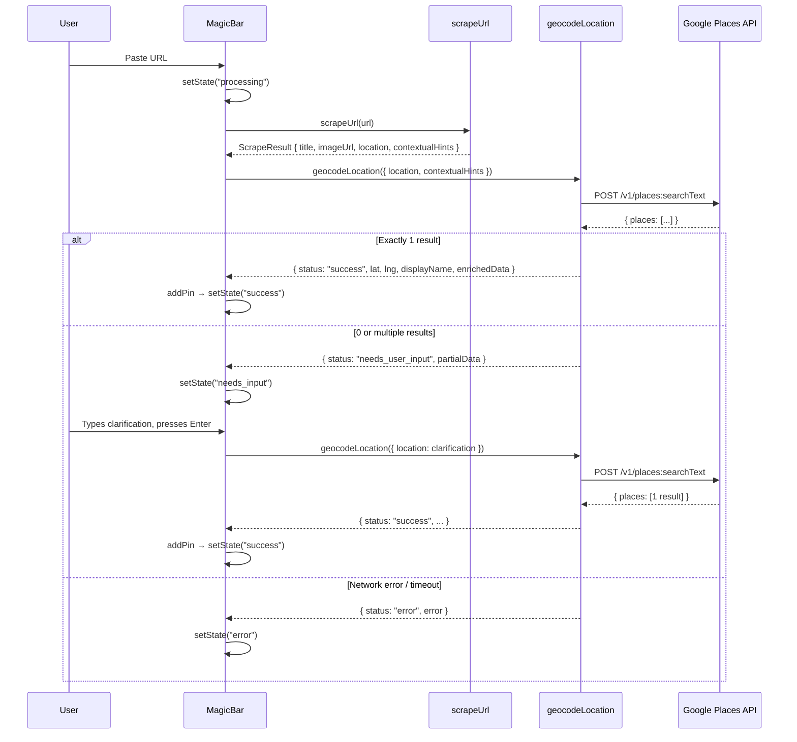

# Design Document: Google Places Geocoding

## Overview

This feature replaces the Nominatim (OpenStreetMap) geocoder with the Google Places API (New) Text Search endpoint and introduces a Human-in-the-Loop fallback for ambiguous locations. The current `geocodeLocation` server action is rewritten to call `POST https://places.googleapis.com/v1/places:searchText`, returning a three-variant discriminated union (`SUCCESS | NEEDS_USER_INPUT | ERROR`). The MagicBar state machine gains a `needs_input` state that renders a friendly clarification UI instead of a dead-end error when the geocoder cannot resolve a location with high confidence.

Key drivers:
- Nominatim struggles with semantic/messy location strings from social media (restaurant names, landmarks, colloquial references).
- Google Places handles these queries significantly better due to its commercial POI database.
- A human-in-the-loop fallback eliminates the "Could not geocode" dead-end, letting users manually clarify.

## Architecture



### Architectural decisions

1. **Server-side only geocoding**: The `geocodeLocation` action keeps the `'use server'` directive. The API key never leaves the server. No new API routes are needed.
2. **Confidence logic in the server action**: The decision of whether a result is high-confidence (exactly 1 place) vs ambiguous (0 or 2+) lives in `geocodeLocation`, not in the client. The client only reacts to the discriminated union variant.
3. **No caching layer**: Google Places billing is per-request. Caching would add complexity for minimal savings given the low request volume of a personal travel app.
4. **Reuse existing scraper output**: The `ScrapeResult` type is unchanged. The `partialData` in `NEEDS_USER_INPUT` carries `title` and `imageUrl` from the scrape result so the needs-input UI can display them without re-scraping.

## Components and Interfaces

### 1. `geocodeLocation` server action (`src/actions/geocodeLocation.ts`)

Complete rewrite. Removes all Nominatim code. New responsibilities:

- Validate input (non-empty location string, API key present)
- Build `textQuery` by combining location + first contextual hint
- POST to Google Places Text Search with field mask and API key headers
- Apply confidence logic: 1 result → SUCCESS, 0 or 2+ → NEEDS_USER_INPUT, error → ERROR
- 10-second timeout via `AbortController`

```typescript
// Signature
export async function geocodeLocation(input: {
  location: string;
  contextualHints?: string[];
}): Promise<GeocodeResult>
```

### 2. `MagicBar` component (`src/components/MagicBar.tsx`)

Updated state machine and new `needs_input` branch:

```typescript
export type MagicBarState = 'idle' | 'processing' | 'needs_input' | 'error' | 'success';
```

New internal state:
- `partialData: { title: string; imageUrl: string | null } | null` — stored when geocoder returns `NEEDS_USER_INPUT`
- `clarificationValue: string` — the text input for the user's manual location clarification

New behavior in `handleSubmit`:
- On `NEEDS_USER_INPUT` response: store `partialData`, transition to `needs_input`
- On `needs_input` submit: call `geocodeLocation({ location: clarificationValue })` without contextual hints
- On second `NEEDS_USER_INPUT` or `ERROR` from clarification: stay in `needs_input` state, show inline hint

### 3. Needs-Input UI (inline in `MagicBar.tsx`)

Rendered when `state === 'needs_input'`. Uses Framer Motion `layout` animation for smooth expansion.

```
┌──────────────────────────────────────────────┐
│  [thumbnail]  "We saved the vibe!            │
│               Where exactly is this?"        │
│               ┌──────────────────────┐       │
│               │ Type a venue or addr │       │
│               └──────────────────────┘       │
└──────────────────────────────────────────────┘
```

- Thumbnail: 48×48 rounded image from `partialData.imageUrl` (or placeholder)
- Prompt text: "We saved the vibe! Where exactly is this?"
- Input: standard text input, Enter to submit
- No red styling, no error icons — warm/neutral palette
- Spring animation: `stiffness: 400, damping: 30` (matching existing MagicBar springs)

### 4. Type updates (`src/types/index.ts`)

Remove `GeocodeResult` and `GeocodeError` interfaces. Replace with:

```typescript
export interface EnrichedData {
  placeId: string;
  primaryType?: string;
  rating?: number;
}

export type GeocodeResult =
  | { status: 'success'; lat: number; lng: number; displayName: string; enrichedData: EnrichedData }
  | { status: 'needs_user_input'; partialData: { title: string; imageUrl: string | null } }
  | { status: 'error'; error: string };
```

## Data Models

### EnrichedData

| Field         | Type               | Description                                      |
|---------------|--------------------|--------------------------------------------------|
| `placeId`     | `string`           | Google Places unique identifier                  |
| `primaryType` | `string \| undefined` | Place type (e.g., "restaurant", "landmark")   |
| `rating`      | `number \| undefined` | Google rating (1.0–5.0)                       |

### GeocodeResult (discriminated union on `status`)

**SUCCESS variant**

| Field          | Type           | Description                        |
|----------------|----------------|------------------------------------|
| `status`       | `'success'`    | Discriminant                       |
| `lat`          | `number`       | Latitude                           |
| `lng`          | `number`       | Longitude                          |
| `displayName`  | `string`       | Human-readable place name          |
| `enrichedData` | `EnrichedData` | Additional Google Places metadata  |

**NEEDS_USER_INPUT variant**

| Field         | Type                                          | Description                          |
|---------------|-----------------------------------------------|--------------------------------------|
| `status`      | `'needs_user_input'`                          | Discriminant                         |
| `partialData` | `{ title: string; imageUrl: string \| null }` | Scraped data preserved for the UI    |

**ERROR variant**

| Field    | Type       | Description          |
|----------|------------|----------------------|
| `status` | `'error'`  | Discriminant         |
| `error`  | `string`   | Human-readable error |

### Google Places API request/response shapes (internal, not exported)

**Request body** sent to `POST https://places.googleapis.com/v1/places:searchText`:

```json
{
  "textQuery": "Cedric Grolet, Paris"
}
```

**Request headers**:
- `Content-Type: application/json`
- `X-Goog-Api-Key: <GOOGLE_PLACES_API_KEY>`
- `X-Goog-FieldMask: places.location,places.displayName,places.primaryType,places.rating,places.id`

**Response shape** (relevant fields only):

```typescript
interface GooglePlacesResponse {
  places?: Array<{
    id: string;
    displayName: { text: string; languageCode: string };
    location: { latitude: number; longitude: number };
    primaryType?: string;
    rating?: number;
  }>;
}
```


## Correctness Properties

*A property is a characteristic or behavior that should hold true across all valid executions of a system — essentially, a formal statement about what the system should do. Properties serve as the bridge between human-readable specifications and machine-verifiable correctness guarantees.*

### Property 1: Query construction combines location and hints correctly

*For any* non-empty location string and any array of contextual hints (including empty), the constructed `textQuery` SHALL equal `"<location>, <firstHint>"` when hints are non-empty, or `"<location>"` when hints are empty or absent.

**Validates: Requirements 2.1, 9.1, 9.2**

### Property 2: Single result maps to SUCCESS with correct fields

*For any* valid Google Places response containing exactly one place with arbitrary lat, lng, displayName, id, primaryType, and rating values, the geocoder SHALL return a `SUCCESS` GeocodeResult where `lat` equals the response's `location.latitude`, `lng` equals `location.longitude`, `displayName` equals the response's `displayName.text`, and `enrichedData` contains the place's `id`, `primaryType`, and `rating`.

**Validates: Requirements 3.1**

### Property 3: Non-single result count maps to NEEDS_USER_INPUT

*For any* valid Google Places response containing zero results or two-or-more results, and any `partialData` (title and imageUrl), the geocoder SHALL return a `NEEDS_USER_INPUT` GeocodeResult with the provided `partialData` preserved.

**Validates: Requirements 3.2, 3.3**

### Property 4: Non-OK HTTP status maps to ERROR with status code

*For any* HTTP status code in the range 400–599, when the Google Places API returns that status, the geocoder SHALL return an `ERROR` GeocodeResult whose `error` string contains the numeric status code.

**Validates: Requirements 2.6**

### Property 5: Network errors map to ERROR with descriptive message

*For any* `Error` object thrown by `fetch` (including timeout aborts), the geocoder SHALL return an `ERROR` GeocodeResult whose `error` string is non-empty and descriptive.

**Validates: Requirements 3.4**

### Property 6: API key is never leaked in any response variant

*For any* input (valid, invalid, or error-causing) and any known API key value set in the environment, no field of the returned `GeocodeResult` (including nested `error` strings, `displayName`, or `enrichedData` fields) SHALL contain the API key string.

**Validates: Requirements 8.3**

### Property 7: Whitespace-only input returns ERROR without network request

*For any* string composed entirely of whitespace characters (spaces, tabs, newlines, or empty string), the geocoder SHALL return an `ERROR` GeocodeResult and SHALL NOT invoke `fetch`.

**Validates: Requirements 9.3**

## Error Handling

### Server action (`geocodeLocation`)

| Condition | Behavior |
|---|---|
| Missing `GOOGLE_PLACES_API_KEY` env var | Return `{ status: 'error', error: 'GOOGLE_PLACES_API_KEY is not configured' }` immediately. No fetch call. |
| Empty / whitespace-only location string | Return `{ status: 'error', error: 'Location string is empty' }` immediately. No fetch call. |
| Google Places returns non-OK HTTP (4xx/5xx) | Return `{ status: 'error', error: 'Google Places API returned status <code>' }`. |
| Network error / DNS failure | Return `{ status: 'error', error: 'Geocoding failed: <message>' }`. |
| Request timeout (>10s) | `AbortController` aborts the fetch. Return `{ status: 'error', error: 'Google Places request timed out after 10 seconds' }`. |
| 0 or 2+ results | Return `{ status: 'needs_user_input', partialData: { title, imageUrl } }`. Not treated as an error. |
| API key must not leak | Error messages use hardcoded strings or HTTP status codes. The raw API response body is never forwarded to the client. |

### MagicBar component

| Condition | Behavior |
|---|---|
| `geocodeResult.status === 'error'` | Transition to `error` state, display `error` string in red pill below the bar. |
| `geocodeResult.status === 'needs_user_input'` | Transition to `needs_input` state, store `partialData`, render clarification UI. No red styling. |
| Clarification re-geocode returns `error` or `needs_user_input` | Stay in `needs_input` state. Show subtle inline hint ("Try a more specific name or address"). Allow retry. |
| Unexpected exception in `handleSubmit` | Catch-all: transition to `error` state with generic message. |

## Testing Strategy

### Property-based tests (fast-check, minimum 100 iterations each)

The project already uses `fast-check` with `vitest`. Property tests will live in `src/actions/__tests__/geocodeLocation.pbt.test.ts`.

Each test mocks `fetch` globally to control Google Places API responses. The `geocodeLocation` function is a pure server action (no browser APIs), making it ideal for PBT.

| Property | Test approach |
|---|---|
| Property 1: Query construction | Generate random `{ location, contextualHints }` inputs. Mock fetch to capture the request body. Assert `textQuery` matches expected format. |
| Property 2: Single result → SUCCESS | Generate random single-place Google responses. Assert SUCCESS with correct field mapping. |
| Property 3: Non-single → NEEDS_USER_INPUT | Generate 0 or 2+ place responses. Assert NEEDS_USER_INPUT with partialData preserved. |
| Property 4: HTTP error → ERROR with code | Generate random 400–599 status codes. Assert ERROR contains the code. |
| Property 5: Network error → ERROR | Generate random Error objects. Assert ERROR with non-empty message. |
| Property 6: API key not leaked | Generate various inputs across all code paths. Assert API key string absent from all result fields. |
| Property 7: Whitespace → ERROR, no fetch | Generate whitespace-only strings. Assert ERROR and fetch not called. |

Tag format: `Feature: google-places-geocoding, Property N: <title>`

### Unit tests (example-based)

File: `src/actions/__tests__/geocodeLocation.test.ts`

- Verify `X-Goog-FieldMask` header is correct (Req 2.2)
- Verify `X-Goog-Api-Key` header matches env var (Req 2.3)
- Verify missing API key returns ERROR without fetch (Req 2.4)
- Verify 10-second timeout configuration (Req 2.5)

File: `src/components/__tests__/MagicBar.test.tsx`

- State transitions: SUCCESS → `success`, ERROR → `error`, NEEDS_USER_INPUT → `needs_input` (Req 5.2–5.4)
- Needs-input UI renders thumbnail, prompt text, input field (Req 6.2–6.5)
- Clarification submit calls geocodeLocation with user input (Req 6.6)
- Clarification SUCCESS creates pin (Req 6.7)
- Clarification failure stays in needs_input (Req 6.8)

### What is NOT tested with PBT

- Nominatim removal (Req 1.1, 1.2) — static analysis / code review
- Type definitions (Req 4.1–4.3) — TypeScript compiler enforcement
- Animation behavior (Req 6.1, 7.1–7.3) — visual/manual review
- Server-only execution (Req 8.2) — enforced by `'use server'` directive
