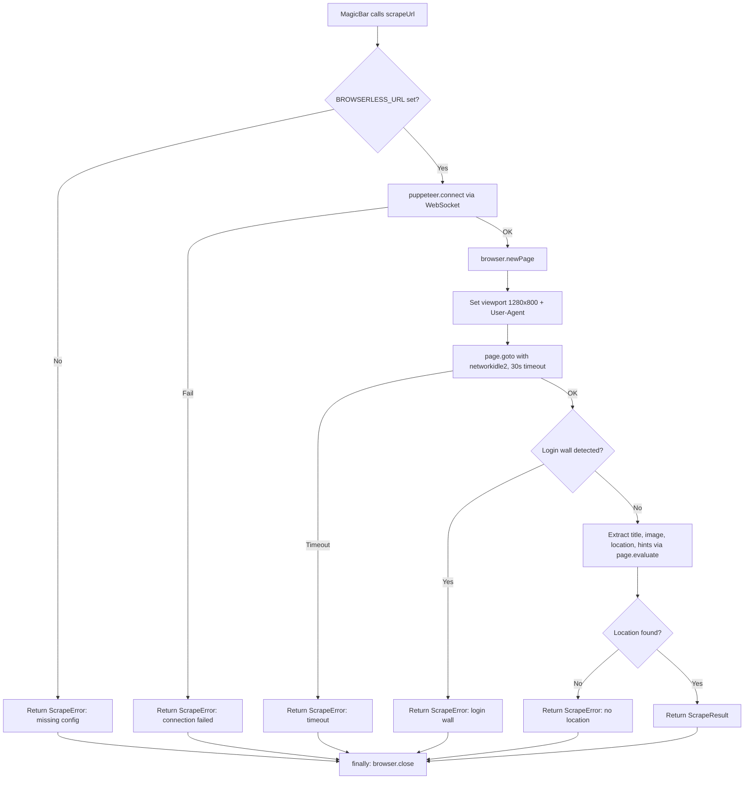

# Design Document: Headless Scraper Engine

## Overview

This design describes the refactoring of `src/actions/scrapeUrl.ts` from a `cheerio`-based static HTML parser to a `puppeteer-core`-based headless browser scraper connected to a remote browser service (Browserless.io) via WebSocket.

The core motivation is that client-side rendered (CSR) pages — particularly Instagram — serve empty HTML shells that only populate after JavaScript execution. The current `cheerio` approach cannot execute JavaScript, so it extracts empty or fallback metadata, leading to incorrect pin placements.

The new implementation:
- Uses `puppeteer.connect()` with a `BROWSERLESS_URL` environment variable (no bundled Chromium)
- Waits for `networkidle2` to let CSR frameworks finish rendering
- Detects Instagram login walls and returns actionable errors
- Removes the `og:locale` country code fallback entirely
- Guarantees `browser.close()` in a `finally` block
- Preserves the existing `ScrapeResult` / `ScrapeError` type contract

## Architecture

The refactored scraper maintains the same external interface (`scrapeUrl(url: string) → Promise<ScrapeResult | ScrapeError>`) but replaces the internal pipeline:



### Key Architectural Decisions

1. **`puppeteer.connect()` over `puppeteer.launch()`**: The app runs on Vercel/serverless where bundling Chromium would exceed deployment size limits. Connecting to a remote Browserless.io instance via WebSocket avoids this entirely.

2. **`networkidle2` wait strategy**: This waits until there are no more than 2 network connections for 500ms. It's the right balance for CSR pages — `networkidle0` is too aggressive (some pages keep analytics connections alive), while `domcontentloaded` fires before JS rendering completes.

3. **Login wall detection**: Instagram and similar sites serve a login wall page instead of content. Rather than extracting garbage metadata from the login page, we detect it early and return a clear error.

4. **No `og:locale` fallback**: The previous implementation used `og:locale` (e.g., `fr_FR` → `FR`) as a location source. This produced vague country codes that the geocoder resolved to wrong locations. Removed entirely.

5. **`browser.close()` in `finally`**: Remote browser sessions are a finite resource. Leaking them causes memory exhaustion on the Browserless.io service. The `finally` block guarantees cleanup.

## Components and Interfaces

### Modified File: `src/actions/scrapeUrl.ts`

The entire file is rewritten. The public API is unchanged.

```typescript
// Public API (unchanged)
export async function scrapeUrl(url: string): Promise<ScrapeResult | ScrapeError>
```

### Internal Functions

| Function | Signature | Purpose |
|---|---|---|
| `connectBrowser` | `() → Promise<Browser>` | Reads `BROWSERLESS_URL`, calls `puppeteer.connect()` |
| `setupPage` | `(browser: Browser) → Promise<Page>` | Creates page, sets viewport (1280×800) and User-Agent |
| `navigateWithTimeout` | `(page: Page, url: string) → Promise<void>` | `page.goto()` with `networkidle2` and 30s timeout |
| `detectLoginWall` | `(page: Page) → Promise<boolean>` | Checks title for "log in" and absence of article/main content |
| `extractTitle` | `(page: Page) → Promise<string>` | og:title → `<title>` → "Untitled" |
| `extractImage` | `(page: Page) → Promise<string \| null>` | og:image → first large `` |
| `extractLocation` | `(page: Page) → Promise<string \| null>` | geo meta → JSON-LD → location links → og:description → text patterns |
| `extractContextualHints` | `(page: Page) → Promise<string[]>` | Place names, 📍 patterns, hashtags from rendered DOM |

### Removed Dependencies

- `cheerio` — removed from `package.json` and all imports

### Added Dependencies

- `puppeteer-core` — added as production dependency

### Environment Variables

| Variable | Required | Example | Purpose |
|---|---|---|---|
| `BROWSERLESS_URL` | Yes | `wss://production-sfo.browserless.io/chromium?token=XXX` | WebSocket endpoint for remote browser |

### Unchanged Files

- `src/types/index.ts` — `ScrapeResult`, `ScrapeError`, `GeocodeResult`, `GeocodeError` unchanged
- `src/components/MagicBar.tsx` — calls `scrapeUrl()` the same way
- `src/actions/geocodeLocation.ts` — receives same `location` + `contextualHints` shape

## Data Models

No data model changes. The existing types are preserved exactly:

```typescript
// src/types/index.ts — NO CHANGES
interface ScrapeResult {
  success: true;
  title: string;
  imageUrl: string | null;
  location: string;
  contextualHints: string[];
  sourceUrl: string;
}

interface ScrapeError {
  success: false;
  error: string;
}
```

### Internal Data Flow

1. **Input**: `url: string` (from MagicBar)
2. **Browser session**: `puppeteer-core` `Browser` and `Page` objects (transient, closed after use)
3. **DOM extraction**: All metadata extracted via `page.evaluate()` running in the browser context
4. **Output**: `ScrapeResult | ScrapeError` (same shape as before)


## Correctness Properties

*A property is a characteristic or behavior that should hold true across all valid executions of a system — essentially, a formal statement about what the system should do. Properties serve as the bridge between human-readable specifications and machine-verifiable correctness guarantees.*

### Property 1: Login wall detection correctness

*For any* page where the title contains "log in" (case-insensitive) AND the page body lacks both `<article>` and `<main>` elements while containing a login form, the `detectLoginWall` function SHALL return `true`. Conversely, *for any* page that has an `<article>` or `<main>` element, or whose title does not contain "log in", the function SHALL return `false`.

**Validates: Requirements 4.1**

### Property 2: Image extraction priority

*For any* rendered DOM, if an `og:image` meta tag is present with a non-empty `content` attribute, `extractImage` SHALL return that value regardless of what `` elements exist. *For any* DOM without `og:image`, `extractImage` SHALL return the `src` of the first `` element that is not a small icon (width/height >= 100 or unspecified), or `null` if no qualifying image exists.

**Validates: Requirements 5.1**

### Property 3: Title extraction priority

*For any* rendered DOM, `extractTitle` SHALL return the `og:title` meta content if present, otherwise the `<title>` text if present, otherwise the string `"Untitled"`. The priority chain is strict: a present `og:title` always wins over `<title>`.

**Validates: Requirements 5.2**

### Property 4: Location extraction source priority

*For any* rendered DOM containing multiple location sources, `extractLocation` SHALL return the value from the highest-priority source. The priority order is: geo meta tags (`geo.placename`, `geo.region`) > JSON-LD structured data > rendered location link elements > `og:description` patterns > body text patterns. Lower-priority sources SHALL NOT override higher-priority ones.

**Validates: Requirements 5.3**

### Property 5: Contextual hints pattern extraction

*For any* text containing capitalized place name patterns (e.g., "Bali"), pin emoji patterns (e.g., "📍 Paris"), or place-like hashtags (e.g., "#BaliIndonesia"), `extractContextualHints` SHALL include those patterns in the returned array. The result SHALL contain no more than 10 hints.

**Validates: Requirements 5.4**

### Property 6: og:locale exclusion from location extraction

*For any* rendered DOM where `og:locale` is the only potential location-like metadata present (no geo meta tags, no JSON-LD location data, no location links, no location patterns in og:description or body text), `extractLocation` SHALL return `null`. The `og:locale` value SHALL never appear in the location result.

**Validates: Requirements 6.1**

## Error Handling

The scraper uses a layered error handling strategy. All errors are returned as `ScrapeError` objects — no exceptions propagate to the caller.

### Error Hierarchy (checked in order)

| Error Condition | Error Message | Requirement |
|---|---|---|
| Invalid URL format | `"Invalid URL format"` | 7.3 |
| `BROWSERLESS_URL` not set/empty | `"BROWSERLESS_URL environment variable is not configured"` | 2.3 |
| WebSocket connection failure | `"Failed to connect to browser service: {detail}"` | 2.4 |
| Navigation network error | `"Navigation failed: {detail}"` | 7.1 |
| Navigation timeout (30s) | `"Page timed out after 30 seconds"` | 3.4, 7.2 |
| Login wall detected | `"Instagram is blocking access. Try pasting the location name manually."` | 4.1 |
| No location found | `"Could not determine location from the provided URL"` | 6.2 |

### Resource Cleanup

```typescript
let browser: Browser | null = null;
try {
  browser = await connectBrowser();
  // ... scraping logic ...
} catch (err) {
  return { success: false, error: describeError(err) };
} finally {
  if (browser) {
    try {
      await browser.close();
    } catch (closeErr) {
      console.error('Failed to close browser:', closeErr);
    }
  }
}
```

The `finally` block guarantees `browser.close()` runs regardless of success or failure. If `browser.close()` itself throws, the error is logged but does not override the original result (Requirement 8.3).

## Testing Strategy

### Unit Tests (example-based)

Unit tests cover specific scenarios, error conditions, and integration points using mocked puppeteer objects:

- **Environment validation**: `BROWSERLESS_URL` missing/empty returns correct error (2.3)
- **Connection failure**: Mocked `puppeteer.connect()` rejection returns error (2.4)
- **Page setup**: Viewport set to 1280×800, User-Agent set (3.1, 3.2)
- **Navigation config**: `networkidle2` wait strategy used (3.3)
- **Timeout handling**: Navigation timeout returns error (3.4, 7.2)
- **Login wall flow**: Login wall detected → extraction skipped → correct error returned (4.1, 4.2)
- **No location**: Pages without location sources return correct error (6.2)
- **Invalid URL**: Malformed URLs return "Invalid URL format" (7.3)
- **Network errors**: Navigation failures return descriptive errors (7.1)
- **Resource cleanup**: `browser.close()` called in success and error paths (8.1, 8.2)
- **Close failure**: `browser.close()` error doesn't override result (8.3)
- **Type contract**: Return types match `ScrapeResult | ScrapeError` (9.1–9.4)

### Property-Based Tests

Property-based tests verify universal properties of the pure extraction logic using `fast-check`. Each test runs a minimum of 100 iterations with generated DOM structures.

| Property | Test Description | Tag |
|---|---|---|
| Property 1 | Generate random page titles and body structures, verify login wall detection correctness | `Feature: headless-scraper-engine, Property 1: Login wall detection correctness` |
| Property 2 | Generate DOMs with/without og:image and various img elements, verify priority | `Feature: headless-scraper-engine, Property 2: Image extraction priority` |
| Property 3 | Generate DOMs with/without og:title and title elements, verify priority chain | `Feature: headless-scraper-engine, Property 3: Title extraction priority` |
| Property 4 | Generate DOMs with multiple location sources, verify priority order | `Feature: headless-scraper-engine, Property 4: Location extraction source priority` |
| Property 5 | Generate text with place names, 📍 patterns, hashtags, verify extraction | `Feature: headless-scraper-engine, Property 5: Contextual hints pattern extraction` |
| Property 6 | Generate DOMs with og:locale as only location-like data, verify null returned | `Feature: headless-scraper-engine, Property 6: og:locale exclusion` |

### Testing Library

- **Property-based testing**: `fast-check` (TypeScript-native, integrates with Jest/Vitest)
- **Mocking**: Jest mocks for `puppeteer-core` module, `Browser`, and `Page` objects
- **Test runner**: Existing project test infrastructure

### Test Architecture Note

The extraction functions (`extractTitle`, `extractImage`, `extractLocation`, `extractContextualHints`, `detectLoginWall`) should be implemented to accept a DOM-query interface (or raw HTML string for testing) so that property tests can exercise them without a real browser. In production, `page.evaluate()` runs these in the browser context; in tests, they run against generated HTML strings parsed by a lightweight DOM parser.
