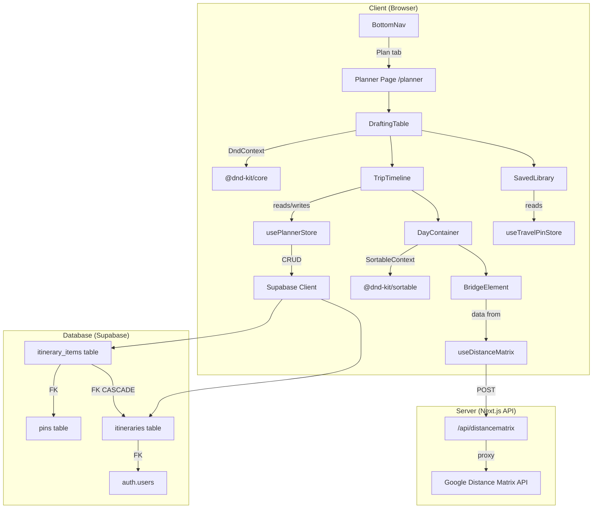
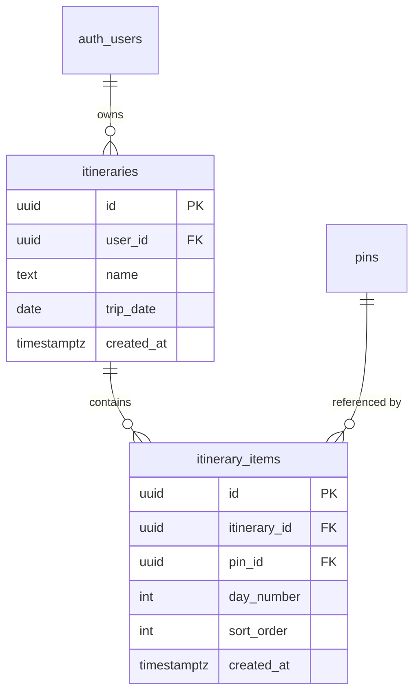

# Design Document: Itinerary Planner

## Overview

The Itinerary Planner extends YUPP from a pin-saving tool into a trip-planning platform. Users drag saved pins into day-by-day timelines, reorder stops, and see estimated travel times between consecutive locations. The feature introduces a `/planner` route with a dual-pane "Drafting Table" UI, a new Supabase schema (`itineraries` + `itinerary_items`), a dedicated Zustand store (`usePlannerStore`), drag-and-drop via `@dnd-kit`, and a Google Distance Matrix proxy for logistics.

The design follows existing codebase conventions: Zustand with `persist` middleware for state, `createClient()` from `@/utils/supabase/client` for browser-side Supabase access, `createClient()` from `@/utils/supabase/server` for API routes, Tailwind CSS with the established design tokens (`accent`, `surface`, `background`), and `framer-motion` for animations.

## Architecture



The architecture separates concerns into three layers:

1. **Data Layer**: Supabase tables with RLS, TypeScript types, and the Zustand planner store handle persistence and local state.
2. **Interaction Layer**: `@dnd-kit` manages drag-and-drop mechanics; the store translates drag events into state mutations.
3. **Presentation Layer**: React components render the dual-pane layout, day containers, and bridge elements. `framer-motion` handles layout animations.

## Components and Interfaces

### Component Hierarchy

```
Planner Page (/planner)
└── DraftingTable
    ├── DndContext (from @dnd-kit/core)
    │   ├── SavedLibrary
    │   │   ├── SearchInput
    │   │   └── DraggablePinCard[] (useDraggable)
    │   └── TripTimeline
    │       ├── ItineraryHeader (name, date, save/delete)
    │       ├── DayContainer[] (useDroppable + SortableContext)
    │       │   ├── SortablePlannedPinCard[] (useSortable)
    │       │   └── BridgeElement[] (between cards)
    │       └── AddDayButton
    └── DragOverlay (floating preview during drag)
```

### SavedLibrary

Reads pins from `useTravelPinStore`. Groups them by city/region extracted from the `address` field (splitting on the last comma-separated segment). Provides a text search input filtering by `title` or `address`. Each pin renders as a compact card with a 4:5 aspect-ratio image, title, and a "Drag to Plan" grip icon. The pane has its own `overflow-y-auto` scroll container.

```typescript
interface SavedLibraryProps {
  className?: string;
}
```

### TripTimeline

Reads `dayItems` from `usePlannerStore`. Renders a vertical list of `DayContainer` components, each labeled "Day N". Includes an "Add Day" button at the bottom. Has its own `overflow-y-auto` scroll container.

```typescript
interface TripTimelineProps {
  className?: string;
}
```

### DayContainer

A droppable zone (via `useDroppable`) wrapping a `SortableContext`. Renders `SortablePlannedPinCard` items as horizontal cards (64px thumbnail, title). Between consecutive cards, renders a `BridgeElement` showing travel time.

```typescript
interface DayContainerProps {
  dayNumber: number;
  pins: PlannedPin[];
  distanceData: DistanceSegment[];
}
```

### BridgeElement

Displays travel mode icon and duration between consecutive timeline cards. Receives data from `useDistanceMatrix`.

```typescript
interface BridgeElementProps {
  distance: string;   // e.g., "2.4 km"
  duration: string;   // e.g., "12 mins"
  mode: 'transit' | 'driving';
  isLoading?: boolean;
}
```

### DraftingTable

The top-level layout component. Wraps children in `DndContext`. On desktop (≥768px), renders `SavedLibrary` at 35% width and `TripTimeline` at 65% width in a horizontal flex. On mobile (<768px), stacks them vertically. Handles `onDragEnd` to dispatch the correct store action based on source/target.

```typescript
interface DraftingTableProps {
  // No external props — reads from stores directly
}
```

### Drag-and-Drop Event Handling

The `onDragEnd` handler in `DraftingTable` inspects the `active` and `over` data:

| Source | Target | Store Action |
|--------|--------|-------------|
| SavedLibrary pin | DayContainer | `addPinToDay(pin, dayNumber)` |
| PlannedPin in Day N | Same Day N (different position) | `reorderPinInDay(dayNumber, oldIndex, newIndex)` |
| PlannedPin in Day N | Day M (N ≠ M) | `movePinBetweenDays(sourceDay, targetDay, pinId, targetIndex)` |

Each draggable item carries metadata via `@dnd-kit`'s `data` prop:
- Library pins: `{ type: 'library-pin', pin: Pin }`
- Planned pins: `{ type: 'planned-pin', dayNumber: number, pinId: string }`


## Data Models

### Database Schema

#### `itineraries` table

```sql
CREATE TABLE itineraries (
  id         UUID        PRIMARY KEY DEFAULT gen_random_uuid(),
  user_id    UUID        NOT NULL REFERENCES auth.users(id),
  name       TEXT        NOT NULL,
  trip_date  DATE,
  created_at TIMESTAMPTZ DEFAULT now()
);

ALTER TABLE itineraries ENABLE ROW LEVEL SECURITY;

CREATE POLICY select_own_itineraries ON itineraries FOR SELECT USING (user_id = auth.uid());
CREATE POLICY insert_own_itineraries ON itineraries FOR INSERT WITH CHECK (user_id = auth.uid());
CREATE POLICY update_own_itineraries ON itineraries FOR UPDATE USING (user_id = auth.uid());
CREATE POLICY delete_own_itineraries ON itineraries FOR DELETE USING (user_id = auth.uid());
```

#### `itinerary_items` table

```sql
CREATE TABLE itinerary_items (
  id            UUID        PRIMARY KEY DEFAULT gen_random_uuid(),
  itinerary_id  UUID        NOT NULL REFERENCES itineraries(id) ON DELETE CASCADE,
  pin_id        UUID        NOT NULL REFERENCES pins(id),
  day_number    INT         DEFAULT 1,
  sort_order    INT         NOT NULL,
  created_at    TIMESTAMPTZ DEFAULT now()
);

ALTER TABLE itinerary_items ENABLE ROW LEVEL SECURITY;

CREATE POLICY select_own_itinerary_items ON itinerary_items FOR SELECT
  USING (itinerary_id IN (SELECT id FROM itineraries WHERE user_id = auth.uid()));
CREATE POLICY insert_own_itinerary_items ON itinerary_items FOR INSERT
  WITH CHECK (itinerary_id IN (SELECT id FROM itineraries WHERE user_id = auth.uid()));
CREATE POLICY update_own_itinerary_items ON itinerary_items FOR UPDATE
  USING (itinerary_id IN (SELECT id FROM itineraries WHERE user_id = auth.uid()));
CREATE POLICY delete_own_itinerary_items ON itinerary_items FOR DELETE
  USING (itinerary_id IN (SELECT id FROM itineraries WHERE user_id = auth.uid()));
```

#### ER Diagram



### TypeScript Types

Added to `src/types/index.ts` alongside existing `Pin`, `Collection`, etc.:

```typescript
export interface Itinerary {
  id: string;
  userId: string;
  name: string;
  tripDate: string | null;
  createdAt: string;
}

export interface ItineraryItem {
  id: string;
  itineraryId: string;
  pinId: string;
  dayNumber: number;
  sortOrder: number;
  createdAt: string;
}

/** A Pin enriched with its placement in an itinerary day. */
export type PlannedPin = Pin & {
  day_number: number;
  sort_order: number;
  itinerary_item_id: string;
};
```

### Zustand Planner Store (`usePlannerStore`)

Located at `src/store/usePlannerStore.ts`. Follows the same pattern as `useTravelPinStore` — `create()` from Zustand with typed state and actions.

```typescript
interface PlannerStore {
  // State
  activeItinerary: Itinerary | null;
  dayItems: Record<number, PlannedPin[]>;  // keyed by day number
  hasUnsavedChanges: boolean;
  itineraries: Itinerary[];

  // Local mutation actions
  addPinToDay: (pin: Pin, dayNumber: number) => void;
  reorderPinInDay: (dayNumber: number, oldIndex: number, newIndex: number) => void;
  movePinBetweenDays: (sourceDay: number, targetDay: number, pinId: string, targetIndex: number) => void;
  removePinFromDay: (dayNumber: number, pinId: string) => void;
  addDay: () => void;

  // Supabase CRUD actions
  createItinerary: (name: string, tripDate?: string) => Promise<void>;
  fetchItineraries: () => Promise<void>;
  loadItinerary: (itineraryId: string) => Promise<void>;
  saveItinerary: () => Promise<void>;
  deleteItinerary: (itineraryId: string) => Promise<void>;
  renameItinerary: (itineraryId: string, newName: string) => Promise<void>;
}
```

**Key behaviors:**

- `addPinToDay`: Creates a `PlannedPin` from the given `Pin`, assigns `sort_order` = length of target day array, appends to `dayItems[dayNumber]`, sets `hasUnsavedChanges = true`.
- `reorderPinInDay`: Removes the pin at `oldIndex`, splices it at `newIndex`, then recalculates `sort_order` for all pins in that day (index-based: 0, 1, 2, ...). Sets `hasUnsavedChanges = true`.
- `movePinBetweenDays`: Removes pin from `dayItems[sourceDay]`, inserts into `dayItems[targetDay]` at `targetIndex`, recalculates `sort_order` for both days. Sets `hasUnsavedChanges = true`.
- `removePinFromDay`: Filters out the pin, recalculates `sort_order` for remaining pins.
- `addDay`: Finds the max day number in `dayItems` keys, adds `dayItems[max + 1] = []`.
- `saveItinerary`: Upserts all `PlannedPin` entries as `itinerary_items` rows via Supabase, resets `hasUnsavedChanges = false`.
- `loadItinerary`: Fetches itinerary + items, joins with pins data, populates `dayItems` grouped by `day_number` and sorted by `sort_order`.

### Distance Matrix API Route

**Endpoint:** `POST /api/distancematrix`

**Request body:**
```typescript
interface DistanceMatrixRequest {
  coordinates: { lat: number; lng: number }[];
  mode: 'transit' | 'driving';
}
```

**Response body:**
```typescript
interface DistanceSegment {
  distance: string;   // e.g., "2.4 km"
  duration: string;   // e.g., "12 mins"
  status: string;     // "OK" or error status
}

interface DistanceMatrixResponse {
  segments: DistanceSegment[];
}

// Error response
interface DistanceMatrixError {
  error: string;
  details?: string;
}
```

The route uses `createClient()` from `@/utils/supabase/server` for auth verification, then proxies to the Google Distance Matrix API using the `GOOGLE_PLACES_API_KEY` environment variable (same key used by the existing geocode action). For N coordinates, it computes N-1 consecutive origin→destination pairs.

### `useDistanceMatrix` Hook

Located at `src/hooks/useDistanceMatrix.ts`.

```typescript
function useDistanceMatrix(
  pins: PlannedPin[],
  mode: 'transit' | 'driving'
): {
  segments: DistanceSegment[];
  isLoading: boolean;
  error: string | null;
}
```

- Extracts consecutive coordinate pairs from the `pins` array.
- Calls `POST /api/distancematrix` when the pin order changes (tracked via a serialized key of `pin.id + sort_order` values).
- Uses `useEffect` with a dependency on the serialized key to avoid redundant API calls.
- Returns loading/error states for the `BridgeElement` to display.

### BottomNav Integration

The existing `BottomNav` component's `activeTab` union type expands from `"discover" | "add" | "profile"` to `"discover" | "add" | "profile" | "plan"`. A new "Plan" button with the `CalendarDays` icon from `lucide-react` is added. When tapped, `AppLayout` navigates to `/planner` using `next/navigation`'s `useRouter`.

### Mobile-Responsive Layout Strategy

| Breakpoint | Layout | Behavior |
|-----------|--------|----------|
| ≥768px (md) | Horizontal flex: SavedLibrary 35% / TripTimeline 65% | Side-by-side panes, each with independent scroll |
| <768px | Vertical stack: SavedLibrary top / TripTimeline bottom | Each pane gets ~50vh, independent scroll, safe-area insets applied |

The Planner Page container uses:
- `h-screen` / `h-[100dvh]` for full viewport
- `pt-[env(safe-area-inset-top)]` and `pb-[env(safe-area-inset-bottom)]` for device chrome
- `overflow-hidden` on the outer container; `overflow-y-auto` on each pane individually

This matches the existing `AppLayout` pattern of `h-[100dvh] overflow-hidden`.


## Correctness Properties

*A property is a characteristic or behavior that should hold true across all valid executions of a system — essentially, a formal statement about what the system should do. Properties serve as the bridge between human-readable specifications and machine-verifiable correctness guarantees.*

### Property 1: Adding a pin to a day grows that day's array by one

*For any* valid Pin and any day number, calling `addPinToDay(pin, dayNumber)` on the planner store SHALL result in `dayItems[dayNumber].length` increasing by exactly 1, the last element having the pin's `id`, and `hasUnsavedChanges` being `true`.

**Validates: Requirements 4.2**

### Property 2: Reordering within a day preserves all pins and produces sequential sort_order

*For any* day containing N PlannedPins (N ≥ 2) and any valid `oldIndex`/`newIndex` pair (0 ≤ oldIndex, newIndex < N, oldIndex ≠ newIndex), calling `reorderPinInDay(dayNumber, oldIndex, newIndex)` SHALL produce a day array of the same length N where: (a) the set of pin IDs is unchanged, (b) `sort_order` values are exactly `[0, 1, 2, ..., N-1]`, and (c) the pin originally at `oldIndex` is now at `newIndex`.

**Validates: Requirements 4.3**

### Property 3: Moving a pin between days preserves total pin count and produces sequential sort_order in both days

*For any* two distinct days (source with S pins, target with T pins) and any pin in the source day and any valid target index (0 ≤ targetIndex ≤ T), calling `movePinBetweenDays(sourceDay, targetDay, pinId, targetIndex)` SHALL result in: (a) source day having S-1 pins, (b) target day having T+1 pins, (c) both days having sequential `sort_order` values `[0, 1, ..., length-1]`, and (d) the moved pin appearing at `targetIndex` in the target day.

**Validates: Requirements 4.4**

### Property 4: Loading itinerary items groups by day_number and sorts by sort_order

*For any* array of itinerary items with arbitrary `day_number` and `sort_order` values, the hydration logic SHALL produce a `dayItems` record where: (a) every item appears in exactly the group matching its `day_number`, (b) within each group, items are sorted in ascending `sort_order`, and (c) the total count of items across all groups equals the input array length.

**Validates: Requirements 4.6**

### Property 5: Pin grouping by city/region places all pins with the same region into the same group

*For any* set of pins with `address` fields, the grouping function SHALL produce groups where: (a) every pin in a group shares the same derived city/region key, and (b) every pin appears in exactly one group.

**Validates: Requirements 6.2**

### Property 6: Search filter returns exactly the pins matching the query

*For any* set of pins and any non-empty search query string, the filter function SHALL return only pins whose `title` or `address` contains the query (case-insensitive), and no matching pin shall be excluded from the results.

**Validates: Requirements 6.3**

### Property 7: Adding a day increases the day count by one

*For any* planner state with N days, calling `addDay()` SHALL result in the store having N+1 day keys, and the new day key SHALL be `max(existing keys) + 1` with an empty array.

**Validates: Requirements 7.2**

### Property 8: N coordinates produce exactly N-1 consecutive-pair distance segments

*For any* array of N coordinates (N ≥ 2), the distance matrix proxy logic SHALL produce exactly N-1 origin→destination pairs, where pair `i` has origin = `coordinates[i]` and destination = `coordinates[i+1]`.

**Validates: Requirements 9.2**

## Error Handling

| Scenario | Component | Behavior |
|----------|-----------|----------|
| Supabase CRUD failure (create/save/delete/rename) | `usePlannerStore` | Catch error, log to console, show toast notification. Local state remains unchanged on failure. `hasUnsavedChanges` stays `true` if save fails. |
| Supabase fetch failure (load itinerary/fetch list) | `usePlannerStore` | Catch error, log to console, show toast. Store retains previous state. |
| Google Distance Matrix API error | `/api/distancematrix` | Return `{ error: string, details?: string }` with appropriate HTTP status (502 for upstream failure, 400 for bad input). |
| Google Distance Matrix non-OK element status | `/api/distancematrix` | Include the element-level status in the `DistanceSegment.status` field. `BridgeElement` shows "—" instead of duration. |
| `useDistanceMatrix` fetch failure | `useDistanceMatrix` | Set `error` state, `isLoading = false`. `BridgeElement` renders a muted "Unable to calculate" message. |
| Empty coordinates array (< 2 pins in day) | `/api/distancematrix` | Return 400 with `{ error: "At least 2 coordinates required" }`. Hook skips the call entirely if pins < 2. |
| Drag-and-drop to invalid target | `DraftingTable` `onDragEnd` | If `over` is null or unrecognized, no-op. No store mutation. |
| Pin already exists in itinerary | `addPinToDay` | Allow duplicates — a user may want to revisit a location on different days. Each gets a unique `itinerary_item_id`. |
| Network offline during save | `usePlannerStore` | Supabase client throws; caught by save handler. Toast: "Save failed — check your connection". `hasUnsavedChanges` remains `true`. |

## Testing Strategy

### Unit Tests (Example-Based)

- **Store initial state**: Verify `usePlannerStore` initializes with `activeItinerary: null`, `dayItems: {}`, `hasUnsavedChanges: false`.
- **DnD event routing**: Simulate `onDragEnd` events and verify the correct store action is dispatched for library→day, same-day reorder, and cross-day move scenarios.
- **API route input validation**: Test `/api/distancematrix` rejects empty coordinates, invalid mode values, and malformed bodies.
- **API route error handling**: Mock Google API errors and verify structured error responses.
- **Component rendering**: Verify `SavedLibrary`, `TripTimeline`, `DayContainer`, and `BridgeElement` render expected elements given mock data.
- **BottomNav**: Verify "Plan" tab renders and triggers navigation callback.

### Property-Based Tests (via `fast-check`)

The project already has `fast-check` v4.7.0 installed as a dev dependency. Each property test runs a minimum of 100 iterations.

Each property test is tagged with a comment:
```
// Feature: itinerary-planner, Property N: <property text>
```

Properties to implement:
1. **Property 1**: `addPinToDay` grows day array by 1 — generate random `Pin` objects and day numbers.
2. **Property 2**: `reorderPinInDay` preserves pins and produces sequential sort_order — generate random day arrays and valid index pairs.
3. **Property 3**: `movePinBetweenDays` preserves total count and sequential sort_order — generate random source/target days and move parameters.
4. **Property 4**: Itinerary item hydration groups by day and sorts by sort_order — generate random item arrays.
5. **Property 5**: Pin grouping by city/region — generate random pins with various address formats.
6. **Property 6**: Search filter correctness — generate random pin sets and query strings.
7. **Property 7**: `addDay` increases day count by 1 — generate random initial day states.
8. **Property 8**: Consecutive-pair extraction produces N-1 segments from N coordinates — generate random coordinate arrays.

### Integration Tests

- Supabase CRUD operations (create, load, save, delete, rename itinerary) with mocked Supabase client.
- Distance Matrix API route end-to-end with mocked Google API responses.
- RLS policy verification (if running against a test Supabase instance).

