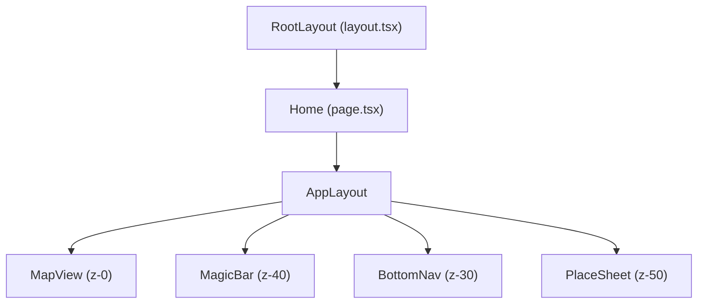
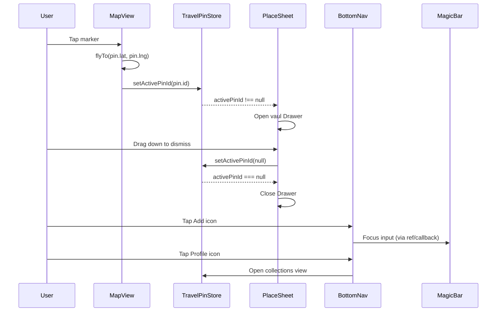

# Design Document: Mobile App Shell

## Overview

This design converts the Travel Pin Board from a traditional web layout into a mobile-first "App Shell" using a layer-cake architecture. The map becomes a permanently fixed background (z-index 0), and all interactive UI — navigation, search, place details — floats above it in fixed-position elements and bottom sheets.

The key architectural change is replacing the current inline layout in `page.tsx` (which shifts the map when the drawer opens) with a new `AppLayout.tsx` component that establishes a strict z-index stacking order. The existing `CollectionDrawer` desktop slide-in panel and `MarkerPopover` popup are replaced by mobile-native patterns: a pill-shaped bottom navigation bar and a `vaul`-powered bottom sheet for place details.

### Key Design Decisions

1. **Viewport Lock via CSS** — Rather than JavaScript-based viewport management, we lock the viewport using CSS properties on `html`/`body` (`100dvh`, `overflow: hidden`, `position: fixed`, `overscroll-behavior: none`, `touch-action: none`). This prevents iOS Safari address-bar layout shifts and browser bounce without runtime overhead.

2. **vaul Drawer for PlaceSheet** — We reuse the already-installed `vaul` library for the bottom sheet. vaul handles drag-to-dismiss, snap points, and scroll locking out of the box, avoiding a custom gesture implementation.

3. **Zustand `activePinId` as transient state** — The active pin selection is UI-only state that should not survive page reloads. We add it to the store but exclude it from the `partialize` function in the persist middleware.

4. **Remove MarkerPopover, keep flyTo** — Marker clicks now set `activePinId` instead of calling `showMarkerPopover`. The cinematic `flyTo` animation is preserved. The `MarkerPopover.tsx` file becomes unused and can be removed.

## Architecture

### Layer-Cake Stacking Model

```
┌─────────────────────────────────────┐
│  z-50  PlaceSheet (vaul Drawer)     │  ← Topmost when open
├─────────────────────────────────────┤
│  z-40  MagicBar                     │  ← Floating search input
├─────────────────────────────────────┤
│  z-30  BottomNav                    │  ← Pill-shaped nav bar
├─────────────────────────────────────┤
│  z-0   MapView (full-screen)        │  ← Always-mounted background
└─────────────────────────────────────┘
```

### Component Tree



### Data Flow



## Components and Interfaces

### 1. AppLayout (`src/components/AppLayout.tsx`)

Client component that replaces the current inline layout in `page.tsx`. Establishes the layer-cake architecture.

```typescript
interface AppLayoutProps {
  children?: React.ReactNode; // Not used — all children are internal
}
```

Responsibilities:
- Renders `MapView` as full-screen background at z-0
- Renders `MagicBar` at z-40
- Renders `BottomNav` at z-30
- Renders `PlaceSheet` at z-50
- Holds the `MapViewRef` for resize/flyTo coordination

### 2. BottomNav (`src/components/BottomNav.tsx`)

Pill-shaped floating navigation bar at the bottom of the viewport.

```typescript
interface BottomNavProps {
  activeTab: 'discover' | 'add' | 'profile';
  onTabChange: (tab: 'discover' | 'add' | 'profile') => void;
}
```

Visual specs:
- `position: absolute`, `bottom: 1.5rem`, centered horizontally
- Glassmorphism: `bg-white/80 backdrop-blur-xl border border-white/20`
- `rounded-full` pill shape
- Three Lucide icons: `Compass` (Discover), `PlusCircle` (Add), `User` (Profile)
- `PlusCircle` always rendered in accent color `#6366F1`
- `Compass` and `User` in `#000000` by default, with active state indicator
- z-index 30

Behavior:
- Discover tap: sets active tab indicator
- Add tap: triggers MagicBar focus via callback
- Profile tap: opens collections view (future — for now, toggles drawer state)

### 3. PlaceSheet (`src/components/PlaceSheet.tsx`)

Bottom sheet for displaying active pin details, built on `vaul` Drawer.

```typescript
interface PlaceSheetProps {
  pin: Pin | null;       // The active pin to display, or null when closed
  onDismiss: () => void; // Called when user drags sheet down
}
```

Visual specs:
- Full-bleed hero image in top half
- Title with `text-2xl tracking-tight`
- `primaryType` displayed as rounded pill badge (when present)
- `rating` displayed as numeric value (when present)
- "View Source" button with accent background `#6366F1`
- z-index 50

Behavior:
- Opens automatically when `pin` prop is non-null
- Closes on drag-down dismiss → calls `onDismiss`
- "View Source" opens `pin.sourceUrl` in new tab via `window.open`

### 4. MagicBar (refactored — `src/components/MagicBar.tsx`)

Existing component with positioning and shadow changes.

Changes:
- Position: `top: 3rem` (Tailwind `top-12`) instead of current `top-4`
- Add `shadow-xl` for prominent floating appearance
- z-index remains 40
- All existing functionality (URL input, processing animation, clarification UI) preserved
- Add `ref` forwarding or `onFocusRequest` callback so BottomNav can trigger focus

### 5. MapView (modified — `src/components/MapView.tsx`)

Changes:
- Marker click handler: call `setActivePinId(pin.id)` instead of `showMarkerPopover(map, pin)`
- Remove import of `showMarkerPopover` / `MarkerPopover`
- Keep `flyTo` animation on marker click
- Keep `flyTo` animation on new pin creation

### 6. Viewport Lock (CSS changes — `src/app/globals.css`)

CSS-only changes to `html` and `body`:

```css
html {
  overflow: hidden;
  height: 100%;
}

body {
  height: 100dvh;
  width: 100vw;
  overflow: hidden;
  position: fixed;
  overscroll-behavior: none;
  touch-action: none;
}
```

## Data Models

### Store Changes (`useTravelPinStore.ts`)

New state field:
```typescript
activePinId: string | null  // initialized to null
```

New action:
```typescript
setActivePinId: (pinId: string | null) => void
```

The `partialize` function in the persist middleware must exclude `activePinId` (it is transient UI state):

```typescript
partialize: (state) => ({
  pins: state.pins,
  collections: state.collections,
  // activePinId intentionally excluded
})
```

### Derived State

The active pin object is derived in consuming components:
```typescript
const activePinId = useTravelPinStore((s) => s.activePinId);
const pins = useTravelPinStore((s) => s.pins);
const activePin = pins.find((p) => p.id === activePinId) ?? null;
```

### No New Types Required

All existing types (`Pin`, `Collection`, etc.) are sufficient. No new interfaces are needed in `src/types/index.ts`.

### BottomNav Active Tab State

The active tab for BottomNav is local component state within `AppLayout`, not persisted to the store. It defaults to `'discover'`.

```typescript
const [activeTab, setActiveTab] = useState<'discover' | 'add' | 'profile'>('discover');
```

## Correctness Properties

*A property is a characteristic or behavior that should hold true across all valid executions of a system — essentially, a formal statement about what the system should do. Properties serve as the bridge between human-readable specifications and machine-verifiable correctness guarantees.*

### Property 1: setActivePinId round-trip

*For any* value of type `string | null`, calling `setActivePinId(value)` on the Travel_Pin_Store and then reading `activePinId` from the store SHALL return the same value.

**Validates: Requirements 6.2**

### Property 2: activePinId persistence exclusion

*For any* sequence of store operations that set `activePinId` to arbitrary `string | null` values, the persisted state in localStorage SHALL never contain an `activePinId` key.

**Validates: Requirements 6.5**

## Error Handling

### PlaceSheet

- If `activePinId` references a pin ID that no longer exists in the store (e.g., pin was deleted), the derived `activePin` will be `null` and the sheet will remain closed. No error state needed.
- If the pin's `imageUrl` fails to load, display a fallback placeholder (consistent with existing `VisualMarker` fallback pattern).
- If `window.open` fails for the "View Source" button (popup blocker), degrade gracefully — no crash, no error toast needed.

### BottomNav

- No error states. All interactions are local state changes or callbacks. If a callback is not provided, the tap is a no-op.

### MagicBar

- Existing error handling (invalid URL, scrape failure, geocode failure) is preserved unchanged.
- The only change is positioning — no new error paths introduced.

### Viewport Lock

- CSS-only — no runtime error paths. If `100dvh` is unsupported in an older browser, the fallback `100vh` from the existing `height: 100%` on `html` provides a reasonable degradation.

### MapView Marker Click

- If `setActivePinId` is called with a pin ID and the pin is subsequently deleted before PlaceSheet reads it, the derived `activePin` is `null` and the sheet stays closed. This is a race condition that resolves safely.

## Testing Strategy

### Property-Based Tests (fast-check, minimum 100 iterations each)

Property-based testing applies to the Zustand store logic where universal properties hold across all inputs.

Library: `fast-check` (already installed as dev dependency)
Runner: `vitest` (already installed)

Each property test must:
- Run minimum 100 iterations
- Reference its design document property in a tag comment
- Use `fast-check` arbitraries to generate random inputs

Tests:
1. **Property 1: setActivePinId round-trip** — Generate random `string | null` values via `fc.option(fc.string())`, call `setActivePinId`, assert `getState().activePinId` equals the input.
   - Tag: `Feature: mobile-app-shell, Property 1: setActivePinId round-trip`

2. **Property 2: activePinId persistence exclusion** — Generate random `string | null` values, call `setActivePinId`, serialize the partialize output, assert `activePinId` key is absent.
   - Tag: `Feature: mobile-app-shell, Property 2: activePinId persistence exclusion`

### Unit Tests (vitest, example-based)

- **BottomNav rendering**: Verify three icons rendered, correct colors, pill shape classes, glassmorphism classes
- **BottomNav interactions**: Verify Discover/Add/Profile tap callbacks fire with correct arguments
- **PlaceSheet conditional rendering**: Verify primaryType badge shown/hidden, rating shown/hidden, image displayed, title styled
- **PlaceSheet open/close**: Verify sheet opens when pin is non-null, stays closed when null
- **PlaceSheet "View Source"**: Verify button opens sourceUrl in new tab
- **MagicBar positioning**: Verify `top-12` and `shadow-xl` classes applied
- **Store initialization**: Verify `activePinId` starts as `null`

### Integration Tests (manual / visual)

- Viewport lock: Verify no scroll bounce on iOS Safari, no address-bar layout shift
- Full flow: Tap marker → flyTo → PlaceSheet opens → drag dismiss → sheet closes
- BottomNav Add tap → MagicBar receives focus
- Z-index stacking: PlaceSheet overlays BottomNav, BottomNav overlays Map

### What We Don't Test with PBT

- CSS styling and positioning (smoke/example tests)
- Component rendering and composition (example tests)
- MapLibre GL JS interactions (integration tests)
- vaul Drawer gesture handling (covered by vaul's own tests)

