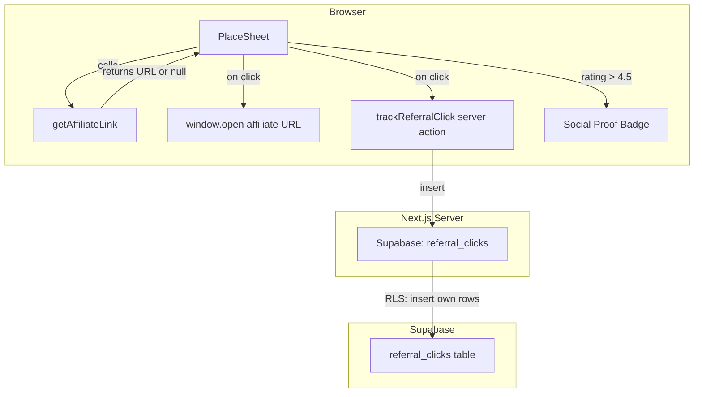

# Design Document: Monetization Engine

## Overview

The Monetization Engine adds revenue-generating affiliate links to the travel workstation by embedding contextual booking buttons into the PlaceSheet component. The system consists of four interconnected pieces:

1. **Affiliate Link Utility** (`src/utils/affiliateLinks.ts`) — a pure function `getAffiliateLink` that maps a Pin's `primaryType` to a platform-specific deep-link search URL (Booking.com for hotels, Klook/Viator for attractions, TripAdvisor/OpenTable for restaurants). Returns `null` for unrecognized or missing types.
2. **PlaceSheet Upgrade** (`src/components/PlaceSheet.tsx`) — adds a branded "Plan Your Visit" section with platform-colored CTA buttons (Book Stay, Get Tickets, Reserve Table) and a social proof badge for highly-rated pins.
3. **Click Tracking Infrastructure** — a new Supabase migration (`0004_referral_clicks.sql`) creating the `referral_clicks` table, plus a server action `trackReferralClick` that fire-and-forget inserts a row on each affiliate click.
4. **Social Proof Badges** — a "🔥 Popular" pill badge rendered in the PlaceSheet header when a pin's rating exceeds 4.5.

### Design Rationale

- **Pure utility function**: `getAffiliateLink` is a pure function with no side effects — it takes a Pin and returns a URL string or null. This makes it trivially testable with property-based tests and keeps the PlaceSheet component thin.
- **Fire-and-forget tracking**: The click tracker uses a non-blocking pattern — the affiliate link opens immediately via `window.open`, and the tracking insert happens in parallel. If tracking fails, the user experience is unaffected.
- **Null user_id for anonymous clicks**: Rather than silently dropping anonymous clicks, we record them with `user_id = null`. This preserves analytics completeness while respecting the unauthenticated state.
- **Category matching via substring**: Using `includes()` on `primaryType` (e.g., checking if it contains "hotel") is intentional — Google Places API returns types like `"hotel"`, `"lodging"`, `"tourist_attraction"`, and this approach handles compound types gracefully without maintaining an exhaustive enum.

## Architecture



### Request Flow — Affiliate Button Click

1. User opens PlaceSheet for a pin.
2. `getAffiliateLink(pin)` is called — returns a URL or `null`.
3. If URL exists, a branded button renders under "Plan Your Visit".
4. User taps button → `window.open(url, '_blank', 'noopener,noreferrer')` fires immediately.
5. In parallel, `trackReferralClick({ pinId, platformName })` server action is called (fire-and-forget, errors caught silently).
6. Server action reads auth session (nullable), inserts row into `referral_clicks`.

### Request Flow — Social Proof Badge

1. PlaceSheet receives a `pin` prop.
2. If `pin.rating` exists and is `> 4.5`, render the "🔥 Popular" badge in the header area.
3. No server interaction needed — purely client-side rendering based on existing pin data.

## Components and Interfaces

### 1. Affiliate Link Utility

**Location**: `src/utils/affiliateLinks.ts`

```typescript
import type { Pin } from '@/types';

export interface AffiliateLinkResult {
  url: string;
  platformName: string;
  label: string;
  bgColor: string;
}

/**
 * Pure function: maps a Pin's primaryType to an affiliate deep-link.
 * Returns null if no matching category or missing primaryType.
 */
export function getAffiliateLink(pin: Pin): AffiliateLinkResult | null;

/**
 * Extracts the city component from a pin's address string.
 * Heuristic: takes the second-to-last comma-separated segment,
 * or the full address if no commas.
 */
export function extractCity(address: string): string;
```

Category mapping:
| primaryType contains | Platform | Label | Background |
|---------------------|----------|-------|------------|
| `"hotel"` or `"lodging"` | Booking.com | "Book Stay" | `#003580` |
| `"restaurant"` or `"food"` or `"cafe"` | TripAdvisor | "Reserve Table" | `#34E0A1` |
| `"tourist_attraction"` or `"museum"` or `"park"` | Klook | "Get Tickets" | `#FF5B00` |

URL templates:
- Booking.com: `https://www.booking.com/searchresults.html?ss={encodedTitle}+{encodedCity}`
- TripAdvisor: `https://www.tripadvisor.com/Search?q={encodedTitle}+{encodedCity}`
- Klook: `https://www.klook.com/search/?query={encodedTitle}+{encodedCity}`

When `address` is undefined, the city component is omitted and only the title is used.

### 2. PlaceSheet Upgrade

**Location**: `src/components/PlaceSheet.tsx` (modified)

Changes:
- Import `getAffiliateLink` from `@/utils/affiliateLinks`.
- Import `trackReferralClick` from `@/actions/trackReferralClick`.
- Add social proof badge rendering in the header area (after title, before address).
- Add "Plan Your Visit" section between the description/vibe section and the meta row.
- Affiliate button uses the `AffiliateLinkResult` to set label, background color, and href.
- On click: open link in new tab, fire-and-forget call to `trackReferralClick`.

### 3. Click Tracking Server Action

**Location**: `src/actions/trackReferralClick.ts`

```typescript
'use server';

export async function trackReferralClick(params: {
  pinId: string;
  platformName: string;
}): Promise<{ success: boolean }>;
```

Implementation:
1. Create Supabase server client via `createClient()` from `@/utils/supabase/server`.
2. Get current user session (nullable — anonymous clicks allowed).
3. Insert into `referral_clicks`: `{ user_id: session?.user?.id ?? null, pin_id: pinId, platform_name: platformName }`.
4. Return `{ success: true }` on success, `{ success: false }` on error (logged server-side).

### 4. Database Migration

**Location**: `supabase/migrations/0004_referral_clicks.sql`

```sql
CREATE TABLE referral_clicks (
  id            UUID        PRIMARY KEY DEFAULT gen_random_uuid(),
  user_id       UUID        REFERENCES auth.users(id),
  pin_id        UUID        NOT NULL,
  platform_name TEXT        NOT NULL,
  created_at    TIMESTAMPTZ DEFAULT now()
);

ALTER TABLE referral_clicks ENABLE ROW LEVEL SECURITY;

-- Allow authenticated users to insert their own rows
CREATE POLICY insert_own_referral_clicks ON referral_clicks
  FOR INSERT WITH CHECK (user_id = auth.uid());

-- Allow anonymous inserts (user_id is null)
CREATE POLICY insert_anon_referral_clicks ON referral_clicks
  FOR INSERT WITH CHECK (user_id IS NULL);

-- Service role can read all rows for analytics
-- (No SELECT policy for regular users — analytics is admin-only)
```

### 5. Social Proof Badge

Rendered inline in PlaceSheet — no separate component file needed.

```tsx
{pin.rating != null && pin.rating > 4.5 && (
  <span className="inline-flex items-center gap-1 px-2.5 py-1 bg-orange-50 text-orange-700 text-[11px] font-bold rounded-full">
    🔥 Popular
  </span>
)}
```

Placed in the header area near the title, after the `<h2>` and before the address `<p>`.

## Data Models

### New Table: `referral_clicks`

| Column | Type | Constraints | Description |
|--------|------|-------------|-------------|
| `id` | UUID | PK, default `gen_random_uuid()` | Unique click identifier |
| `user_id` | UUID | FK → `auth.users(id)`, nullable | Clicking user (null if anonymous) |
| `pin_id` | UUID | NOT NULL | The pin whose affiliate button was clicked |
| `platform_name` | TEXT | NOT NULL | e.g., `"booking.com"`, `"klook"`, `"tripadvisor"` |
| `created_at` | TIMESTAMPTZ | default `now()` | Click timestamp |

### New Type: `AffiliateLinkResult`

```typescript
export interface AffiliateLinkResult {
  url: string;          // Full affiliate deep-link URL
  platformName: string; // e.g., "booking.com"
  label: string;        // Button text, e.g., "Book Stay"
  bgColor: string;      // Hex color for button background
}
```

### Existing Types (unchanged)

| Type | Location | Relevant Fields |
|------|----------|-----------------|
| `Pin` | `src/types/index.ts` | `primaryType?`, `address?`, `rating?`, `title`, `id` |


## Correctness Properties

*A property is a characteristic or behavior that should hold true across all valid executions of a system — essentially, a formal statement about what the system should do. Properties serve as the bridge between human-readable specifications and machine-verifiable correctness guarantees.*

### Property 1: Category-to-platform mapping with correct URL construction

*For any* Pin with a `primaryType` containing a recognized category keyword (hotel/lodging, restaurant/food/cafe, tourist_attraction/museum/park) and any combination of `title` and optional `address`, `getAffiliateLink` SHALL return a result whose `url` starts with the correct platform base URL, whose decoded query/path contains the URI-encoded pin title, and whose decoded query/path contains the URI-encoded city extracted from the address (or omits the city component when address is undefined).

**Validates: Requirements 1.1, 1.2, 1.3, 1.6, 1.7**

### Property 2: Unrecognized or missing primaryType returns null

*For any* Pin whose `primaryType` is `undefined` or is a string that does not contain any of the recognized category keywords ("hotel", "lodging", "restaurant", "food", "cafe", "tourist_attraction", "museum", "park"), `getAffiliateLink` SHALL return `null`.

**Validates: Requirements 1.4, 1.5**

### Property 3: Affiliate URL round-trip validity

*For any* Pin that causes `getAffiliateLink` to return a non-null result, the `url` field SHALL be parseable by `new URL()` without throwing — i.e., it is always a valid, well-formed URL.

**Validates: Requirements 1.8**

## Error Handling

| Scenario | Component | Behavior |
|----------|-----------|----------|
| Pin has no `primaryType` | `getAffiliateLink` | Returns `null` — no affiliate button rendered |
| Pin has unrecognized `primaryType` | `getAffiliateLink` | Returns `null` — no affiliate button rendered |
| Pin has no `address` | `getAffiliateLink` | Returns URL with title only, no city component |
| Pin title contains special characters | `getAffiliateLink` | URI-encodes title — URL remains valid |
| `trackReferralClick` insert fails | PlaceSheet click handler | Affiliate link still opens; error logged server-side |
| User is not authenticated | `trackReferralClick` | Inserts row with `user_id = null` |
| Supabase client creation fails | `trackReferralClick` | Returns `{ success: false }`; link still opens |
| Pin is `null` | PlaceSheet | Component renders nothing (existing behavior) |

## Testing Strategy

### Property-Based Tests

Library: `fast-check` (already in devDependencies)
Minimum iterations: 100 per property

| Test File | Property | Tag |
|-----------|----------|-----|
| `src/utils/__tests__/affiliateLinks.pbt.test.ts` | Property 1: Category-to-platform mapping | Feature: monetization-engine, Property 1: Category-to-platform mapping with correct URL construction |
| `src/utils/__tests__/affiliateLinks.pbt.test.ts` | Property 2: Unrecognized types return null | Feature: monetization-engine, Property 2: Unrecognized or missing primaryType returns null |
| `src/utils/__tests__/affiliateLinks.pbt.test.ts` | Property 3: URL round-trip validity | Feature: monetization-engine, Property 3: Affiliate URL round-trip validity |

### Unit Tests (Example-Based)

| Test | Validates |
|------|-----------|
| Hotel-type pin renders "Book Stay" button with `#003580` background | Req 2.1 |
| Attraction-type pin renders "Get Tickets" button with `#FF5B00` background | Req 2.2 |
| Restaurant-type pin renders "Reserve Table" button with branded background | Req 2.3 |
| Affiliate link element has `target="_blank"` and `rel="noopener noreferrer"` | Req 2.4 |
| Pin with no matching category renders no affiliate button | Req 2.5 |
| "Plan Your Visit" header renders above affiliate button | Req 2.6 |
| Anonymous user click inserts row with null `user_id` | Req 3.3 |
| Tracking failure does not block affiliate link opening | Req 3.4 |
| Pin with rating 4.6 displays "🔥 Popular" badge | Req 4.1 |
| Pin with rating 4.5 does not display badge | Req 4.2 |
| Pin with undefined rating does not display badge | Req 4.3 |
| Badge has warm background and rounded-full styling | Req 4.4 |

### Integration Tests

| Test | Validates |
|------|-----------|
| Migration creates `referral_clicks` table with correct schema | Req 3.1 |
| `trackReferralClick` inserts row with correct pin_id and platform_name | Req 3.2 |
| RLS allows authenticated user to insert own referral click | Req 3.5 |
| RLS allows anonymous insert with null user_id | Req 3.5 |
