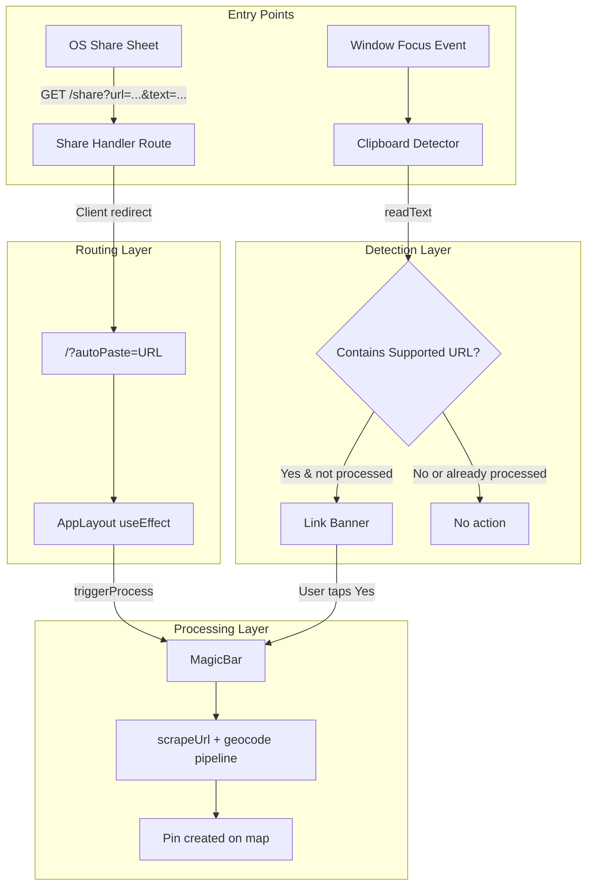

# Design Document: Native Share & Auto-Detect

## Overview

This feature enables YUPP Travel's PWA to receive shared links from the OS share sheet and detect travel-related URLs on the clipboard. The system registers as a Web Share Target via the PWA manifest, provides a `/share` handler route that redirects shared URLs into the main app via an `autoPaste` query parameter, and adds clipboard detection on window focus. A Link Banner UI prompts users to process detected links, and the MagicBar gains a programmatic `triggerProcess` method for external invocation.

The architecture follows a pipeline: **OS Share Sheet → /share route → autoPaste param → MagicBar.triggerProcess** for the share flow, and **Window Focus → Clipboard Read → Link Banner → MagicBar.triggerProcess** for the clipboard flow. Both converge on the same MagicBar processing logic, ensuring consistent behavior.

## Architecture



### Key Design Decisions

1. **Client-side redirect in /share route**: The share handler uses `'use client'` with `useEffect` + `router.replace` instead of a server-side redirect. This preserves SPA state (Zustand stores, map instance) that would be lost on a full page navigation.

2. **URL parsing utility as a pure function**: `extractSupportedUrl(text: string): string | null` is a standalone pure utility in `src/utils/urlParsing.ts`. Both the share handler and clipboard detector import it, ensuring consistent URL extraction logic. This function uses regex to find URLs in arbitrary text and validates them against `detectPlatform`.

3. **Processed links tracked in-memory via `useRef<Set<string>>`**: A `Set` stored in a ref inside AppLayout tracks URLs that have already been shown in the banner or processed. This prevents duplicate prompts within a session without persisting across reloads (which would be undesirable — users may want to re-share the same link in a new session).

4. **MagicBar `triggerProcess` reuses existing `handleSubmit` logic**: Rather than duplicating the scrape+geocode pipeline, `triggerProcess` sets the input value and invokes the same processing path. The only difference is the status text displayed ("Shared from [Platform]!" vs "Scanning for multiple spots...").

5. **Link Banner auto-dismiss with 8-second timeout**: Uses `setTimeout` inside a `useEffect` cleanup pattern. The timer resets if the banner is dismissed manually or the user taps "Yes".

## Components and Interfaces

### New Files

| File | Purpose |
|------|---------|
| `src/utils/urlParsing.ts` | Pure utility: `extractSupportedUrl(text)` extracts the first supported URL from arbitrary text |
| `src/app/share/page.tsx` | Client component: reads query params, extracts URL, redirects to `/?autoPaste=<url>` |
| `src/components/LinkBanner.tsx` | Animated banner component shown when clipboard contains a supported URL |

### Modified Files

| File | Change |
|------|--------|
| `public/manifest.json` | Add `share_target` object |
| `src/components/MagicBar.tsx` | Add `triggerProcess(url: string)` to `MagicBarRef`; add shared-link status text logic |
| `src/components/AppLayout.tsx` | Add `autoPaste` consumption on mount; add clipboard detection on `focus` event; render `LinkBanner`; track processed links |

### Interface Changes

```typescript
// MagicBarRef — extended
export interface MagicBarRef {
  focus: () => void;
  triggerProcess: (url: string) => void;
}
```

```typescript
// New: src/utils/urlParsing.ts
export function extractSupportedUrl(text: string): string | null;
```

```typescript
// New: LinkBanner props
export interface LinkBannerProps {
  url: string;
  platformName: string;
  onAccept: () => void;
  onDismiss: () => void;
}
```

### Component: Share Handler (`src/app/share/page.tsx`)

- `'use client'` component
- On mount, reads `searchParams` for `url` and `text`
- Calls `extractSupportedUrl(url)` first; if null, calls `extractSupportedUrl(text)`
- Redirects to `/?autoPaste=<extractedUrl>` or `/` if no supported URL found
- Uses `next/navigation` `useRouter().replace()` for client-side redirect

### Component: LinkBanner (`src/components/LinkBanner.tsx`)

- Receives `url`, `platformName`, `onAccept`, `onDismiss` props
- Renders at top of viewport below safe area inset (`top: max(1rem, env(safe-area-inset-top)) + MagicBar height offset`)
- Positioned at `z-[35]` (below MagicBar's `z-[40]` but above map)
- Uses `framer-motion` for enter/exit animations (slide down + fade)
- "Yes" button calls `onAccept`; tap-outside or X calls `onDismiss`
- Auto-dismisses after 8 seconds via `useEffect` timer

### Component: AppLayout Changes

- New `useEffect` for `autoPaste` param: reads from `window.location.search`, calls `magicBarRef.current?.triggerProcess(url)`, then removes param via `window.history.replaceState`
- New `useEffect` for clipboard detection: adds `focus` event listener on `window`, reads clipboard, checks against processed set, shows/hides LinkBanner
- New state: `bannerUrl: string | null`, `bannerPlatform: string`
- New ref: `processedLinksRef = useRef<Set<string>>(new Set())`

## Data Models

### Manifest share_target Addition

```json
{
  "share_target": {
    "action": "/share",
    "method": "GET",
    "params": {
      "title": "title",
      "text": "text",
      "url": "url"
    }
  }
}
```

### URL Parsing

The `extractSupportedUrl` function uses a regex pattern to find HTTP(S) URLs in text, then validates each candidate against `detectPlatform` from `src/actions/extractPlaces.ts`. The supported hostnames are:

- `instagram.com` and subdomains (e.g., `www.instagram.com`)
- `v.douyin.com`
- `xiaohongshu.com` and subdomains
- `xhslink.com` and subdomains

### State Flow

```
autoPaste flow:  URL param → triggerProcess(url) → MagicBar processing → Pin
clipboard flow:  focus → readText → extractSupportedUrl → LinkBanner → triggerProcess(url) → MagicBar processing → Pin
```

No new persistent data models are introduced. The `Processed_Links_Set` is ephemeral (in-memory `Set<string>` via `useRef`).


## Correctness Properties

*A property is a characteristic or behavior that should hold true across all valid executions of a system — essentially, a formal statement about what the system should do. Properties serve as the bridge between human-readable specifications and machine-verifiable correctness guarantees.*

### Property 1: URL extraction returns a valid supported URL or null

*For any* arbitrary string, `extractSupportedUrl(text)` SHALL return either `null` (if no supported URL is present) or a string that is a valid URL with a hostname matching one of the supported platforms (instagram.com, v.douyin.com, xiaohongshu.com, xhslink.com and their subdomains). If the input contains a supported URL embedded in surrounding text, the function SHALL extract it correctly.

**Validates: Requirements 8.1, 8.2, 8.3**

### Property 2: URL extraction round-trip with detectPlatform

*For any* string containing exactly one Supported_URL, calling `extractSupportedUrl` on the string and then calling `detectPlatform` on the result SHALL return a Platform value other than `'unknown'`.

**Validates: Requirements 8.4**

### Property 3: Share handler routing correctness

*For any* combination of `url` and `text` query parameters, the share handler SHALL redirect to `/?autoPaste=<URL>` if `extractSupportedUrl(url)` returns a non-null value, else if `extractSupportedUrl(text)` returns a non-null value, else redirect to `/` without `autoPaste`.

**Validates: Requirements 2.2, 2.3, 2.4**

### Property 4: Clipboard detection shows banner iff supported URL is unprocessed

*For any* clipboard text and processed links set, the Link Banner SHALL be displayed if and only if `extractSupportedUrl(clipboardText)` returns a non-null URL AND that URL is not in the processed links set.

**Validates: Requirements 4.2, 4.3, 4.4**

### Property 5: Processed links deduplication prevents repeat prompts

*For any* supported URL, once it has been added to the Processed_Links_Set (either by banner display or processing), subsequent clipboard detections of the same URL SHALL NOT display the Link Banner.

**Validates: Requirements 4.4, 4.6**

### Property 6: Platform name formatting

*For any* supported Platform value (`'instagram'`, `'douyin'`, `'xiaohongshu'`), `formatPlatformName(platform)` SHALL return the platform name with the first letter capitalized (e.g., `'Instagram'`, `'Douyin'`, `'Xiaohongshu'`).

**Validates: Requirements 5.1, 7.1**

## Error Handling

| Scenario | Behavior |
|----------|----------|
| Clipboard API unavailable or permission denied | Silently catch error; do not show Link Banner (Req 4.5) |
| `extractSupportedUrl` receives malformed text | Return `null`; no crash |
| `triggerProcess` called during active processing | Ignore the call; do not queue (Req 6.3) |
| `triggerProcess` called with empty string | Ignore the call (Req 6.4) |
| Share handler receives no `url` or `text` params | Redirect to `/` without `autoPaste` (Req 2.4) |
| `autoPaste` param contains non-supported URL | Ignore; do not call `triggerProcess` |
| Link Banner auto-dismiss timer fires after manual dismiss | No-op; timer cleanup in `useEffect` return |

## Testing Strategy

### Property-Based Tests (using `fast-check` with Vitest)

Property-based testing is well-suited for this feature because the core URL parsing utility is a pure function with a large input space (arbitrary strings containing URLs in various formats). The clipboard detection and share handler routing logic also have clear universal properties.

Each property test MUST run a minimum of 100 iterations and reference its design property.

**Tag format:** `Feature: native-share-auto-detect, Property {number}: {property_text}`

Properties to implement as PBT:
- **Property 1**: Generate arbitrary strings with/without embedded supported URLs → verify `extractSupportedUrl` returns valid URL or null
- **Property 2**: Generate strings with exactly one supported URL → verify round-trip with `detectPlatform`
- **Property 3**: Generate random `url`/`text` param combinations → verify share handler redirect logic
- **Property 4**: Generate clipboard text + processed sets → verify banner display logic
- **Property 5**: Generate supported URLs → add to processed set → verify no repeat banner
- **Property 6**: Test `formatPlatformName` across all platform values

### Unit Tests (Example-Based)

- Share handler reads query params correctly (Req 2.1)
- Share handler uses client-side redirect (Req 2.5)
- AppLayout consumes `autoPaste` param and calls `triggerProcess` (Req 3.1)
- AppLayout removes `autoPaste` param from URL (Req 3.2)
- AppLayout processes `autoPaste` at most once (Req 3.3)
- Clipboard detector calls `readText` on focus (Req 4.1)
- Clipboard detector adds URL to processed set after display (Req 4.6)
- Link Banner renders with correct text and buttons (Req 5.1, 5.2, 5.3)
- Link Banner positioning below safe area (Req 5.4)
- Link Banner dismisses on "Yes" tap (Req 5.5)
- Link Banner auto-dismisses after 8 seconds (Req 5.6)
- MagicBarRef exposes `triggerProcess` method (Req 6.1)
- `triggerProcess` sets input and starts processing (Req 6.2)
- `triggerProcess` ignored during active processing (Req 6.3)
- `triggerProcess` ignored for empty string (Req 6.4)
- Status text shows "Shared from [Platform]" for triggerProcess (Req 7.1)
- Status text shows "Scanning for multiple spots..." for manual paste (Req 7.2)
- `detectPlatform` is called before scrape step (Req 7.3)

### Smoke Tests

- Manifest contains `share_target` with correct structure (Req 1.1)
- Manifest retains all existing properties (Req 1.3)

### Edge Case Coverage (via PBT generators)

- Clipboard API throws error → silent failure (Req 4.5)
- Empty string input to `extractSupportedUrl` → null
- String with multiple supported URLs → returns first one
- URL with unusual subdomains (e.g., `www.instagram.com`, `m.xiaohongshu.com`)
- Text with URLs separated by newlines, tabs, or other whitespace
- `triggerProcess('')` → ignored
- `triggerProcess` while already processing → ignored
