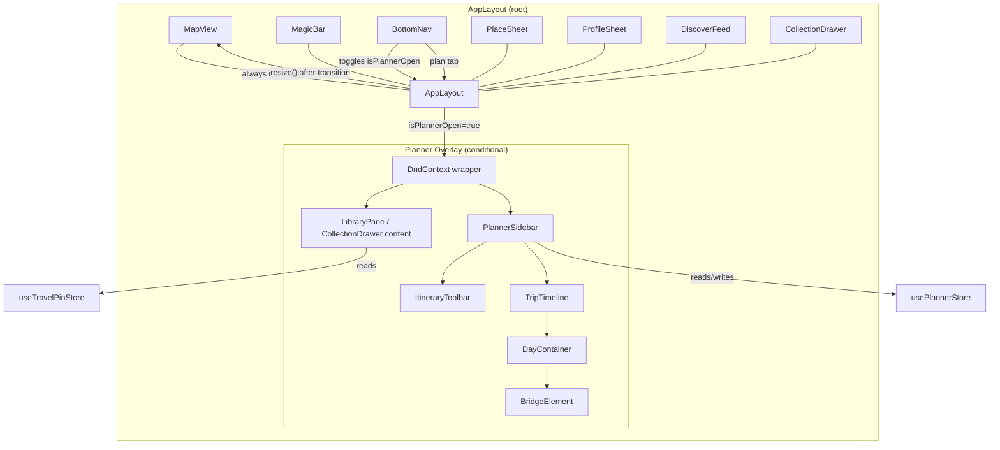

# Design Document: Planner Sidebar Overlay

## Overview

This feature pivots the Itinerary Planner from a standalone `/planner` route into a slide-in sidebar overlay within the main Map view. The map stays mounted, visible, and interactive while the planner is open — creating a "Command Center" experience where users can explore locations and plan simultaneously.

On desktop (≥768px), the planner renders as a right-anchored sidebar panel (max 400px) with a Framer Motion slide animation. On mobile (<768px), it renders as a full-screen vaul drawer. The existing `CollectionDrawer` (left side) serves as the drag source, and the planner sidebar/drawer hosts the `TripTimeline` as the drop target, all wrapped in a shared `DndContext`.

The `/planner` route is removed entirely; a Next.js middleware redirect sends any stale `/planner` URLs back to `/`. The `BottomNav` "Plan" tab toggles `isPlannerOpen` state instead of navigating to a separate page.

## Architecture



Key architectural decisions:

1. **No new route** — The planner lives entirely within `AppLayout` as a conditional overlay, eliminating the `/planner` page and its associated navigation complexity.
2. **Shared DndContext** — When the planner is open, a `DndContext` wraps both the `LibraryPane` (drag source) and the `TripTimeline` (drop target) so cross-component drag-and-drop works seamlessly.
3. **Responsive strategy** — Desktop uses Framer Motion `AnimatePresence` for the sidebar (matching the existing `CollectionDrawer` pattern). Mobile uses vaul (also matching `CollectionDrawer`).
4. **MapView.resize()** — Called after the sidebar transition completes (300ms) so MapLibre recalculates its container dimensions when the sidebar opens or closes.

## Components and Interfaces

### New Component: PlannerSidebar

A new component at `src/components/PlannerSidebar.tsx` that handles the responsive rendering of the planner overlay.

```typescript
interface PlannerSidebarProps {
  isOpen: boolean;
  onClose: () => void;
}
```

**Desktop behavior (≥768px):**
- Fixed-position panel, right edge, `max-w-[400px]`, `w-full`, full viewport height, `z-[80]`
- Framer Motion `AnimatePresence` with `initial={{ x: '100%' }}`, `animate={{ x: 0 }}`, `exit={{ x: '100%' }}`, `transition={{ duration: 0.3, ease: 'easeInOut' }}`
- Left-facing box shadow: `shadow-[-10px_0_40px_rgba(0,0,0,0.1)]`
- Contains `ItineraryToolbar` at top, `TripTimeline` as scrollable content below

**Mobile behavior (<768px):**
- Full-screen vaul `Drawer` with drag-to-dismiss
- `onOpenChange` syncs back to `isPlannerOpen` via `onClose`
- Contains same `ItineraryToolbar` + `TripTimeline` content

### Modified Component: AppLayout

Changes to `src/components/AppLayout.tsx`:

1. Add `isPlannerOpen` boolean state (default `false`)
2. Add `itinerariesLoaded` ref to track whether `fetchItineraries` has been called this session
3. Wrap `LibraryPane` + `PlannerSidebar` in a `DndContext` when `isPlannerOpen` is true
4. Modify `handleTabChange('plan')` to toggle `isPlannerOpen` instead of `router.push('/planner')`
5. Call `mapViewRef.current?.resize()` with a 300ms `setTimeout` when `isPlannerOpen` changes on desktop
6. Close other overlays (ProfileSheet, DiscoverFeed) when planner opens
7. Close planner when other overlays open

### Modified Component: BottomNav

No structural changes needed — `BottomNav` already supports the `'plan'` tab value and calls `onTabChange('plan')`. The behavior change is entirely in `AppLayout`'s `handleTabChange`.

### DnD Integration Strategy

When `isPlannerOpen` is true, `AppLayout` renders a `DndContext` that wraps:
- The `CollectionDrawer` content area (which contains `LibraryPane` as drag source)
- The `PlannerSidebar` (which contains `TripTimeline` with `DayContainer` drop targets)

The `onDragEnd` handler reuses the same logic from the existing `DraftingTable`:

| Source | Target | Store Action |
|--------|--------|-------------|
| LibraryPane pin | DayContainer | `addPinToDay(pin, dayNumber)` |
| PlannedPin in Day N | Same Day N | `reorderPinInDay(dayNumber, oldIndex, newIndex)` |
| PlannedPin in Day N | Day M | `movePinBetweenDays(sourceDay, targetDay, pinId, targetIndex)` |

The drag-and-drop event handling logic from `DraftingTable` will be extracted into a shared utility or hook so both the old `DraftingTable` (if kept for reference) and the new `AppLayout` DnD context can use it.

### Component Hierarchy (Planner Open State)

```
AppLayout
├── MapView (z-0, always mounted)
├── DndContext (when isPlannerOpen)
│   ├── CollectionDrawer (left side, drag source)
│   │   └── LibraryPane
│   │       └── DraggablePinCard[] (useDraggable)
│   └── PlannerSidebar (right side, z-80)
│       ├── ItineraryToolbar
│       └── TripTimeline (scrollable)
│           ├── DayContainer[] (useDroppable + SortableContext)
│           │   ├── TimelineCard[] (useSortable)
│           │   └── BridgeElement[]
│           └── AddDayButton
├── MagicBar (z-40)
├── BottomNav (z-90)
├── PlaceSheet (z-50, conditional)
├── ProfileSheet (z-50, conditional)
└── DiscoverFeed (z-50, conditional)
```

### Route Cleanup

1. Delete `src/app/planner/page.tsx`
2. Add a redirect rule in `src/middleware.ts`:
   ```typescript
   if (request.nextUrl.pathname === '/planner') {
     return NextResponse.redirect(new URL('/', request.url));
   }
   ```

### Viewport Detection

The `PlannerSidebar` component uses `window.matchMedia('(max-width: 767px)')` with an event listener (same pattern as `CollectionDrawer`) to determine mobile vs desktop rendering. This avoids SSR hydration mismatches by defaulting to desktop and updating on mount.

## Data Models

No new data models are introduced. This feature reuses all existing types and stores:

- **`usePlannerStore`** — Manages `activeItinerary`, `dayItems`, `hasUnsavedChanges`, `itineraries`, and all CRUD/mutation actions. No changes to the store interface.
- **`useTravelPinStore`** — Provides `pins` for the `LibraryPane` drag source. No changes.
- **`Pin`, `PlannedPin`, `Itinerary`** — Existing types from `src/types/index.ts`. No changes.

### State Management Additions

The only new state lives in `AppLayout`:

```typescript
// New state in AppLayout
const [isPlannerOpen, setIsPlannerOpen] = useState(false);
const itinerariesLoadedRef = useRef(false);
```

`isPlannerOpen` controls:
- Whether `PlannerSidebar` renders (desktop) or the vaul Drawer opens (mobile)
- Whether the `DndContext` wrapper is mounted
- The `activeTab` value in `BottomNav` (set to `'plan'` when open)
- MapView resize timing

`itinerariesLoadedRef` ensures `fetchItineraries()` is called only once per session when the planner first opens, avoiding redundant Supabase queries on repeated open/close cycles.

## Correctness Properties

*A property is a characteristic or behavior that should hold true across all valid executions of a system — essentially, a formal statement about what the system should do. Properties serve as the bridge between human-readable specifications and machine-verifiable correctness guarantees.*

### Property 1: Plan tab toggle is a boolean flip

*For any* sequence of "plan" tab taps starting from a known `isPlannerOpen` state, each tap SHALL flip `isPlannerOpen` to the opposite boolean value. After N taps, `isPlannerOpen` SHALL equal `N % 2 !== 0` if the initial state was `false`, or `N % 2 === 0` if the initial state was `true`.

**Validates: Requirements 1.1**

### Property 2: Opening the planner closes all other overlays

*For any* combination of overlay states (ProfileSheet open/closed, DiscoverFeed open/closed), when `isPlannerOpen` transitions to `true`, both `isProfileOpen` and `isDiscoverOpen` SHALL be `false`. The planner is mutually exclusive with all other overlays.

**Validates: Requirements 7.1**

## Error Handling

| Scenario | Component | Behavior |
|----------|-----------|----------|
| `fetchItineraries` fails on planner open | `AppLayout` | Caught by `usePlannerStore`; logs to console. Planner sidebar still opens with empty itinerary list. User can retry by closing and reopening. |
| Drag-and-drop to invalid target | `AppLayout` DnD handler | If `over` is null or unrecognized, no-op. No store mutation. Matches existing `DraftingTable` behavior. |
| MapView.resize() called before map is initialized | `MapView` | `resize()` checks `mapRef.current` is non-null before calling. Safe no-op if map hasn't loaded yet. |
| Viewport resize during sidebar animation | `PlannerSidebar` | `matchMedia` listener updates `isMobile` state. If viewport crosses 768px threshold while sidebar is animating, the component re-renders with the appropriate layout (sidebar vs drawer). |
| vaul Drawer dismiss while DnD is active | `PlannerSidebar` | vaul's `onOpenChange(false)` fires, setting `isPlannerOpen` to false. Any active drag is cancelled (DndContext unmounts). |
| `/planner` URL accessed directly | `middleware.ts` | Redirects to `/` before the page renders. No 404 or broken state. |
| Multiple rapid plan tab taps | `AppLayout` | React batches state updates. Each tap toggles `isPlannerOpen`. The 300ms resize timeout is cleared and re-set on each transition, so only the final state triggers a resize. |

## Testing Strategy

### Unit Tests (Example-Based)

- **BottomNav active state**: Render with `activeTab="plan"`, verify accent color and indicator dot. Render with `activeTab="add"`, verify plan tab has default styling.
- **PlannerSidebar desktop rendering**: At ≥768px viewport, verify fixed positioning, max-width 400px, z-index 80, shadow, and that ItineraryToolbar + TripTimeline are rendered.
- **PlannerSidebar mobile rendering**: At <768px viewport, verify vaul Drawer is rendered with ItineraryToolbar + TripTimeline content.
- **PlannerSidebar animation props**: Verify Framer Motion initial/animate/exit/transition values match spec (translate-x, 300ms, ease-in-out).
- **MapView.resize() timing**: Mock `MapViewRef.resize`, toggle `isPlannerOpen`, advance timers by 300ms, verify `resize()` was called exactly once.
- **Itinerary fetch on first open**: Mock `fetchItineraries`, open planner twice, verify it's called only on the first open.
- **Overlay mutual exclusivity**: Open ProfileSheet, then tap Plan — verify ProfileSheet closes and planner opens. Open planner, then tap Discover — verify planner closes and DiscoverFeed opens.
- **Plan tab toggle-off resets to "add"**: Set `isPlannerOpen=true`, tap Plan, verify `isPlannerOpen=false` and `activeTab="add"`.
- **Middleware redirect**: Send request to `/planner`, verify redirect response to `/`.
- **DnD event routing**: Simulate `onDragEnd` events for library→day, same-day reorder, and cross-day move — verify correct store actions are called.

### Property-Based Tests (via `fast-check`)

The project has `fast-check` v4.7.0 installed. Each property test runs a minimum of 100 iterations.

Each property test is tagged with a comment:
```
// Feature: planner-sidebar-overlay, Property N: <property text>
```

Properties to implement:
1. **Property 1**: Plan tab toggle — generate random sequences of tap counts (1–50) and random initial states, verify `isPlannerOpen` matches expected value after N taps.
2. **Property 2**: Overlay mutual exclusivity — generate random combinations of `{isProfileOpen, isDiscoverOpen}` booleans, simulate opening the planner, verify both are `false` after.

### Integration Tests

- **End-to-end planner flow**: Open planner via BottomNav, create an itinerary, drag a pin from LibraryPane to a DayContainer, verify the pin appears in the timeline.
- **Cross-component DnD**: Verify drag-and-drop works across the CollectionDrawer → PlannerSidebar boundary within the shared DndContext.
- **Responsive switching**: Resize viewport across the 768px breakpoint while planner is open, verify it transitions between sidebar and drawer without losing state.

