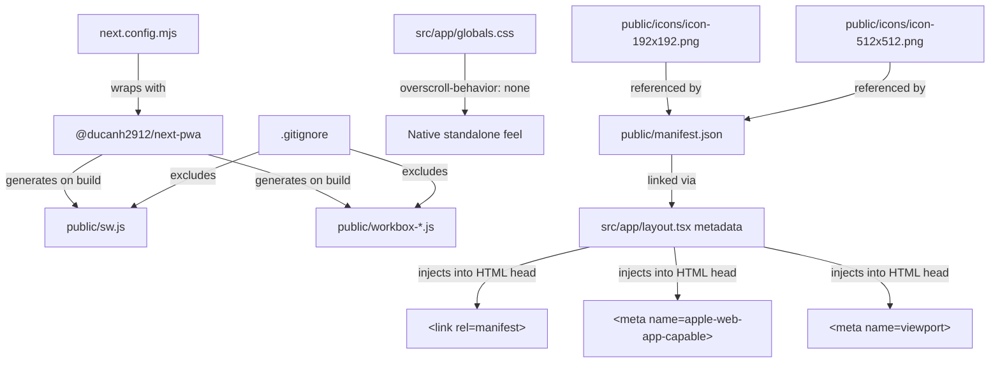

# Design Document: PWA Native Conversion

## Overview

This design converts the YUPP Next.js travel application into an installable Progressive Web App (PWA). The conversion touches configuration files, static assets, and CSS — no new runtime components or data models are introduced. The core approach is:

1. Wrap `next.config.mjs` with `@ducanh2912/next-pwa` to auto-generate and register a Service Worker on production builds.
2. Add a `public/manifest.json` declaring the app identity, icons, display mode, and colors.
3. Update `src/app/layout.tsx` metadata/viewport exports so Next.js injects the correct `<meta>` and `<link>` tags for iOS and Android PWA support.
4. Add overscroll-prevention CSS to `globals.css` for a native standalone feel.
5. Place placeholder PNG icons in `public/icons/`.
6. Update `.gitignore` to exclude generated Service Worker artifacts.

No new API routes, database changes, or runtime state management are required.

## Architecture

The PWA conversion is a build-time and static-asset concern. It layers on top of the existing Next.js architecture without altering the application's runtime behavior.



### Key Design Decisions

1. **`@ducanh2912/next-pwa` over manual Service Worker**: This is the actively maintained community fork compatible with Next.js 14 App Router. It handles Workbox configuration, precaching, and SW registration automatically, reducing boilerplate and maintenance burden. ([Source](https://ducanh-next-pwa.vercel.app/docs/next-pwa/configuring))

2. **ESM import style**: The existing `next.config.mjs` uses ESM (`export default`). The PWA wrapper will use the ESM import pattern: `import withPWA from '@ducanh2912/next-pwa'`.

3. **Icons in `public/icons/` subdirectory**: Keeps the `public/` root clean. The manifest references `/icons/icon-192x192.png` and `/icons/icon-512x512.png`.

4. **Disable in development**: Setting `disable: process.env.NODE_ENV === "development"` avoids Service Worker interference during local development, which can cause stale-cache issues.

5. **Overscroll CSS on `body`**: The `body` selector in `globals.css` already exists with layout styles. We add `overscroll-behavior: none` and `touch-action: none` there (both are already present in the current CSS, so this requirement is already satisfied — we verify and preserve them).

## Components and Interfaces

### 1. Next.js Config Wrapper (`next.config.mjs`)

**Current state:**
```js
const nextConfig = { serverExternalPackages: ['puppeteer-core'] };
export default nextConfig;
```

**Target state:**
```js
import withPWA from '@ducanh2912/next-pwa';

const nextConfig = { serverExternalPackages: ['puppeteer-core'] };

export default withPWA({
  dest: 'public',
  register: true,
  skipWaiting: true,
  disable: process.env.NODE_ENV === 'development',
})(nextConfig);
```

The `withPWA` function is a higher-order config wrapper. It accepts PWA options and returns a function that wraps the Next.js config object. The existing `serverExternalPackages` setting is preserved by passing `nextConfig` as the inner argument.

### 2. Web App Manifest (`public/manifest.json`)

A static JSON file conforming to the [W3C Web App Manifest spec](https://www.w3.org/TR/appmanifest/). Structure:

```json
{
  "name": "YUPP Travel",
  "short_name": "YUPP",
  "description": "The AI-Powered Travel Command Center.",
  "start_url": "/",
  "display": "standalone",
  "background_color": "#FAFAFA",
  "theme_color": "#FAFAFA",
  "orientation": "portrait",
  "icons": [
    { "src": "/icons/icon-192x192.png", "sizes": "192x192", "type": "image/png" },
    { "src": "/icons/icon-512x512.png", "sizes": "512x512", "type": "image/png" }
  ]
}
```

### 3. Layout Metadata (`src/app/layout.tsx`)

Next.js App Router uses exported `Metadata` and `Viewport` objects to generate `<head>` tags. The layout will be updated to export both:

**Viewport export:**
```ts
export const viewport: Viewport = {
  width: 'device-width',
  initialScale: 1,
  maximumScale: 1,
  userScalable: false,
  themeColor: '#FAFAFA',
};
```

**Metadata export (updated):**
```ts
export const metadata: Metadata = {
  title: 'YUPP | Travel Planner',
  description: 'The AI-Powered Travel Command Center.',
  manifest: '/manifest.json',
  appleWebApp: {
    capable: true,
    statusBarStyle: 'default',
    title: 'YUPP Travel',
  },
};
```

The `Viewport` type is imported from `next` alongside `Metadata`.

### 4. Global CSS (`src/app/globals.css`)

The `body` rule already contains `overscroll-behavior: none` and `touch-action: none`. These will be verified and preserved. No changes needed unless they are missing.

### 5. Placeholder Icons (`public/icons/`)

Two minimal valid PNG files:
- `public/icons/icon-192x192.png` — 192×192 pixels
- `public/icons/icon-512x512.png` — 512×512 pixels

These are programmatically generated minimal PNG files (solid color placeholder) that satisfy the manifest icon requirements. They can be replaced with branded artwork later.

### 6. Gitignore Updates (`.gitignore`)

Append entries to exclude build-generated SW artifacts:

```
# PWA Service Worker artifacts
/public/sw.js
/public/sw.js.map
/public/workbox-*.js
/public/workbox-*.js.map
```

## Data Models

No new data models are introduced. The PWA conversion is purely a build-configuration and static-asset concern. The existing `Pin`, `Collection`, `Itinerary`, and other types in `src/types/index.ts` remain unchanged.

The only structured data artifact is `public/manifest.json`, whose schema is defined by the [W3C Web App Manifest specification](https://www.w3.org/TR/appmanifest/). The manifest fields are:

| Field | Type | Value |
|-------|------|-------|
| `name` | string | `"YUPP Travel"` |
| `short_name` | string | `"YUPP"` |
| `description` | string | `"The AI-Powered Travel Command Center."` |
| `start_url` | string | `"/"` |
| `display` | string | `"standalone"` |
| `background_color` | string | `"#FAFAFA"` |
| `theme_color` | string | `"#FAFAFA"` |
| `orientation` | string | `"portrait"` |
| `icons` | array | Two icon entries (192×192, 512×512) |


## Correctness Properties

*A property is a characteristic or behavior that should hold true across all valid executions of a system — essentially, a formal statement about what the system should do. Properties serve as the bridge between human-readable specifications and machine-verifiable correctness guarantees.*

Most acceptance criteria in this feature are static configuration checks (SMOKE tests) — they verify that specific values exist in specific files. These are not suitable for property-based testing because there is no input variation.

However, Requirement 7 explicitly calls for a round-trip property on manifest JSON, which is a classic PBT pattern.

### Property 1: Manifest JSON round-trip integrity

*For any* valid web app manifest object (containing string fields for name, short_name, description, start_url, display, background_color, theme_color, orientation, and an array of icon objects with src, sizes, and type fields), serializing the object to a JSON string via `JSON.stringify` and parsing it back via `JSON.parse` SHALL produce a deeply equal object.

**Validates: Requirements 7.1**

## Error Handling

This feature is primarily static configuration and build-time setup. Error scenarios are minimal:

| Scenario | Handling |
|----------|----------|
| `@ducanh2912/next-pwa` not installed | `npm install` will fail at import time in `next.config.mjs`. The build error message from Node.js clearly indicates the missing module. |
| `manifest.json` contains invalid JSON | The browser silently ignores the manifest and the PWA install prompt won't appear. Our round-trip property test catches malformed JSON during CI. |
| Icon files missing or corrupt | The browser falls back to the favicon. The smoke tests verify icon file existence and PNG header validity. |
| Service Worker registration fails | `@ducanh2912/next-pwa` handles registration errors internally and logs to the browser console. The app continues to function as a normal web app. |
| `.gitignore` entries missing | SW artifacts get committed to the repo. This is a developer experience issue, not a runtime error. Smoke test catches it. |

No custom error boundaries, try/catch blocks, or error UI are needed for this feature.

## Testing Strategy

### Approach

This feature is almost entirely static configuration. The testing strategy reflects that:

- **Smoke/unit tests**: Verify that all configuration files contain the correct values (manifest fields, metadata exports, CSS rules, gitignore entries, icon files).
- **Property-based test**: One PBT for the manifest JSON round-trip property (Requirement 7).

### Test Framework

- **Runner**: Vitest (already configured in `vitest.config.ts`)
- **PBT library**: fast-check (already in devDependencies)
- **Test location**: `src/__tests__/pwa-native-conversion.test.ts` for smoke/unit tests, `src/__tests__/pwa-native-conversion.pbt.test.ts` for the property test

### Unit / Smoke Tests

These verify the static configuration requirements:

1. **Manifest field validation** (Req 2.1–2.10): Parse `public/manifest.json` and assert each field matches the expected value.
2. **Manifest icon entries** (Req 2.8–2.9): Verify the icons array contains entries with correct sizes and types.
3. **Manifest valid JSON** (Req 2.10): Verify `JSON.parse` succeeds without error.
4. **Icon file existence and validity** (Req 5.1–5.3): Verify PNG files exist and start with the PNG magic bytes (`89 50 4E 47`).
5. **Gitignore entries** (Req 6.1): Read `.gitignore` and verify it contains `sw.js`, `sw.js.map`, `workbox-*.js`, `workbox-*.js.map` entries.
6. **CSS overscroll rules** (Req 4.1–4.2): Read `globals.css` and verify the body rule contains `overscroll-behavior: none` and `touch-action: none`.

### Property-Based Test

- **Property 1: Manifest JSON round-trip** (Req 7.1)
  - Generate random manifest-like objects using fast-check arbitraries
  - Serialize with `JSON.stringify`, parse with `JSON.parse`
  - Assert deep equality
  - Minimum 100 iterations
  - Tag: `Feature: pwa-native-conversion, Property 1: Manifest JSON round-trip integrity`

### What Is NOT Tested

- **Next.js config wrapping** (Req 1.1–1.6): The `withPWA` wrapper is third-party code. We don't unit-test that `@ducanh2912/next-pwa` works — that's the library author's responsibility. The config file is small enough to verify by code review.
- **Service Worker generation** (Req 1.7): This requires a full production build. It's an integration concern, not a unit test.
- **Layout metadata exports** (Req 3.1–3.5): These are TypeScript type-checked exports. The Next.js framework handles injecting them into HTML. We rely on TypeScript compilation and the framework's own testing for correctness.
