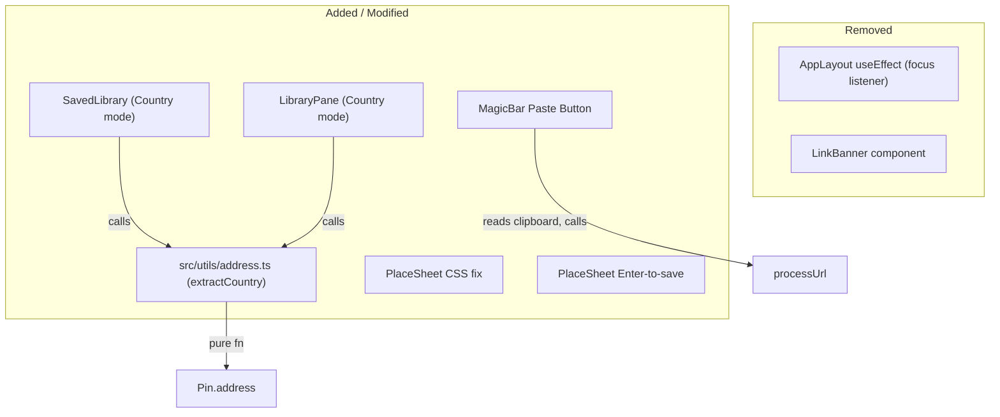

# Design Document: QA Hotfix & Country Filter

## Overview

This design covers a batch of QA hotfixes and a new "Country" grouping feature for the travel pin-board PWA. The changes span six files across three concern areas:

1. **Clipboard behaviour overhaul** — Remove the automatic clipboard polling `useEffect` from `AppLayout` and its associated `LinkBanner` rendering. Replace it with an explicit "Paste & Scan" button inside `MagicBar` that reads the clipboard on user tap.
2. **PlaceSheet polish** — Fix a CSS `overflow-hidden` clipping bug on the collection dropdown and add Enter-key-to-save on the edit title input.
3. **Country grouping** — Introduce a pure `extractCountry` utility in `src/utils/address.ts`, then wire a new "Country" grouping mode into both `SavedLibrary` (three-way toggle: Region / Category / Country) and `LibraryPane` (two-way toggle: City / Country).

All changes are client-side only. No database migrations, API routes, or server actions are affected.

## Architecture

The feature touches the **presentation layer** and a new **utility module**. No new state management patterns are introduced — the existing Zustand store (`useTravelPinStore`) already exposes `pins` and `collections` which are consumed by the grouping logic.



### Design Decisions

| Decision | Rationale |
|---|---|
| Delete `LinkBanner` usage in AppLayout but keep the file | Other code may still import it; removal of the file itself is out of scope. The import and rendering are removed from AppLayout. |
| Place `extractCountry` in `src/utils/address.ts` (new file) | Keeps address-parsing utilities separate from URL parsing and category mapping. Single-responsibility. |
| Reuse existing `groupPinsByRegion` pattern for country grouping | `groupPinsByCountry` follows the identical `Record<string, Pin[]>` shape, making the toggle trivial. |
| Use `overflow-visible` on outer dropdown, `overflow-hidden` on inner list | The outer wrapper must not clip the "New Collection" input that extends beyond the list. The inner wrapper keeps rounded corners on the scrollable list. |

## Components and Interfaces

### 1. AppLayout (`src/components/AppLayout.tsx`)

**Removals:**
- `LinkBanner` import and JSX rendering
- `bannerUrl` / `bannerPlatform` state variables and their setter calls
- `processedLinksRef` ref declaration
- `useEffect` block containing `window.addEventListener('focus', handleFocus)` for clipboard detection
- Imports of `extractSupportedUrl`, `formatPlatformName` from `@/utils/urlParsing`
- Import of `detectPlatform` from `@/actions/extractPlaces`

**Preserved:** All other functionality — `autoPaste` query param consumption, `DndContext`, `MapView`, `MagicBar`, `BottomNav`, `PlaceSheet`, `ProfileSheet`, `DiscoverFeed`, `CollectionDrawer`, `PlannerSidebar`, `AuthModal`, resize `useEffect`, cloud sync hook.

### 2. MagicBar (`src/components/MagicBar.tsx`)

**Addition:** A `Clipboard` icon button rendered inside the form, adjacent to the text input.

```typescript
// New import
import { Sparkles, Clipboard } from 'lucide-react';

// Inside the form, before or after the input (when not in processing/success state):
<button
  type="button"
  onClick={handlePaste}
  className="..."
  aria-label="Paste from clipboard"
>
  <Clipboard size={16} />
</button>
```

**`handlePaste` callback:**
```typescript
const handlePaste = useCallback(async () => {
  try {
    const text = await navigator.clipboard.readText();
    const trimmed = text?.trim();
    if (trimmed && isValidUrl(trimmed)) {
      processUrl(trimmed, true);
    }
  } catch {
    // Silently ignore — permission denied or API unavailable
  }
}, [processUrl]);
```

The button is hidden when `showStatusText` is true (processing/success states).

### 3. PlaceSheet (`src/components/PlaceSheet.tsx`)

**CSS fix — Collection dropdown outer wrapper:**
Change `overflow-hidden` → `overflow-visible` on the absolutely-positioned dropdown `div`.

**CSS fix — Collection dropdown inner list:**
Wrap the `collections.map(...)` buttons in a `div` with `rounded-b-lg overflow-hidden` to maintain rounded corners on the scrollable list.

**Enter-to-save — editTitle input:**
Add `onKeyDown` handler:
```typescript
onKeyDown={(e) => {
  if (e.key === 'Enter') handleSaveEdit();
}}
```

### 4. extractCountry (`src/utils/address.ts`) — NEW FILE

```typescript
/**
 * Extracts the country name from a Google Places formatted address.
 * Returns the trimmed last comma-separated segment, or "Unknown Country"
 * for empty/undefined input.
 */
export function extractCountry(address: string | undefined): string {
  if (!address || !address.trim()) return 'Unknown Country';
  const segments = address.split(',').map((s) => s.trim());
  return segments[segments.length - 1] || 'Unknown Country';
}
```

### 5. SavedLibrary (`src/components/planner/SavedLibrary.tsx`)

**New export:**
```typescript
export function groupPinsByCountry(pins: Pin[]): Record<string, Pin[]> {
  const groups: Record<string, Pin[]> = Object.create(null);
  for (const pin of pins) {
    const country = extractCountry(pin.address);
    if (!groups[country]) groups[country] = [];
    groups[country].push(pin);
  }
  return groups;
}
```

**State change:** `groupMode` type widens from `'region' | 'category'` to `'region' | 'category' | 'country'`.

**Toggle UI:** Add a third button "Country" to the segmented toggle.

**`filteredGroups` memo:** Add `country` branch calling `groupPinsByCountry`.

### 6. LibraryPane (`src/components/planner/LibraryPane.tsx`)

**New state:** `groupMode: 'city' | 'country'` (default `'city'`).

**New export:**
```typescript
export function groupPinsByCountry(pins: Pin[]): Record<string, Pin[]> { ... }
```
(Same logic as SavedLibrary, or imported from a shared location. Since the existing `groupPinsByCity` is co-located in LibraryPane, we follow the same pattern and co-locate `groupPinsByCountry` here as well, importing `extractCountry` from `@/utils/address`.)

**Toggle UI:** Add a City / Country segmented toggle above the search input.

**`filteredGroups` memo:** Branch on `groupMode` to call either `groupPinsByCity` or `groupPinsByCountry`.

## Data Models

No new data models are introduced. The existing `Pin` interface already contains the `address?: string` field used by `extractCountry`. The grouping functions produce `Record<string, Pin[]>` — the same shape already used by `groupPinsByRegion` and `groupPinsByCategory`.

## Correctness Properties

*A property is a characteristic or behavior that should hold true across all valid executions of a system — essentially, a formal statement about what the system should do. Properties serve as the bridge between human-readable specifications and machine-verifiable correctness guarantees.*

### Property 1: Paste button URL validation gate

*For any* string read from the clipboard, `processUrl` SHALL be called if and only if the string is a valid URL (passes `isValidUrl` after trimming). Invalid or empty clipboard text SHALL never trigger `processUrl`.

**Validates: Requirements 2.3, 2.4**

### Property 2: Non-Enter keys do not trigger save

*For any* key value that is not `"Enter"`, pressing that key while focused on the editTitle input in PlaceSheet SHALL NOT invoke `handleSaveEdit`.

**Validates: Requirements 4.3**

### Property 3: extractCountry returns last comma segment

*For any* non-empty string, `extractCountry` SHALL return the trimmed last comma-separated segment. If the string contains no commas, it SHALL return the trimmed full string.

**Validates: Requirements 5.2, 5.3**

### Property 4: extractCountry round-trip consistency

*For any* valid address string, extracting the country and then calling `extractCountry` on a string that ends with `, <country>` SHALL produce the same country value. That is, `extractCountry(anyPrefix + ', ' + extractCountry(addr)) === extractCountry(addr)`.

**Validates: Requirements 5.5**

### Property 5: Country grouping keys match extractCountry

*For any* array of pins, every pin in the result of `groupPinsByCountry(pins)` under key `k` SHALL satisfy `extractCountry(pin.address) === k`. Additionally, every input pin SHALL appear in exactly one group.

**Validates: Requirements 6.2, 7.2**

### Property 6: SavedLibrary mode switching preserves search query

*For any* search query string entered in SavedLibrary, switching between Region, Category, and Country grouping modes SHALL NOT clear or modify the search query value.

**Validates: Requirements 6.5**

### Property 7: LibraryPane mode switching preserves search query

*For any* search query string entered in LibraryPane, switching between City and Country grouping modes SHALL NOT clear or modify the search query value.

**Validates: Requirements 7.5**

## Error Handling

| Scenario | Handling |
|---|---|
| `navigator.clipboard.readText()` throws (permission denied, unavailable API) | Silently caught in `handlePaste` — no toast, no error state. |
| `navigator.clipboard` is `undefined` (older browsers, non-secure context) | The optional chaining in `handlePaste` prevents runtime errors. Button is still rendered but becomes a no-op. |
| `extractCountry` receives `undefined` or empty string | Returns `"Unknown Country"` — pins without addresses are grouped under this fallback label. |
| Pin has no `address` field | Both `groupPinsByCountry` and `extractCountry` handle `undefined` gracefully via the fallback. |

## Testing Strategy

### Property-Based Tests (fast-check, minimum 100 iterations each)

The project already uses `fast-check` with `vitest`. Each property test references its design property.

| Property | Test File | What's Generated |
|---|---|---|
| Property 1: URL validation gate | `src/components/__tests__/MagicBar.pbt.test.ts` | Random strings (URLs and non-URLs) |
| Property 2: Non-Enter keys | `src/components/__tests__/PlaceSheet.pbt.test.ts` | Random key names excluding "Enter" |
| Property 3: Last comma segment | `src/utils/__tests__/address.pbt.test.ts` | Random comma-separated strings |
| Property 4: Round-trip consistency | `src/utils/__tests__/address.pbt.test.ts` | Random address strings |
| Property 5: Country grouping keys | `src/components/planner/__tests__/SavedLibrary.pbt.test.ts` | Random Pin arrays with varied addresses |
| Property 6: SavedLibrary query preservation | `src/components/planner/__tests__/SavedLibrary.pbt.test.ts` | Random search strings |
| Property 7: LibraryPane query preservation | `src/components/planner/__tests__/LibraryPane.pbt.test.ts` | Random search strings |

### Unit Tests (example-based)

| Area | Test File | Coverage |
|---|---|---|
| AppLayout removals (smoke) | `src/components/__tests__/AppLayout.test.ts` | Verify no focus listener, no LinkBanner, no banner state |
| MagicBar paste button rendering | `src/components/__tests__/MagicBar.test.ts` | Button visible in idle, hidden during processing |
| PlaceSheet CSS classes | `src/components/__tests__/PlaceSheet.test.ts` | overflow-visible on outer, overflow-hidden on inner |
| PlaceSheet Enter-to-save | `src/components/__tests__/PlaceSheet.test.ts` | Enter triggers save, other keys don't |
| extractCountry edge cases | `src/utils/__tests__/address.test.ts` | Empty string, undefined, single segment, trailing whitespace |
| SavedLibrary toggle rendering | `src/components/planner/__tests__/SavedLibrary.test.ts` | Three buttons present, default is Region |
| LibraryPane toggle rendering | `src/components/planner/__tests__/LibraryPane.test.ts` | Two buttons present, default is City |

### Test Configuration

- PBT library: `fast-check` (already in devDependencies)
- Test runner: `vitest --run`
- Minimum iterations per property: 100
- Tag format: `Feature: qa-hotfix-country-filter, Property {N}: {title}`
