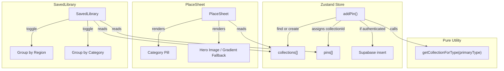

# Design Document: Smart Pin Organizer

## Overview

The Smart Pin Organizer adds automatic category-based organization to the travel pin board. Instead of all pins landing in "Unorganized," the system maps each pin's Google Place `primaryType` to a human-readable collection name (e.g., "Food & Drink", "Sightseeing") and auto-creates collections on the fly. The PlaceSheet UI gains a category pill and a gradient image fallback, and the SavedLibrary gets a toggle to group pins by category alongside the existing region grouping.

The feature is decomposed into four layers:

1. **Pure utility** (`src/utils/categories.ts`) — a stateless mapping function with zero side effects
2. **Store logic** (`src/store/useTravelPinStore.ts`) — `addPin` enhanced to resolve/create collections via the mapper
3. **PlaceSheet UI** (`src/components/PlaceSheet.tsx`) — category pill + gradient fallback
4. **SavedLibrary UI** (`src/components/planner/SavedLibrary.tsx`) — grouping toggle

## Architecture



### Data Flow

1. User saves a pin → `addPin(pinData)` is called
2. `addPin` extracts `pinData.primaryType` and calls `getCollectionForType(primaryType)`
3. The mapper returns a collection name (e.g., "Food & Drink")
4. Store checks if a collection with that name exists; if not, creates one
5. Pin is assigned the resolved `collectionId` and appended to `pins[]`
6. If user is authenticated, the new collection (if created) is persisted to Supabase
7. PlaceSheet reads the pin's collection to display the category pill
8. SavedLibrary groups pins by collection name when "Group by Category" is active

## Components and Interfaces

### 1. Category Mapper — `src/utils/categories.ts`

```typescript
/** Maps a Google Place primaryType to a user-friendly collection name. */
export function getCollectionForType(primaryType: string | undefined): string;

/** Returns the set of all known collection names (for validation/testing). */
export function getKnownCollectionNames(): ReadonlySet<string>;

/** Returns a category-appropriate icon name for gradient fallbacks. */
export function getCategoryIcon(collectionName: string): string;

/** Returns a gradient CSS class for a given collection name. */
export function getCategoryGradient(collectionName: string): string;
```

The internal mapping is a `Record<string, string>` from primaryType values to collection names. The known categories are:

| Collection Name   | Primary Types                                        |
|-------------------|------------------------------------------------------|
| Food & Drink      | restaurant, cafe, bar, bakery                        |
| Accommodations    | hotel, lodging, apartment                            |
| Sightseeing       | tourist_attraction, museum, park, zoo                |
| Shopping          | shopping_mall, store                                 |
| Unorganized       | *(fallback for unknown/missing types)*               |

### 2. Enhanced `addPin` — `src/store/useTravelPinStore.ts`

The existing `addPin` action signature stays the same (`Omit<Pin, 'id' | 'createdAt' | 'collectionId'>`), but the implementation changes:

```typescript
addPin: (pinData) => {
  const collectionName = getCollectionForType(pinData.primaryType);
  // Find existing collection by name, or create a new one
  let targetCollection = state.collections.find(c => c.name === collectionName);
  if (!targetCollection) {
    targetCollection = { id: uuidv4(), name: collectionName, createdAt: new Date().toISOString() };
    // Append to collections list
    // If authenticated, persist to Supabase
  }
  const newPin = { ...pinData, id: uuidv4(), createdAt: ..., collectionId: targetCollection.id };
  // Append to pins list
  return newPin;
}
```

Supabase persistence for auto-created collections reuses the existing `createClient()` pattern from `useCloudSync.ts`. The store will call Supabase directly for collection creation (fire-and-forget with error logging) since the live sync subscriber in `useCloudSync` already handles pin persistence.

### 3. PlaceSheet Enhancements — `src/components/PlaceSheet.tsx`

**Category Pill**: A new `<span>` element rendered above the title `<h2>`, showing the collection name with a rounded pill style. Uses the collection looked up from `pin.collectionId`.

**Gradient Fallback**: The existing hero image section gains a conditional branch: when `pin.imageUrl` is empty/missing, render a gradient background (from `getCategoryGradient`) with a centered icon (from `getCategoryIcon`) using Lucide icons.

### 4. SavedLibrary Grouping Toggle — `src/components/planner/SavedLibrary.tsx`

**New state**: `groupMode: 'region' | 'category'` (default: `'region'`).

**New pure function**:
```typescript
export function groupPinsByCategory(
  pins: Pin[],
  collections: Collection[]
): Record<string, Pin[]>;
```

**Toggle UI**: A segmented control above the search bar with "Region" and "Category" labels. Switching modes re-derives the grouped data via `useMemo` — no network calls, no page reload.

The existing `filterPins` function is applied before grouping in both modes, satisfying requirement 5.6.

## Data Models

No database schema changes are required. The existing `collections` and `pins` tables in Supabase already support the needed fields. Auto-created collections use the same `Collection` interface:

```typescript
interface Collection {
  id: string;        // UUID v4
  name: string;      // e.g., "Food & Drink"
  createdAt: string; // ISO 8601
  user_id?: string;  // Set when persisted to cloud
  isPublic?: boolean;
}
```

The `Pin` interface already has `primaryType?: string` and `collectionId: string` — no changes needed.

The category mapping is stored as a compile-time constant (a plain object literal in `categories.ts`), not in the database. This keeps the mapping fast, testable, and version-controlled.


## Correctness Properties

*A property is a characteristic or behavior that should hold true across all valid executions of a system — essentially, a formal statement about what the system should do. Properties serve as the bridge between human-readable specifications and machine-verifiable correctness guarantees.*

### Property 1: Closed-world mapping with unknown fallback

*For any* string (including empty, undefined, or arbitrary characters), `getCollectionForType` SHALL return a value contained in the set {"Food & Drink", "Accommodations", "Sightseeing", "Shopping", "Unorganized"}. Furthermore, *for any* string that is not one of the explicitly mapped primaryType values, the result SHALL be "Unorganized".

**Validates: Requirements 1.5, 1.7**

### Property 2: addPin assigns correct collection name

*For any* pin with any primaryType value (including undefined), after calling `addPin`, the pin's `collectionId` SHALL reference a collection whose `name` equals `getCollectionForType(pin.primaryType)`.

**Validates: Requirements 2.1, 2.3**

### Property 3: Collection deduplication on repeated primaryType

*For any* primaryType value, adding two pins with the same primaryType SHALL result in both pins sharing the same `collectionId`, and the collections list SHALL contain exactly one collection with that mapped name.

**Validates: Requirements 2.2**

### Property 4: Preservation on pin addition

*For any* sequence of pin additions, all previously existing pins and collections SHALL remain present in the store after each new pin is added. The count of pins SHALL grow by exactly one per addition, and no previously existing collection SHALL be removed.

**Validates: Requirements 2.5**

### Property 5: Referential integrity

*For any* pin in the store's pin list, the pin's `collectionId` SHALL reference a collection `id` that exists in the store's collections list.

**Validates: Requirements 2.7**

### Property 6: Category grouping is a correct partition

*For any* set of pins with assigned collectionIds, `groupPinsByCategory` SHALL produce groups where: (a) every pin appears in exactly one group, (b) the group key for each pin matches its collection name, and (c) the total count of pins across all groups equals the input count.

**Validates: Requirements 5.3, 5.7**

### Property 7: Filter-before-group commutativity

*For any* set of pins and any search query string, filtering pins then grouping by category SHALL produce the same result as the combined filter-then-group operation. No pin excluded by the filter SHALL appear in any group.

**Validates: Requirements 5.6**

## Error Handling

| Scenario | Handling |
|---|---|
| `getCollectionForType` receives undefined/null/empty | Returns "Unorganized" — no error thrown |
| `addPin` called with unknown primaryType | Falls through to "Unorganized" collection — graceful degradation |
| Supabase collection insert fails (network error) | Log error to console, pin is still saved locally with correct collectionId. Cloud sync will retry on next session. |
| PlaceSheet receives pin with missing imageUrl | Renders gradient fallback with category icon — no broken image |
| PlaceSheet receives pin with collectionId pointing to deleted collection | Falls back to displaying "Unorganized" in the pill |
| SavedLibrary groupPinsByCategory receives pin with collectionId not in collections list | Groups under "Unknown" fallback key |

## Testing Strategy

### Property-Based Tests (fast-check, minimum 100 iterations each)

The project already uses `fast-check` with `vitest`. Each property test references its design property.

| Test File | Properties Covered |
|---|---|
| `src/utils/__tests__/categories.pbt.test.ts` | Property 1 (closed-world mapping) |
| `src/store/__tests__/useTravelPinStore.pbt.test.ts` | Properties 2, 3, 4, 5 (store invariants) |
| `src/components/planner/__tests__/SavedLibrary.pbt.test.ts` | Properties 6, 7 (grouping partition + filter commutativity) |

Tag format: `Feature: smart-pin-organizer, Property N: <title>`

### Unit Tests (example-based)

| Test File | Coverage |
|---|---|
| `src/utils/__tests__/categories.test.ts` | Requirements 1.1–1.4, 1.6 — specific mapping examples and edge cases |
| `src/store/__tests__/useTravelPinStore.test.ts` | Requirements 2.4, 2.6 — Supabase persistence mock, undefined primaryType edge case |
| `src/components/__tests__/PlaceSheet.test.ts` | Requirements 3.1–3.3, 4.1–4.4 — category pill rendering, gradient fallback |
| `src/components/planner/__tests__/SavedLibrary.test.ts` | Requirements 5.1, 5.2, 5.4, 5.5 — toggle rendering, default mode, re-render behavior |

### Test Configuration

- All property tests: `{ numRuns: 100 }` minimum
- Vitest with `@` path alias (already configured)
- Store tests reset state in `beforeEach` (existing pattern)
- UI tests use jsdom environment (already in devDependencies)
