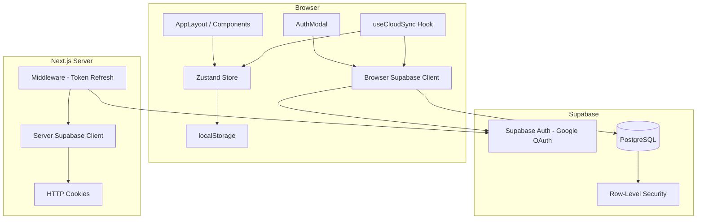

# Design Document: Supabase Cloud Bridge

## Overview

The Supabase Cloud Bridge transforms the YUPP travel pin board from a local-only app into a hybrid local/cloud application. Unauthenticated guests continue using localStorage as before. Authenticated users get their data persisted to a Supabase PostgreSQL database with Row-Level Security, and a sync engine migrates local guest data to the cloud on first sign-in.

The integration uses `@supabase/ssr` for SSR-compatible auth across Next.js 14 App Router, with cookie-based session management in middleware and server components. The browser client handles client-side queries and OAuth flows, while the server client handles server-rendered pages. A Zustand store extension adds cloud-aware state without breaking the existing localStorage persistence for guests.

Key design decisions:
- **Hybrid persistence**: localStorage remains the source of truth for guests; Supabase becomes the source of truth for authenticated users after sync.
- **Non-blocking sync**: The guest-to-cloud migration runs asynchronously so the UI stays interactive.
- **Collection ID mapping**: Local UUIDs are mapped to cloud-generated UUIDs during migration to preserve pin-to-collection relationships.
- **Middleware passthrough**: The auth middleware refreshes tokens but never blocks unauthenticated requests.

## Architecture



**Data flow for guest users**: UI → Store → localStorage (unchanged from current behavior).

**Data flow for authenticated users**:
1. User taps Profile → AuthModal opens → Google OAuth via browser client
2. `onAuthStateChange` fires `SIGNED_IN` → `useCloudSync` detects local data
3. Sync engine batch-inserts collections (gets cloud IDs back), then batch-inserts pins with mapped collection IDs
4. Sync engine fetches all cloud data → calls `setCloudData` on store
5. Subsequent mutations go through store actions that persist to both localStorage and Supabase

**Middleware flow**: Every server request → middleware creates server client → calls `getUser()` to refresh session → updates response cookies → passes request through (never blocks).

## Components and Interfaces

### 1. Database Migration (`supabase/migrations/0001_initial_schema.sql`)

SQL migration that creates the `collections` and `pins` tables with RLS policies. Executed via `supabase db push` or the Supabase dashboard.

### 2. Browser Client (`src/utils/supabase/client.ts`)

```typescript
// Exports: createClient() => SupabaseClient
import { createBrowserClient } from '@supabase/ssr'

export function createClient() {
  return createBrowserClient(
    process.env.NEXT_PUBLIC_SUPABASE_URL!,
    process.env.NEXT_PUBLIC_SUPABASE_ANON_KEY!
  )
}
```

Singleton-like usage in client components. Reads env vars at call time.

### 3. Server Client (`src/utils/supabase/server.ts`)

```typescript
// Exports: createClient() => Promise<SupabaseClient>
import { createServerClient } from '@supabase/ssr'
import { cookies } from 'next/headers'
```

Uses `cookies().getAll()` and `cookies().set()` for cookie-based session management per the `@supabase/ssr` API. Must be called per-request (not cached).

### 4. Auth Middleware (`src/middleware.ts`)


Creates a server Supabase client, calls `supabase.auth.getUser()` to refresh the session, and writes updated cookies to the response. The `config.matcher` excludes `_next/static`, `_next/image`, `favicon.ico`, and common image extensions. All requests pass through regardless of auth status — no redirects or blocks for guests.

### 5. AuthModal (`src/components/AuthModal.tsx`)

A vaul `Drawer` component (consistent with existing PlaceSheet and CollectionDrawer patterns) with glassmorphic styling (`backdrop-blur-md bg-surface/90 rounded-3xl`). Two states:

- **Unauthenticated**: Shows "Sign in with Google" button that calls `supabase.auth.signInWithOAuth({ provider: 'google' })`.
- **Authenticated**: Shows user identity (avatar, email) and a "Sign out" button that calls `supabase.auth.signOut()` and `setUser(null)` on the store.

Opened when the Profile tab is tapped in BottomNav.

### 6. Zustand Store Extensions

New fields and actions added to `TravelPinStore`:

```typescript
// New state
user: User | null           // Supabase User object or null

// New actions
setUser: (user: User | null) => void
setCloudData: (pins: Pin[], collections: Collection[]) => void
```

The `Pin` and `Collection` interfaces gain an optional `user_id?: string` field. The `partialize` config continues to persist `pins` and `collections` to localStorage.

### 7. Cloud Sync Hook (`src/hooks/useCloudSync.ts`)

```typescript
// Exports: useCloudSync() => void
// Side effects: subscribes to onAuthStateChange, orchestrates migration
```

Responsibilities:
- Subscribe to `supabase.auth.onAuthStateChange`
- On `SIGNED_IN`: detect local data (items without `user_id`), batch-insert to Supabase, fetch cloud data, hydrate store
- On `SIGNED_OUT`: call `setUser(null)`, revert to local-only mode
- On app load: check for existing session via `supabase.auth.getSession()`
- Display toast notifications for sync success/failure

### 8. Collection ID Mapping

During migration, the sync engine:
1. Inserts local collections into Supabase → receives cloud-generated UUIDs in the response
2. Builds a `Map<string, string>` from local ID → cloud ID
3. Replaces each pin's `collectionId` with the mapped cloud ID before inserting pins
4. If a pin references an unmapped collection, assigns it to a default "unorganized" cloud collection

## Data Models

### Supabase `collections` Table

| Column | Type | Constraints |
|---|---|---|
| `id` | UUID | PK, default `gen_random_uuid()` |
| `user_id` | UUID | NOT NULL, FK → `auth.users(id)` |
| `name` | TEXT | NOT NULL |
| `is_public` | BOOLEAN | default `false` |
| `created_at` | TIMESTAMPTZ | default `now()` |

### Supabase `pins` Table

| Column | Type | Constraints |
|---|---|---|
| `id` | UUID | PK, default `gen_random_uuid()` |
| `user_id` | UUID | NOT NULL, FK → `auth.users(id)` |
| `collection_id` | UUID | NOT NULL, FK → `collections(id)` |
| `title` | TEXT | NOT NULL |
| `image_url` | TEXT | NOT NULL |
| `source_url` | TEXT | NOT NULL |
| `latitude` | FLOAT | NOT NULL |
| `longitude` | FLOAT | NOT NULL |
| `place_id` | TEXT | nullable |
| `primary_type` | TEXT | nullable |
| `rating` | FLOAT | nullable |
| `created_at` | TIMESTAMPTZ | default `now()` |

### TypeScript Interface Changes

```typescript
// src/types/index.ts — additions
export interface Pin {
  // ... existing fields ...
  user_id?: string;  // Set when persisted to cloud
}

export interface Collection {
  // ... existing fields ...
  user_id?: string;  // Set when persisted to cloud
  isPublic?: boolean; // Maps to is_public column
}
```

### RLS Policies

Both tables get identical policy sets — one policy per CRUD operation, each with the condition `user_id = auth.uid()`. This ensures complete row-level isolation per user.

```sql
-- Pattern applied to both collections and pins
CREATE POLICY "select_own" ON {table} FOR SELECT USING (user_id = auth.uid());
CREATE POLICY "insert_own" ON {table} FOR INSERT WITH CHECK (user_id = auth.uid());
CREATE POLICY "update_own" ON {table} FOR UPDATE USING (user_id = auth.uid());
CREATE POLICY "delete_own" ON {table} FOR DELETE USING (user_id = auth.uid());
```


## Correctness Properties

*A property is a characteristic or behavior that should hold true across all valid executions of a system — essentially, a formal statement about what the system should do. Properties serve as the bridge between human-readable specifications and machine-verifiable correctness guarantees.*

### Property 1: setCloudData replaces store contents exactly

*For any* valid arrays of pins and collections, calling `setCloudData(pins, collections)` on the store should result in the store's `pins` array being deeply equal to the provided pins and the store's `collections` array being deeply equal to the provided collections, with no leftover data from the previous state.

**Validates: Requirements 7.5**

### Property 2: Local data detection identifies items without user_id

*For any* mixed array of pins (some with `user_id` set, some without), the sync engine's local data detection should return exactly the subset of items where `user_id` is `undefined` or not set, and the count of detected items plus the count of cloud items should equal the total count.

**Validates: Requirements 8.3**

### Property 3: Collection ID mapping is bijective

*For any* set of local collections with unique IDs, after constructing the ID mapping from local IDs to cloud-generated IDs, the mapping should contain exactly one entry per local collection, every local ID should map to a unique cloud ID, and no two local IDs should map to the same cloud ID.

**Validates: Requirements 9.1**

### Property 4: Pin collection IDs are correctly remapped

*For any* set of pins and a valid collection ID mapping, applying the mapping to the pins should replace every pin's `collectionId` with the corresponding mapped cloud ID. Pins whose `collectionId` exists in the mapping should have their ID replaced; pins whose `collectionId` does not exist in the mapping should be assigned to the default "unorganized" cloud collection ID.

**Validates: Requirements 9.2, 9.3**

## Error Handling

### Missing Environment Variables
- If `NEXT_PUBLIC_SUPABASE_URL` or `NEXT_PUBLIC_SUPABASE_ANON_KEY` is not set, the client factory functions throw a descriptive error at call time (e.g., `"Missing NEXT_PUBLIC_SUPABASE_URL environment variable"`).

### OAuth Failures
- If `signInWithOAuth` fails (network error, popup blocked), the AuthModal displays an inline error message. The app remains functional in guest mode.

### Sync Engine Failures
- If batch INSERT fails during guest-to-cloud migration, the sync engine:
  1. Displays an error toast notification
  2. Retains all local data in the Zustand store and localStorage
  3. Does NOT call `setCloudData` — the store stays in its pre-sync state
  4. The user can retry by signing out and signing back in

### RLS Violations
- If a client attempts to access another user's data, Supabase returns an empty result set (not an error). This is transparent to the application — the user simply sees no data that isn't theirs.

### Session Expiry
- The middleware refreshes tokens on every server request. If a token is expired and cannot be refreshed (e.g., refresh token revoked), `getUser()` returns null. The app falls back to guest mode gracefully.

### Network Errors
- Supabase client operations that fail due to network issues surface errors through the standard Supabase error response. The sync engine catches these and shows error toasts. The store's localStorage persistence ensures no data loss.

## Testing Strategy

### Property-Based Tests (fast-check, minimum 100 iterations each)

The following properties are suitable for PBT because they test pure data transformation logic with meaningful input variation:

1. **setCloudData store replacement** — Generate random pin/collection arrays, verify store contents match exactly after calling setCloudData.
2. **Local data detection** — Generate mixed arrays of items with/without user_id, verify correct partitioning.
3. **Collection ID mapping bijectivity** — Generate random sets of collections, simulate mapping construction, verify bijection.
4. **Pin collection ID remapping** — Generate random pins and mappings, verify correct ID substitution with fallback to unorganized.

Library: `fast-check` (already in devDependencies)
Runner: `vitest` (already configured)
Tag format: `Feature: supabase-cloud-bridge, Property {N}: {title}`

### Unit Tests (example-based)

- AuthModal renders sign-in button when unauthenticated
- AuthModal renders user info and sign-out when authenticated
- AuthModal sign-in button calls `signInWithOAuth({ provider: 'google' })`
- AuthModal sign-out button calls `signOut()` and `setUser(null)`
- Profile tab in BottomNav opens AuthModal
- `setUser` action updates store user field
- Middleware `config.matcher` excludes static assets
- Middleware passes through unauthenticated requests
- Sync engine subscribes to `onAuthStateChange` on mount
- Sync engine calls `setUser` when existing session found on load
- Sync engine calls `setUser(null)` on SIGNED_OUT event
- Success toast shown after sync completion
- Error toast shown and local data retained on sync failure
- Missing env var throws descriptive error

### Integration Tests

- RLS policies: verify user A cannot read user B's collections/pins
- Full sync flow: local data → batch insert → fetch → store hydration (with mocked Supabase)
- Middleware token refresh: verify cookies are updated in response

### What's NOT tested with PBT

- Database schema (SMOKE — declarative SQL, verified by migration)
- RLS policies (INTEGRATION — tests PostgreSQL behavior, not our code)
- OAuth flow (EXAMPLE — specific UI interaction)
- Cookie handling (INTEGRATION — tests @supabase/ssr behavior)
- Glassmorphic styling (NOT TESTABLE — visual design)
- UI responsiveness during sync (NOT TESTABLE — UX perception)
