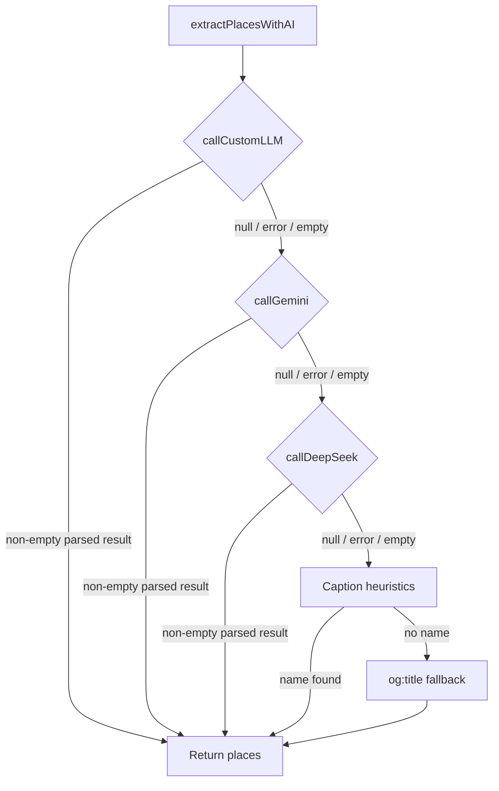

# Design Document: Three-Tier AI Orchestrator

## Overview

This design adds a `callCustomLLM` function to `src/actions/extractPlaces.ts` and reorders the `extractPlacesWithAI` orchestrator to use a three-tier fallback chain: Custom LLM → Gemini → DeepSeek → caption heuristics/og:title.

The Custom LLM client follows the same pattern as the existing `callDeepSeek` client — a fetch-based call to an OpenAI-compatible chat completions endpoint with a 10-second AbortController timeout. Configuration is read from three environment variables: `CUSTOM_LLM_ENDPOINT`, `CUSTOM_LLM_API_KEY`, and `CUSTOM_LLM_MODEL`.

The orchestrator logic is restructured from a two-provider chain to a three-provider chain, with the same skip/fail/empty semantics already established. The warning messages are updated to reflect three providers.

No new files are created. All changes are confined to `src/actions/extractPlaces.ts` and `.env.local.example`.

## Architecture

The architecture remains a single-file module (`extractPlaces.ts`) with pure functions and async provider clients. No new modules, services, or abstractions are introduced.



### Key Design Decisions

1. **Same file, no new abstractions.** The existing module is ~170 lines. Adding one more client function (~40 lines) and adjusting the orchestrator keeps it under 250 lines — well within single-file territory. A provider registry or strategy pattern would be over-engineering for three static providers.

2. **`callCustomLLM` mirrors `callDeepSeek`.** Both use raw `fetch` against OpenAI-compatible endpoints. Reusing the same structure (AbortController timeout, header construction, response shape validation) keeps the code consistent and easy to diff.

3. **Endpoint-based skip (not key-based).** Unlike DeepSeek/Gemini where the API key gates availability, the Custom LLM is skipped when `CUSTOM_LLM_ENDPOINT` is missing. The API key is optional because some self-hosted models run without auth.

4. **Default model value.** When `CUSTOM_LLM_MODEL` is unset, the client defaults to `"default"`. This is a safe sentinel that most OpenAI-compatible servers accept or ignore.

## Components and Interfaces

### New Function: `callCustomLLM`

```typescript
async function callCustomLLM(prompt: string): Promise<string | null>
```

- **Location:** `src/actions/extractPlaces.ts` (private, not exported)
- **Behavior:**
  - Reads `CUSTOM_LLM_ENDPOINT` from `process.env`. Returns `null` if missing/empty.
  - Reads `CUSTOM_LLM_API_KEY` from `process.env`. Omits `Authorization` header if missing/empty.
  - Reads `CUSTOM_LLM_MODEL` from `process.env`. Defaults to `"default"` if missing.
  - Sends `POST` to `CUSTOM_LLM_ENDPOINT` with `Content-Type: application/json`.
  - Request body: `{ model, messages: [{ role: "user", content: prompt }] }`.
  - 10-second timeout via `AbortController`.
  - Validates `response.ok`, then extracts `choices[0].message.content`.
  - Throws on non-OK status or missing content.

### Modified Function: `extractPlacesWithAI`

The orchestrator is updated to attempt three providers in order:

1. `callCustomLLM(prompt)` — new first tier
2. `callGemini(prompt)` — moved from second to second (unchanged position name, but now second of three)
3. `callDeepSeek(prompt)` — moved from first to third

Skip/fail/empty tracking is extended from two booleans to three. Warning messages are updated:
- All three skipped: `"all three API keys/endpoints are missing"`
- At least one attempted but all failed: `"all three AI providers failed"`

### Environment Variables

Added to `.env.local.example`:

```
# Custom LLM (highest-priority AI extraction — any OpenAI-compatible endpoint)
CUSTOM_LLM_ENDPOINT=http://localhost:11434/v1/chat/completions
CUSTOM_LLM_API_KEY=
CUSTOM_LLM_MODEL=default
```

## Data Models

No new data models. The function accepts `string` and returns `Promise<string | null>`. The orchestrator continues to return `Promise<ExtractedPlace[]>` using the existing `ExtractedPlace` interface (`{ name: string; contextualHints: string[] }`).

The OpenAI-compatible response shape is validated inline (same as `callDeepSeek`):

```typescript
const data = (await response.json()) as {
  choices?: { message?: { content?: string } }[];
};
```


## Correctness Properties

*A property is a characteristic or behavior that should hold true across all valid executions of a system — essentially, a formal statement about what the system should do. Properties serve as the bridge between human-readable specifications and machine-verifiable correctness guarantees.*

### Property 1: Missing endpoint skips the provider

*For any* value of `CUSTOM_LLM_ENDPOINT` that is `undefined` or an empty string, `callCustomLLM` SHALL return `null` without issuing any HTTP request.

**Validates: Requirements 1.2**

### Property 2: Request construction is correct for all prompts

*For any* non-empty prompt string and any configured `CUSTOM_LLM_ENDPOINT` / `CUSTOM_LLM_MODEL`, the HTTP request issued by `callCustomLLM` SHALL be a POST to the endpoint URL with a `Content-Type: application/json` header and a JSON body containing `{ model: <CUSTOM_LLM_MODEL or "default">, messages: [{ role: "user", content: <prompt> }] }`.

**Validates: Requirements 2.2, 2.3**

### Property 3: Authorization header matches API key presence

*For any* value of `CUSTOM_LLM_API_KEY`, the request headers SHALL include `Authorization: Bearer <key>` if and only if the key is a non-empty string. When the key is `undefined` or empty, the `Authorization` header SHALL be absent.

**Validates: Requirements 1.3, 2.4**

### Property 4: Non-successful responses produce errors

*For any* HTTP response with a non-OK status code (400–599), or *for any* response body that does not contain a string at `choices[0].message.content`, `callCustomLLM` SHALL throw an error. For non-OK statuses, the error message SHALL contain the status code and status text.

**Validates: Requirements 2.6, 2.7**

### Property 5: Successful responses are returned verbatim

*For any* valid OpenAI-compatible response containing a string at `choices[0].message.content`, `callCustomLLM` SHALL return that exact string.

**Validates: Requirements 2.8**

### Property 6: First valid provider short-circuits the chain

*For any* configuration of the three providers where at least one returns a non-null response that parses into a non-empty `ExtractedPlace[]`, `extractPlacesWithAI` SHALL return that array and SHALL NOT call any provider ordered after the successful one.

**Validates: Requirements 3.2**

### Property 7: Failed or empty providers do not halt the chain

*For any* provider in the fallback chain that throws an error or returns a response that parses into an empty array, `extractPlacesWithAI` SHALL proceed to the next provider in the chain rather than propagating the error or returning empty.

**Validates: Requirements 3.4, 3.5**

### Property 8: Exhausted chain falls back to caption heuristics then og:title

*For any* caption and og:title pair, when all three AI providers are exhausted (skipped, failed, or returned empty), `extractPlacesWithAI` SHALL return a single-element array where the `name` equals the caption heuristic extraction (if non-null) or the og:title, and `contextualHints` is an empty array.

**Validates: Requirements 3.8**

## Error Handling

| Scenario | Behavior |
|---|---|
| `CUSTOM_LLM_ENDPOINT` missing/empty | `callCustomLLM` returns `null` (skip). No error logged. |
| `CUSTOM_LLM_API_KEY` missing/empty | Request sent without `Authorization` header. No error. |
| `CUSTOM_LLM_MODEL` missing | Defaults to `"default"` in request body. No error. |
| Network timeout (>10s) | `AbortController` aborts fetch. Error caught by orchestrator, chain continues. |
| Non-OK HTTP status | `callCustomLLM` throws with status code/text. Orchestrator catches, chain continues. |
| Malformed response (missing `choices[0].message.content`) | `callCustomLLM` throws. Orchestrator catches, chain continues. |
| All three providers skipped (no config) | `console.warn` with "all three API keys/endpoints are missing". Falls back to caption heuristics/og:title. |
| All three providers failed (at least one attempted) | `console.warn` with "all three AI providers failed". Falls back to caption heuristics/og:title. |
| Caption heuristic returns `null` | Uses `ogTitle` as final fallback name. |

No new error types or error classes are introduced. All errors are caught inline with `try/catch` in the orchestrator, consistent with the existing pattern.

## Testing Strategy

### Unit Tests (example-based)

- **Env file content (1.1):** Verify `.env.local.example` contains the three new keys.
- **Default model (1.4):** Verify `"default"` is used when `CUSTOM_LLM_MODEL` is unset.
- **Timeout (2.5):** Mock a slow fetch, verify AbortController fires at 10s.
- **Provider order (3.1):** Mock all three providers, verify call sequence is Custom LLM → Gemini → DeepSeek.
- **Skip combinations (3.3):** Test key combos (only Gemini configured, only DeepSeek, none, etc.).
- **All-skipped warning (3.6):** All three return null → verify `console.warn` message.
- **All-failed warning (3.7):** All three throw → verify `console.warn` message.

### Property-Based Tests (fast-check, ≥100 iterations each)

Each property test maps to a design property above. Tests use `vi.fn()` / `vi.spyOn` to mock `fetch` and env vars.

| Test | Design Property | What varies |
|---|---|---|
| Missing endpoint → null | Property 1 | Random empty/undefined endpoint values |
| Request body construction | Property 2 | Random prompt strings, random model names |
| Auth header ↔ API key | Property 3 | Random truthy/falsy API key values |
| Error on bad responses | Property 4 | Random non-OK status codes (400–599), random malformed payloads |
| Content returned verbatim | Property 5 | Random content strings in valid response shape |
| First success short-circuits | Property 6 | Random valid ExtractedPlace arrays, random provider success position |
| Failed/empty → continues | Property 7 | Random errors, random empty responses, random provider positions |
| Exhausted → caption/og:title | Property 8 | Random caption/ogTitle pairs |

**Library:** `fast-check` (already in devDependencies)
**Runner:** `vitest --run`
**Tag format:** `Feature: three-tier-ai-orchestrator, Property N: <title>`
**Minimum iterations:** 100 per property
