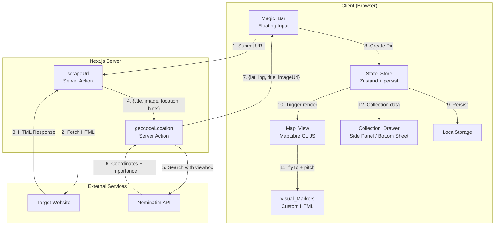
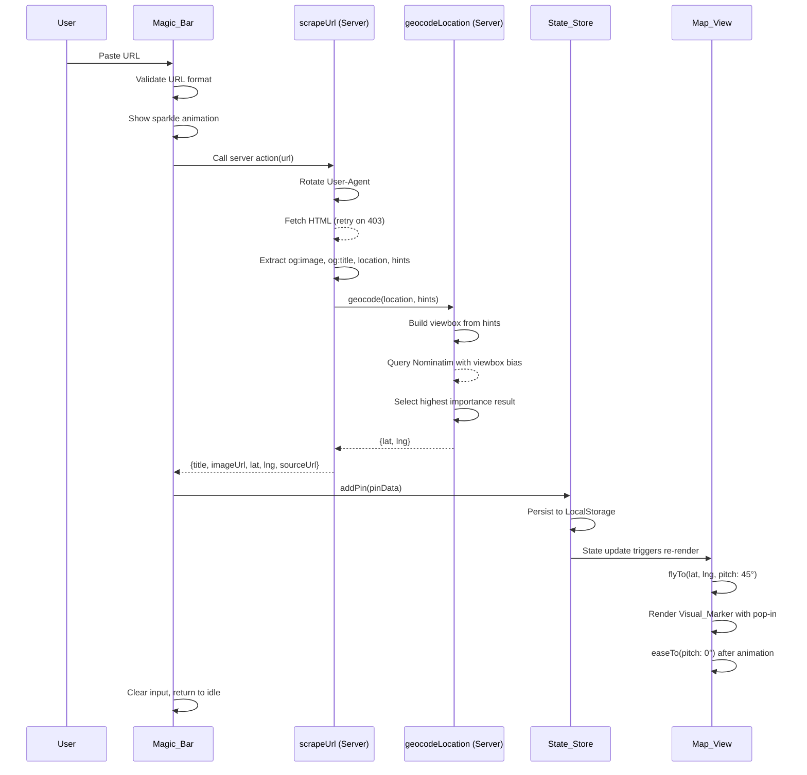
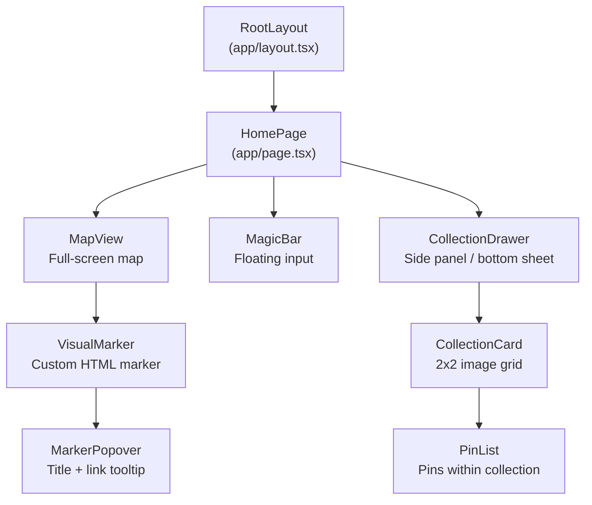

# Design Document: Travel Pin Board

## Overview

Travel Pin Board is a luxury minimalist web application that lets users paste URLs into a floating input bar, automatically scrape metadata (image, title, location), geocode the location, and render custom visual markers on a full-screen interactive map. Pins are organized into collections and persisted to LocalStorage.

The system follows a linear pipeline: URL input → server-side scraping → geocoding → state persistence → map rendering with cinematic animation. The frontend is a Next.js 14 App Router SPA with Tailwind CSS, Framer Motion, and MapLibre GL JS. The backend consists of Next.js Server Actions (or Route Handlers) for scraping and geocoding to avoid CORS issues.

### Key Design Decisions

1. **MapLibre GL JS over Mapbox GL JS**: Open-source, no token required for basic usage, supports custom HTML markers and pitch/bearing control needed for cinematic flyTo.
2. **Zustand with persist middleware**: Lightweight state management that avoids Redux boilerplate. The persist middleware handles LocalStorage serialization. A hydration-safe pattern prevents SSR mismatches in Next.js 14.
3. **Server Actions for scraping**: Keeps scraping server-side to bypass CORS. User-Agent rotation and retry logic live entirely on the server.
4. **Nominatim for geocoding**: Free, no API key required. Supports viewbox biasing for contextual hints. Importance score available for disambiguation.
5. **Framer Motion for animations**: Handles Magic Bar transitions, Collection Drawer slide-in, and Visual Marker pop-in. MapLibre's built-in `flyTo`/`easeTo` handles map camera animations.

## Architecture

### High-Level Architecture Diagram



### Data Flow: Pin Creation Pipeline




## Components and Interfaces

### Component Hierarchy



### Component Specifications

#### MapView

- **Location**: `src/components/MapView.tsx`
- **Responsibility**: Renders the full-screen MapLibre GL JS map, manages camera state, renders Visual Markers from store.
- **Props**: None (reads from Zustand store directly)
- **Key behaviors**:
  - Initializes MapLibre with a minimal light tile style (Maptiler Light or Alidade Smooth)
  - Suppresses default POI icons and labels via style layer filtering
  - Listens to store changes and renders/removes markers accordingly
  - Executes `flyTo` with `pitch: 45` when a new pin is added, then `easeTo({ pitch: 0 })` on `moveend`
  - Resizes when Collection Drawer opens on desktop (CSS transition on container width)

```typescript
interface MapViewRef {
  flyToPin: (lat: number, lng: number) => void;
  resize: () => void;
}
```

#### MagicBar

- **Location**: `src/components/MagicBar.tsx`
- **Responsibility**: Floating URL input with validation, loading states, and error display.
- **State machine**:
  - `idle` → user can type/paste
  - `validating` → checking URL format
  - `processing` → sparkle animation, server action in flight
  - `error` → inline error message displayed
  - `success` → clears input, returns to idle

```typescript
type MagicBarState = 'idle' | 'processing' | 'error' | 'success';

interface MagicBarProps {
  onPinCreated?: (pin: Pin) => void;
}
```

- **Styling**: `z-index: 40` (above map at z-index 0, below modals at z-index 50). `backdrop-blur-md`, `border border-border`, `rounded-full`, Framer Motion `layout` animation for width expansion on focus.

#### VisualMarker

- **Location**: `src/components/VisualMarker.tsx`
- **Responsibility**: Renders a 48×48px custom HTML marker on the map with the scraped image.
- **Implementation**: Creates a DOM element passed to `maplibregl.Marker({ element })`. Not a React component rendered in the React tree — it's an imperative DOM node managed by MapLibre.

```typescript
interface VisualMarkerOptions {
  pin: Pin;
  onClick: (pin: Pin) => void;
}

function createVisualMarkerElement(options: VisualMarkerOptions): HTMLDivElement;
```

- **Styling**: `width: 48px`, `height: 48px`, `border-radius: 8px`, `border: 2px solid white`, `box-shadow: 0 2px 6px rgba(0,0,0,0.25)`, image with `aspect-ratio: 1/1` and `object-fit: cover`.
- **Animation**: CSS `@keyframes` scale-up pop-in (0 → 1.15 → 1.0 over 400ms).
- **Fallback**: If image fails to load, show accent-colored (#6366F1) placeholder with a map-pin Lucide icon.

#### MarkerPopover

- **Location**: `src/components/MarkerPopover.tsx`
- **Responsibility**: Displays pin title and source URL when a Visual Marker is clicked.
- **Implementation**: Rendered via `maplibregl.Popup` attached to the marker's coordinates.

```typescript
interface MarkerPopoverProps {
  pin: Pin;
  onClose: () => void;
}
```

#### CollectionDrawer

- **Location**: `src/components/CollectionDrawer.tsx`
- **Responsibility**: Slide-out panel showing collections. Left panel on desktop (≥768px), bottom-sheet on mobile (<768px).
- **Desktop**: Fixed left panel, 360px wide, pushes map container to the right.
- **Mobile**: Uses `vaul` (Drawer component) for bottom-sheet behavior with drag-to-dismiss.

```typescript
interface CollectionDrawerProps {
  isOpen: boolean;
  onToggle: () => void;
}
```

#### CollectionCard

- **Location**: `src/components/CollectionCard.tsx`
- **Responsibility**: Displays a collection as a card with name and 2×2 image grid preview.

```typescript
interface CollectionCardProps {
  collection: Collection;
  pins: Pin[];
  onClick: (collectionId: string) => void;
}
```

### Server Actions / API Routes

#### scrapeUrl

- **Location**: `src/actions/scrapeUrl.ts`
- **Type**: Next.js Server Action (`'use server'`)
- **Input**: `{ url: string }`
- **Output**: `ScrapeResult | ScrapeError`

```typescript
interface ScrapeResult {
  success: true;
  title: string;
  imageUrl: string | null; // null → use placeholder
  location: string;
  contextualHints: string[]; // e.g., ["Bali", "Indonesia"] from bio/caption
  sourceUrl: string;
}

interface ScrapeError {
  success: false;
  error: string;
}
```

- **User-Agent rotation**: Maintains a pool of 5+ common browser UA strings. Selects randomly per request.
- **Retry logic**: On 403, retries up to 3 times with a different UA each time. 15-second total timeout.
- **Extraction priority**: `og:image` → `twitter:image` → first large ``. `og:title` → `<title>`. Location from `og:locale`, geo meta tags, structured data, or caption text patterns.

#### geocodeLocation

- **Location**: `src/actions/geocodeLocation.ts`
- **Type**: Next.js Server Action (`'use server'`)
- **Input**: `{ location: string, contextualHints?: string[] }`
- **Output**: `GeocodeResult | GeocodeError`

```typescript
interface GeocodeResult {
  success: true;
  lat: number;
  lng: number;
  displayName: string;
  importance: number;
}

interface GeocodeError {
  success: false;
  error: string;
}
```

- **Viewbox biasing**: If contextual hints are provided, first geocode the hint to get a rough bounding box, then use `viewbox` parameter (soft bias, `bounded=0`) when geocoding the primary location string.
- **Disambiguation**: When multiple results are returned, select the one with the highest `importance` score. Log alternatives to console.
- **Rate limiting**: Enforces 1 request/second to Nominatim using a simple timestamp-based throttle.
- **Timeout**: 10-second timeout per Nominatim request.
- **User-Agent**: Includes app identifier per Nominatim usage policy (e.g., `TravelPinBoard/1.0`).

## Data Models

### Pin

```typescript
interface Pin {
  id: string;            // UUID v4
  title: string;         // From og:title or <title>
  imageUrl: string;      // From og:image or placeholder identifier
  sourceUrl: string;     // Original pasted URL
  latitude: number;      // From geocoder
  longitude: number;     // From geocoder
  collectionId: string;  // Defaults to "unorganized"
  createdAt: string;     // ISO 8601 timestamp
}
```

### Collection

```typescript
interface Collection {
  id: string;            // UUID v4 or "unorganized" for default
  name: string;          // User-defined or "Unorganized"
  createdAt: string;     // ISO 8601 timestamp
}
```

### Zustand Store Shape

```typescript
interface TravelPinStore {
  // State
  pins: Pin[];
  collections: Collection[];
  activeCollectionId: string | null;
  isDrawerOpen: boolean;

  // Actions
  addPin: (pin: Omit<Pin, 'id' | 'createdAt' | 'collectionId'>) => Pin;
  removePin: (pinId: string) => void;
  movePin: (pinId: string, collectionId: string) => void;
  addCollection: (name: string) => Collection;
  removeCollection: (collectionId: string) => void;
  setActiveCollection: (collectionId: string | null) => void;
  toggleDrawer: () => void;

  // Computed helpers (not stored, derived in selectors)
  // getPinsByCollection(collectionId: string): Pin[]
}
```

### Store Persistence Configuration

```typescript
import { create } from 'zustand';
import { persist, createJSONStorage } from 'zustand/middleware';

const useTravelPinStore = create(
  persist<TravelPinStore>(
    (set, get) => ({
      // ... state and actions
    }),
    {
      name: 'travel-pin-board-storage',
      storage: createJSONStorage(() => localStorage),
      partialize: (state) => ({
        pins: state.pins,
        collections: state.collections,
      }),
    }
  )
);
```

### Hydration Safety Pattern

To prevent SSR/client hydration mismatches in Next.js 14, components that read persisted state use a hydration-safe hook:

```typescript
import { useState, useEffect } from 'react';

function useHydrated<T>(store: () => T, fallback: T): T {
  const [hydrated, setHydrated] = useState(false);
  const storeValue = store();

  useEffect(() => {
    setHydrated(true);
  }, []);

  return hydrated ? storeValue : fallback;
}
```

This ensures the server render uses the fallback (empty pins array) and the client picks up persisted data after hydration.

### Scraper Internal Models

```typescript
// User-Agent rotation pool
const USER_AGENTS: string[] = [
  'Mozilla/5.0 (Macintosh; Intel Mac OS X 10_15_7) AppleWebKit/537.36 ...',
  'Mozilla/5.0 (Windows NT 10.0; Win64; x64) AppleWebKit/537.36 ...',
  'Mozilla/5.0 (X11; Linux x86_64) AppleWebKit/537.36 ...',
  'Mozilla/5.0 (iPhone; CPU iPhone OS 17_0 like Mac OS X) ...',
  'Mozilla/5.0 (iPad; CPU OS 17_0 like Mac OS X) ...',
];

interface ScraperConfig {
  maxRetries: number;       // 3
  timeoutMs: number;        // 15000
  userAgents: string[];
}
```

### Geocoder Internal Models

```typescript
interface NominatimResult {
  place_id: number;
  lat: string;
  lon: string;
  display_name: string;
  importance: number;
  boundingbox: [string, string, string, string]; // [south, north, west, east]
}

interface GeocoderConfig {
  baseUrl: string;          // 'https://nominatim.openstreetmap.org/search'
  timeoutMs: number;        // 10000
  minRequestIntervalMs: number; // 1000 (rate limit)
  userAgent: string;        // 'TravelPinBoard/1.0'
}
```
