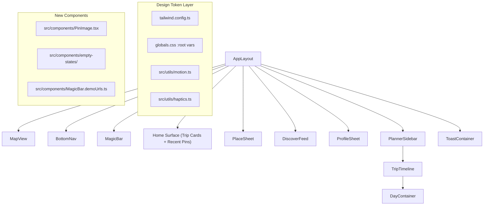
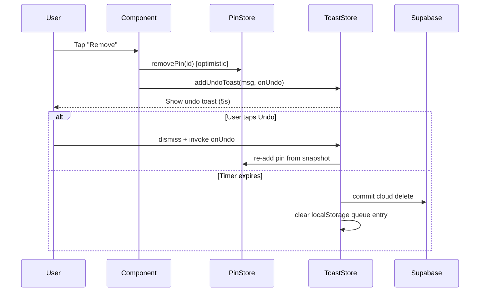
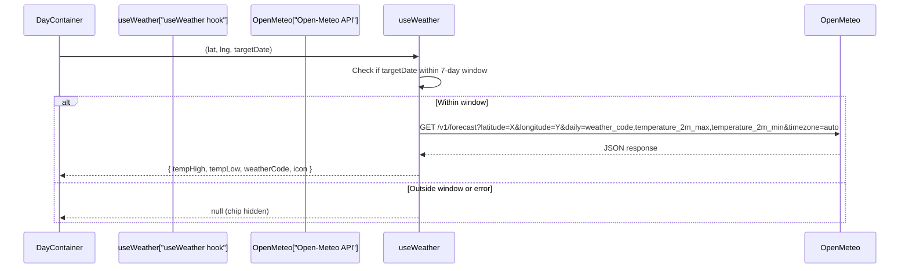

# Design Document: UX Redesign V1

## Overview

This design covers a comprehensive UX overhaul of Yupp, a social-travel PWA built with Next.js 14, Tailwind CSS 3, Zustand, Framer Motion, vaul drawers, and dnd-kit. The redesign introduces a design-token system as the foundation, then applies it across seven UI surfaces (BottomNav, MagicBar, Home Surface, PlaceSheet, DiscoverFeed, DayContainer, Toast system) while adding new capabilities: undo-toast pattern, illustrated empty states, image loading resilience, haptic feedback, and accessibility improvements.

The approach is additive and non-breaking: existing `accent` aliases are preserved, untouched components remain unchanged, and all existing tests continue to pass. The only new runtime dependency is the Open-Meteo free weather API for DayContainer weather chips.

### Key Design Decisions

1. **Token-first migration**: All visual values (color, radius, type, elevation, motion) are defined once in `tailwind.config.ts` and `globals.css`, then consumed by components via utility classes. This eliminates magic numbers and enables future dark-mode support.
2. **Optimistic + Undo over Confirm**: All destructive actions (pin removal, bulk delete) switch from `window.confirm` to optimistic removal with a 5-second undo toast. This is faster, less disruptive, and mobile-friendly.
3. **Open-Meteo for weather**: The free, no-auth-required Open-Meteo `/v1/forecast` endpoint provides daily weather codes and temperatures. It's fetched client-side with a 7-day window guard and silent failure.
4. **PinImage with next/image**: A dedicated component handles aspect-ratio reservation, deterministic gradient placeholders, fade-in, and error fallback — replacing scattered `` tags.
5. **Haptics via Vibration API**: A thin utility wraps `navigator.vibrate()` with `prefers-reduced-motion` gating. No native dependencies.

## Architecture

### High-Level Component Hierarchy



### Data Flow for Undo Toast



### Weather Data Flow for DayContainer



## Components and Interfaces

### 1. Design Token System (`tailwind.config.ts` + `globals.css`)

**Changes to `tailwind.config.ts`:**

```typescript
// theme.extend additions
colors: {
  brand: '#FF5A4E',
  'brand-soft': '#FFE4E1',
  'brand-ink': '#7A1F18',
  surface: '#FFFFFF',
  'surface-raised': '#FAFAFA',
  'surface-sunken': '#F4F4F5',
  'ink-1': '#0A0A0B',
  'ink-2': '#52525B',
  'ink-3': '#A1A1AA',
  border: '#E5E7EB',
  'border-strong': '#D4D4D8',
  success: '#22C55E',
  warning: '#F59E0B',
  danger: '#EF4444',
  accent: '#FF5A4E', // alias → brand
},
borderRadius: {
  chip: '8px',
  control: '12px',
  card: '16px',
  sheet: '24px',
  pill: '9999px',
},
fontSize: {
  display: ['32px', { lineHeight: '36px', letterSpacing: '-0.5px', fontWeight: '700' }],
  title: ['24px', { lineHeight: '28px', letterSpacing: '-0.4px', fontWeight: '700' }],
  headline: ['17px', { lineHeight: '22px', letterSpacing: '-0.2px', fontWeight: '600' }],
  body: ['15px', { lineHeight: '22px', letterSpacing: '0px', fontWeight: '400' }],
  caption: ['13px', { lineHeight: '18px', letterSpacing: '0.1px', fontWeight: '500' }],
  micro: ['11px', { lineHeight: '14px', letterSpacing: '0.4px', fontWeight: '600' }],
},
boxShadow: {
  'elev-0': 'none',
  'elev-1': '0 1px 3px rgba(0,0,0,0.08), 0 1px 2px rgba(0,0,0,0.06)',
  'elev-2': '0 4px 12px rgba(0,0,0,0.10), 0 1px 4px rgba(0,0,0,0.06)',
  'elev-3': '0 12px 48px rgba(0,0,0,0.12), 0 4px 16px rgba(0,0,0,0.08)',
  'elev-modal': '0 24px 80px rgba(0,0,0,0.16), 0 8px 24px rgba(0,0,0,0.10)',
},
```

**Tailwind Plugin for Category Gradients:**

A custom Tailwind plugin registers utility classes `bg-cat-food`, `bg-cat-stay`, `bg-cat-see`, `bg-cat-shop`, `bg-cat-default` that map to the gradient values currently in `src/utils/categories.ts`. This allows components to use `className="bg-cat-food"` instead of importing gradient strings.

**CSS Custom Properties in `globals.css`:**

Every palette color is emitted as `--color-{token-name}` on `:root`, enabling runtime access and future dark-mode overrides:

```css
:root {
  --color-brand: #FF5A4E;
  --color-brand-soft: #FFE4E1;
  --color-brand-ink: #7A1F18;
  --color-surface: #FFFFFF;
  --color-surface-raised: #FAFAFA;
  --color-surface-sunken: #F4F4F5;
  --color-ink-1: #0A0A0B;
  --color-ink-2: #52525B;
  --color-ink-3: #A1A1AA;
  --color-border: #E5E7EB;
  --color-border-strong: #D4D4D8;
  --color-success: #22C55E;
  --color-warning: #F59E0B;
  --color-danger: #EF4444;
}
```

### 2. Motion System (`src/utils/motion.ts`)

```typescript
// Duration constants (seconds)
export const DURATION_FAST = 0.15;
export const DURATION_BASE = 0.25;
export const DURATION_SLOW = 0.4;

// Easing definitions
export const EASE_OUT = [0.16, 1, 0.3, 1]; // cubic-bezier out
export const EASE_IN = [0.4, 0, 1, 1];     // cubic-bezier in
export const EASE_SPRING = { type: 'spring', stiffness: 400, damping: 30 };

// Reusable framer-motion transition presets
export const fadeIn = { initial: { opacity: 0 }, animate: { opacity: 1 }, transition: { duration: DURATION_BASE, ease: EASE_OUT } };
export const slideUp = { initial: { opacity: 0, y: 16 }, animate: { opacity: 1, y: 0 }, transition: { duration: DURATION_BASE, ease: EASE_OUT } };
export const scaleIn = { initial: { opacity: 0, scale: 0.9 }, animate: { opacity: 1, scale: 1 }, transition: { duration: DURATION_FAST, ease: EASE_OUT } };

// Reduced-motion variant
export function getReducedMotion(): boolean {
  if (typeof window === 'undefined') return false;
  return window.matchMedia('(prefers-reduced-motion: reduce)').matches;
}

export const reducedTransition = { duration: 0, ease: 'linear' };
```

The MagicBar currently defines inline spring configs (`stiffness: 400, damping: 30`) and animation durations. These will be replaced with imports from `motion.ts`.

### 3. Haptics Utility (`src/utils/haptics.ts`)

```typescript
export interface HapticsAPI {
  tap: () => void;
  success: () => void;
  error: () => void;
}

function vibrate(pattern: number | number[]): void {
  if (typeof navigator === 'undefined') return;
  if (getReducedMotion()) return; // from motion.ts
  navigator.vibrate?.(pattern);
}

export const haptics: HapticsAPI = {
  tap: () => vibrate(10),
  success: () => vibrate([10, 50, 10]),
  error: () => vibrate([50, 30, 50]),
};
```

Consumers: `MapView` (marker tap), `MagicBar` (chip tap, success, error), `DiscoverFeed` (multi-select toggle), `DayContainer` (save).

### 4. BottomNav Redesign (`src/components/BottomNav.tsx`)

**Interface** (unchanged):
```typescript
export interface BottomNavProps {
  activeTab: 'discover' | 'add' | 'plan' | 'profile';
  onTabChange: (tab: 'discover' | 'add' | 'plan' | 'profile') => void;
}
```

**Visual changes:**
- Each tab renders icon + text label using `text-caption` token
- Active tab gets a pill-shaped highlight (`bg-brand-soft`, `rounded-pill`) animated via framer-motion `layoutId="nav-pill"` shared layout
- `aria-current="page"` set on active tab
- `prefers-reduced-motion` replaces `layoutId` slide with instant cross-fade

### 5. MagicBar Empty-State and Platform Chips (`src/components/MagicBar.tsx`)

**New module: `src/components/MagicBar.demoUrls.ts`**
```typescript
export const DEMO_URLS: Record<string, string> = {
  Instagram: 'https://www.instagram.com/reel/...',
  Xiaohongshu: 'https://www.xiaohongshu.com/explore/...',
  Douyin: 'https://www.douyin.com/video/...',
  TikTok: 'https://www.tiktok.com/@.../video/...',
};
```

**Behavior:**
- When `state === 'idle'` and input is empty, render 4 Platform Chips below the input
- Tapping a chip calls `processUrl(DEMO_URLS[platform], true)`
- Placeholder text cycles through platform-specific phrases at 3s intervals using `useEffect` + `setInterval`
- Dead `needs_input` code path removed

### 6. Home Surface — Trip Cards and Recent Pins

**New section in `AppLayout.tsx`** rendered between MapView and BottomNav:

```typescript
interface TripCardData {
  id: string;
  name: string;
  tripDate: string | null;
  pinCount: number;
  coverImageUrl: string | null;
}
```

- **Trip Cards Strip**: Horizontal scroll of `TripCard` components, sourced from `usePlannerStore.itineraries`. Each card shows cover image, trip name, date, and pin count. Tap navigates to planner with that itinerary loaded.
- **Recent Pins Strip**: Horizontal scroll of 88×88 `PinImage` thumbnails, sourced from `useTravelPinStore.pins` sorted by `createdAt` descending, limited to 12. Tap sets `activePinId` and opens PlaceSheet.
- Both strips hidden when any vaul drawer is open (tracked via existing `isProfileOpen`, `isDiscoverOpen`, etc. state).
- No new data-fetching logic — all data from existing stores.

### 7. PlaceSheet Information Density (`src/components/PlaceSheet.tsx`)

**Extended Pin type** (additions to `src/types/index.ts`):
```typescript
export interface Pin {
  // ... existing fields ...
  openingHours?: string[];    // Array of day strings, e.g. ["Mon: 9AM-5PM", ...]
  priceLevel?: number;        // 1-4 scale (Google Places)
  images?: string[];          // Additional image URLs for carousel
}
```

**New sections in PlaceSheet:**
- **Open/Closed chip**: Computed from `openingHours` + current time. Uses `bg-success/10 text-success` for open, `bg-danger/10 text-danger` for closed.
- **Price level indicator**: Renders "$" repeated `priceLevel` times, displayed next to the type badge.
- **Opening hours collapsible**: Below address, collapsed by default, expands to show full week schedule.
- **Photo carousel**: When `pin.images` has multiple entries, the hero area becomes a horizontally swipeable carousel using CSS `scroll-snap-type: x mandatory`.
- **Undo toast for removal**: `handleRemove` snapshots the pin, calls `removePin(id)` optimistically, then `addUndoToast("Pin removed", () => restorePin(snapshot))`. Cloud delete deferred to timer expiry.
- **Sticky bottom action row**: "View Source" and "Open in Google Maps" buttons in a `sticky bottom-0` container with `bg-surface` and `shadow-elev-2`.
- **Edit mode drawer lock**: When `isEditing === true`, set vaul `dismissible={false}` to prevent drag-dismiss.
- **Token migration**: All inline `text-[26px]`, `rounded-[32px]`, `shadow-[...]` values replaced with `text-title`, `rounded-sheet`, `shadow-elev-3`, etc.

### 8. DiscoverFeed Search, Filter, Sort, Multi-Select (`src/components/DiscoverFeed.tsx`)

**New state:**
```typescript
const [searchQuery, setSearchQuery] = useState('');
const [activeCategory, setActiveCategory] = useState<string | null>(null);
const [sortMode, setSortMode] = useState<'recent' | 'rated' | 'alpha'>('recent');
const [multiSelectMode, setMultiSelectMode] = useState(false);
const [selectedPinIds, setSelectedPinIds] = useState<Set<string>>(new Set());
```

**Filtering pipeline** (pure functions for testability):
```typescript
export function filterPinsByQuery(pins: Pin[], query: string): Pin[] { ... }
export function filterPinsByCategory(pins: Pin[], category: string | null, collections: Collection[]): Pin[] { ... }
export function sortPins(pins: Pin[], mode: 'recent' | 'rated' | 'alpha'): Pin[] { ... }
```

**UI additions:**
- **Sticky search bar**: `position: sticky; top: 0` with `bg-surface` backdrop, filters by title and address.
- **Category filter chips**: Horizontal scroll row of chips from `getKnownCollectionNames()`. Active chip uses `bg-brand-soft text-brand-ink`.
- **Sort menu**: Dropdown with three options. Default: recently added.
- **Multi-select**: Long-press (500ms `setTimeout` on `pointerdown`) enters multi-select mode. Selected cards show check overlay. Bulk action bar at bottom with "Delete" and "Move to Collection" buttons.
- **Bulk delete**: Uses undo toast pattern. Optimistic removal of all selected pins, single undo toast to restore all.
- **Skeleton cards**: Shown while `pins` is loading, matching grid layout dimensions.

### 9. DayContainer Metadata Header (`src/components/planner/DayContainer.tsx`)

**New hook: `src/hooks/useWeather.ts`**
```typescript
export interface WeatherData {
  tempHigh: number;
  tempLow: number;
  weatherCode: number;
  icon: string; // emoji or icon name
}

export function useWeather(
  lat: number | null,
  lng: number | null,
  targetDate: string | null
): { data: WeatherData | null; isLoading: boolean }
```

Fetches from `https://api.open-meteo.com/v1/forecast?latitude={lat}&longitude={lng}&daily=weather_code,temperature_2m_max,temperature_2m_min&timezone=auto`. The hook checks if `targetDate` is within 7 days of today; if not, returns `null`. On fetch error, returns `null` silently.

**WMO weather code → icon mapping** (pure function):
```typescript
export function weatherCodeToIcon(code: number): string { ... }
// 0 → ☀️, 1-3 → ⛅, 45-48 → 🌫️, 51-67 → 🌧️, 71-77 → ❄️, 80-82 → 🌦️, 95-99 → ⛈️
```

**Dominant city extraction** (pure function):
```typescript
export function getDominantCity(pins: PlannedPin[]): string { ... }
// Groups pins by extractCity(address), returns the city with the most pins
```

**Header layout:**
```
┌─────────────────────────────────────────────┐
│ Day 1 · Mon, Jun 16        Tokyo            │
│ 4 stops · 12.3 km    ☀️ 28°/22°            │
└─────────────────────────────────────────────┘
```

- Day number + formatted date (computed from `tripDate + dayNumber - 1`)
- Dominant city from pin addresses
- Stop count = `pins.length`, total distance from `useDistanceMatrix` segments
- Weather chip (conditional)
- Header is `sticky top-0` within its scroll container
- Tap on day title enters inline rename mode (contentEditable or input swap)
- All inline styles migrated to design tokens

### 10. Undo Toast System (`src/store/useToastStore.ts` + `src/components/ToastContainer.tsx`)

**Extended ToastStore:**
```typescript
export type ToastVariant = 'success' | 'error' | 'info' | 'undo';

export interface Toast {
  id: string;
  message: string;
  variant: ToastVariant;
  createdAt: number;
  onUndo?: () => void;       // callback for undo variant
  undoTimeoutId?: number;    // timer reference
}

export interface ToastStore {
  toasts: Toast[];
  addToast: (message: string, variant: ToastVariant) => void;
  addUndoToast: (message: string, onUndo: () => void) => void;
  removeToast: (id: string) => void;
}
```

**`addUndoToast` behavior:**
1. Snapshot the item being deleted
2. Create toast with `variant: 'undo'`, `onUndo` callback
3. Store pending delete in `localStorage` under key `pending-deletes` (JSON array of `{ pinId, timestamp }`)
4. Start 5-second timer
5. On "Undo" tap: invoke `onUndo`, clear timer, remove from `localStorage` queue, dismiss toast
6. On timer expiry: commit cloud delete, remove from `localStorage` queue, dismiss toast

**ToastContainer changes:**
- Undo variant renders with a "Undo" button on the right side
- Uses `bg-surface-sunken text-ink-1` styling with `shadow-elev-2`
- 5-second progress bar animation at the bottom of the toast

**localStorage persistence:**
On app load, `useToastStore` checks `localStorage` for `pending-deletes`. Any entries older than 5 seconds are committed (cloud delete). This handles the case where the user closes the browser during the undo window.

### 11. Illustrated Empty States (`src/components/empty-states/`)

**Directory structure:**
```
src/components/empty-states/
  illustrations/
    MapIllustration.tsx      // Home surface empty state
    CompassIllustration.tsx   // DiscoverFeed empty state
    CalendarIllustration.tsx  // TripTimeline empty state
    PinIllustration.tsx       // LibraryPane empty state
  EmptyState.tsx              // Shared wrapper component
```

**Shared EmptyState component:**
```typescript
interface EmptyStateProps {
  illustration: React.ReactNode;
  message: string;
  ctaLabel?: string;
  onCtaClick?: () => void;
}
```

All SVG illustrations use `var(--color-brand)`, `var(--color-brand-soft)`, `var(--color-ink-3)` for fills and strokes, ensuring they adapt to the token system.

**Placement:**
- Home Surface (zero pins + zero itineraries): MapIllustration + "Paste a link to pin your first place" + CTA focuses MagicBar
- DiscoverFeed (zero pins): CompassIllustration + "Start discovering places" + CTA focuses MagicBar
- TripTimeline (zero planned pins): CalendarIllustration + "Drag pins here to plan your day" + CTA opens LibraryPane
- LibraryPane (zero unplanned pins): PinIllustration + "Save some places first"

### 12. PinImage Component (`src/components/PinImage.tsx`)

```typescript
export interface PinImageProps {
  src: string;
  alt: string;
  pinId: string;           // Used for deterministic gradient
  aspectRatio?: string;    // CSS aspect-ratio value, default "4/5"
  className?: string;
  sizes?: string;          // next/image sizes prop
}
```

**Behavior:**
1. Reserves space with `aspect-ratio` CSS property (no layout shift)
2. Generates deterministic gradient from `pinId` using a simple hash → hue mapping: `hue = hashCode(pinId) % 360`
3. Shows gradient placeholder immediately
4. On `next/image` `onLoad`, fades image in over `DURATION_BASE` (0.25s) using CSS `opacity` transition
5. On `next/image` `onError`, stays on gradient placeholder + renders centered `MapPin` icon

**next.config.mjs changes:**
```javascript
images: {
  remotePatterns: [
    { protocol: 'https', hostname: '**.cdninstagram.com' },
    { protocol: 'https', hostname: '**.xiaohongshu.com' },
    { protocol: 'https', hostname: '**.douyinpic.com' },
    { protocol: 'https', hostname: '**.tiktokcdn.com' },
    { protocol: 'https', hostname: '**.tiktokcdn-us.com' },
  ],
},
```

### 13. Accessibility and Keyboard Support

**Global focus ring style** (added to `globals.css`):
```css
:focus-visible {
  outline: 2px solid var(--color-brand);
  outline-offset: 2px;
}
```

**Component-specific changes:**
- All icon-only buttons get descriptive `aria-label` attributes
- BottomNav: `aria-current="page"` on active tab (already partially implemented, ensure consistency)
- DiscoverFeed multi-select: `Space`/`Enter` toggles selection, `Escape` exits multi-select mode
- DiscoverFeed sort menu and filter chips: fully `Tab`-navigable with `role="listbox"` / `role="option"` semantics
- All decorative SVGs get `aria-hidden="true"`
- Screen-reader-only labels via `sr-only` class for icon-only controls

### 14. Migration and Backwards Compatibility

**Strategy:**
- `accent` color alias retained, resolving to `brand` value (`#FF5A4E`)
- Each migrated component is updated end-to-end in a single pass (no partial migrations)
- Components not listed in requirements remain untouched
- All existing test suites pass without modification
- No new runtime dependencies beyond Open-Meteo fetch
- Browser matrix unchanged

**Migration checklist per component:**
1. Replace all inline `text-[Npx]` with `text-{token}` where a match exists
2. Replace all `rounded-[Npx]` with `rounded-{token}`
3. Replace all `shadow-[...]` with `shadow-elev-{n}`
4. Replace all hardcoded color hex values with token classes
5. Verify with `getDiagnostics` after each component migration

## Data Models

### Extended Pin Type

```typescript
export interface Pin {
  id: string;
  title: string;
  description?: string;
  imageUrl: string;
  sourceUrl: string;
  latitude: number;
  longitude: number;
  collectionId: string;
  createdAt: string;
  placeId?: string;
  primaryType?: string;
  rating?: number;
  address?: string;
  user_id?: string;
  // New fields for PlaceSheet information density
  openingHours?: string[];
  priceLevel?: number;       // 1-4
  images?: string[];          // Additional photo URLs
}
```

### Extended Toast Type

```typescript
export type ToastVariant = 'success' | 'error' | 'info' | 'undo';

export interface Toast {
  id: string;
  message: string;
  variant: ToastVariant;
  createdAt: number;
  onUndo?: () => void;
  undoTimeoutId?: number;
}
```

### Pending Delete Queue (localStorage)

```typescript
interface PendingDelete {
  pinId: string;
  pinSnapshot: Pin;    // Full pin data for restoration
  timestamp: number;   // Date.now() when delete was initiated
}
// Stored as JSON array under key "pending-deletes"
```

### Weather Response (Open-Meteo)

```typescript
interface OpenMeteoResponse {
  daily: {
    time: string[];                // ["2025-06-16", "2025-06-17", ...]
    weather_code: number[];        // WMO codes
    temperature_2m_max: number[];  // °C
    temperature_2m_min: number[];  // °C
  };
}
```

### Demo URLs Module

```typescript
// src/components/MagicBar.demoUrls.ts
export const DEMO_URLS: Record<string, string> = {
  Instagram: string;
  Xiaohongshu: string;
  Douyin: string;
  TikTok: string;
};
```
