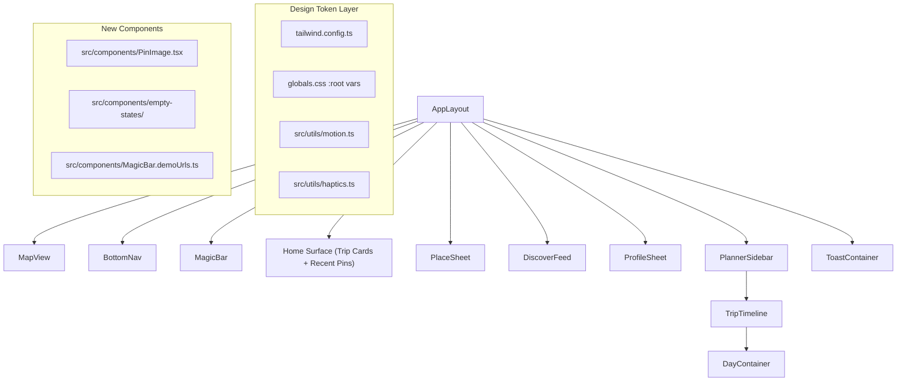
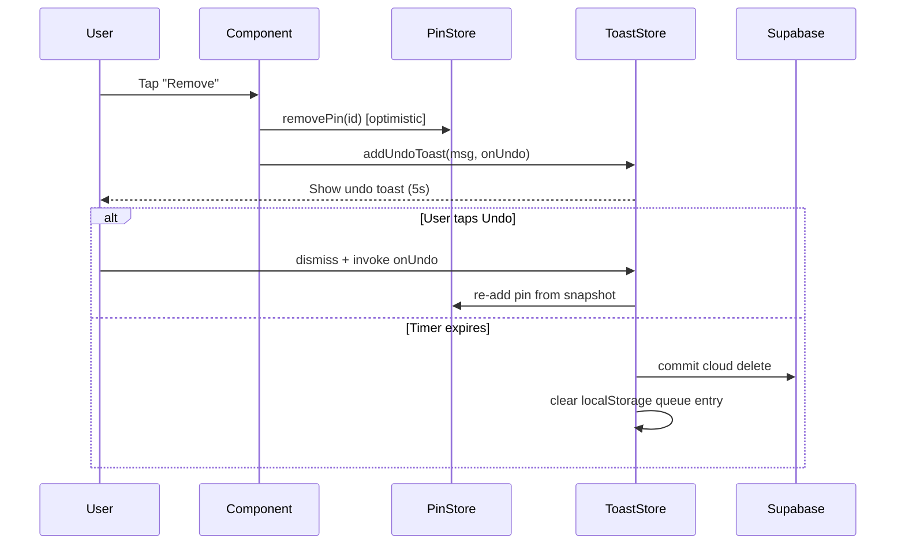
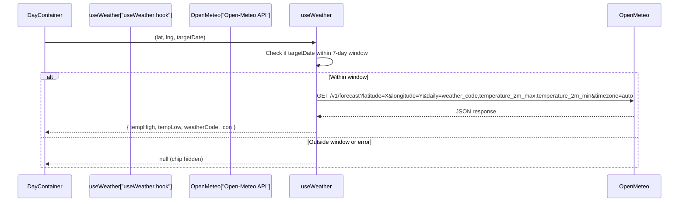

# Design Document: UX Redesign V1

## Overview

This design covers a comprehensive UX overhaul of Yupp, a social-travel PWA built with Next.js 14, Tailwind CSS 3, Zustand, Framer Motion, vaul drawers, and dnd-kit. The redesign introduces a design-token system as the foundation, then applies it across seven UI surfaces (BottomNav, MagicBar, Home Surface, PlaceSheet, DiscoverFeed, DayContainer, Toast system) while adding new capabilities: undo-toast pattern, illustrated empty states, image loading resilience, haptic feedback, and accessibility improvements.

The approach is additive and non-breaking: existing `accent` aliases are preserved, untouched components remain unchanged, and all existing tests continue to pass. The only new runtime dependency is the Open-Meteo free weather API for DayContainer weather chips.

### Key Design Decisions

1. **Token-first migration**: All visual values (color, radius, type, elevation, motion) are defined once in `tailwind.config.ts` and `globals.css`, then consumed by components via utility classes. This eliminates magic numbers and enables future dark-mode support.
2. **Optimistic + Undo over Confirm**: All destructive actions (pin removal, bulk delete) switch from `window.confirm` to optimistic removal with a 5-second undo toast. This is faster, less disruptive, and mobile-friendly.
3. **Open-Meteo for weather**: The free, no-auth-required Open-Meteo `/v1/forecast` endpoint provides daily weather codes and temperatures. It's fetched client-side with a 7-day window guard and silent failure.
4. **PinImage with next/image**: A dedicated component handles aspect-ratio reservation, deterministic gradient placeholders, fade-in, and error fallback — replacing scattered `` tags.
5. **Haptics via Vibration API**: A thin utility wraps `navigator.vibrate()` with `prefers-reduced-motion` gating. No native dependencies.

## Architecture

### High-Level Component Hierarchy

### Data Flow for Undo Toast

### Weather Data Flow for DayContainer

## Components and Interfaces

### 1. Design Token System (`tailwind.config.ts` + `globals.css`)

**Changes to `tailwind.config.ts`:**
