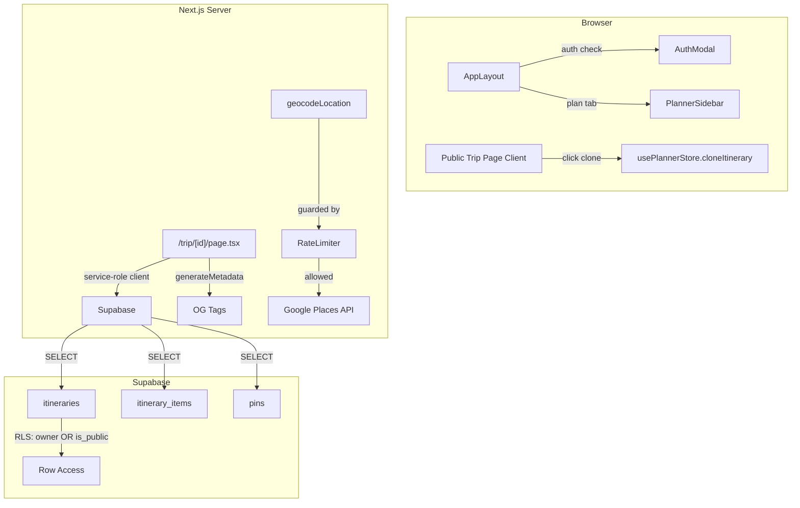

# Design Document: Viral Loop & Security Layer

## Overview

This design covers six interconnected capabilities that form the viral growth loop and security hardening for the Yupp travel app:

1. **Database migration** (`0003_public_sharing.sql`) — adds `is_public` to `itineraries` and relaxes RLS policies so public trips (and their items/pins) are readable by anyone.
2. **Public trip page** (`/trip/[id]`) — a Next.js server-rendered page that fetches itinerary data with a service-role Supabase client, renders a full-screen MapLibre map with markers, and overlays a read-only timeline.
3. **Social sharing metadata** — a `generateMetadata` export on the public trip page that produces dynamic OG tags (title, image) for rich link previews.
4. **Clone engine** — a new `cloneItinerary` action in `usePlannerStore` that deep-copies a public itinerary (items + pins) into the current user's account.
5. **Geocode rate limiter** — a fixed-window (20 req/min per IP) guard wrapping the `geocodeLocation` server action, implemented as an in-memory Map in the server action module.
6. **Login gateway** — an auth check in `AppLayout` that intercepts the Plan tab for unauthenticated users and shows the AuthModal instead.

### Design Rationale

- **Service-role client for public reads**: RLS policies are relaxed for SELECT on public itineraries, but the public trip page uses a service-role client to guarantee data access regardless of the viewer's auth state. This avoids edge cases where anonymous Supabase clients might not resolve RLS correctly.
- **In-memory rate limiter**: For a single-server Next.js deployment, an in-memory `Map<string, { count, windowStart }>` is the simplest approach with zero external dependencies. If the app scales to multiple instances, this can be swapped for a Redis-backed limiter without changing the interface.
- **Clone via Supabase client-side**: The clone action runs in the browser store (Zustand) using the authenticated user's Supabase client. This ensures RLS INSERT policies are respected and the cloned data is owned by the current user.

## Architecture



### Request Flow — Public Trip Page

1. Browser requests `/trip/[id]`.
2. Next.js server component calls `generateMetadata` → fetches itinerary via service-role client → returns OG tags.
3. Server component fetches itinerary + items + pins → passes as props to client component.
4. Client component renders MapLibre map (read-only, interactions disabled) + timeline overlay.
5. "Copy this Trip" button → if authenticated, calls `cloneItinerary(id)` → if not, opens AuthModal.

### Request Flow — Rate-Limited Geocode

1. Client calls `geocodeLocation` server action.
2. Server action extracts IP from request headers (`x-forwarded-for` or `x-real-ip`).
3. `checkRateLimit(ip)` checks in-memory map: if `count >= 20` within current window → return error.
4. Otherwise increment count, proceed to Google Places API.

## Components and Interfaces

### 1. Migration: `0003_public_sharing.sql`

**Location**: `supabase/migrations/0003_public_sharing.sql`

Adds `is_public BOOLEAN DEFAULT false` to `itineraries`. Drops and recreates SELECT policies on `itineraries`, `itinerary_items`, and `pins` to allow public reads.

### 2. Public Trip Page

**Location**: `src/app/trip/[id]/page.tsx` (server component)

```typescript
// Server component
interface TripPageProps {
  params: { id: string };
}

// generateMetadata — dynamic OG tags
export async function generateMetadata({ params }: TripPageProps): Promise<Metadata> { ... }

// Page component — fetches data, renders PublicTripView
export default async function TripPage({ params }: TripPageProps) { ... }
```

**Location**: `src/components/PublicTripView.tsx` (client component)

```typescript
interface PublicTripViewProps {
  itinerary: Itinerary;
  plannedPins: PlannedPin[];
}

// Renders full-screen map + timeline overlay + clone button
export default function PublicTripView({ itinerary, plannedPins }: PublicTripViewProps) { ... }
```

### 3. Service-Role Supabase Client

**Location**: `src/utils/supabase/serviceRole.ts`

```typescript
import { createClient } from '@supabase/supabase-js';

export function createServiceRoleClient() {
  return createClient(
    process.env.NEXT_PUBLIC_SUPABASE_URL!,
    process.env.SUPABASE_SERVICE_ROLE_KEY!
  );
}
```

This client bypasses RLS entirely and is only used server-side for public trip data fetching.

### 4. Clone Engine

**Location**: `src/store/usePlannerStore.ts` (new action on existing store)

```typescript
// Added to PlannerStore interface
cloneItinerary: (sourceItineraryId: string) => Promise<string | null>;
```

The action:
1. Fetches source itinerary + items + pins via the authenticated user's Supabase client (RLS allows SELECT on public itineraries).
2. Inserts a new itinerary row owned by the current user.
3. Batch-inserts new itinerary_items preserving `day_number` and `sort_order`.
4. Calls `loadItinerary` on the new itinerary ID.
5. Returns the new itinerary ID on success, `null` on failure.

### 5. Rate Limiter

**Location**: `src/actions/rateLimit.ts`

```typescript
interface RateLimitEntry {
  count: number;
  windowStart: number;
}

const store = new Map<string, RateLimitEntry>();

const WINDOW_MS = 60_000; // 1 minute
const MAX_REQUESTS = 20;

export function checkRateLimit(ip: string): boolean { ... }
// Returns true if request is allowed, false if rate-limited.
// Automatically resets window when expired.
```

**Integration point**: `geocodeLocation` in `src/actions/geocodeLocation.ts` calls `checkRateLimit` at the top, extracting IP from `headers()`.

### 6. Login Gateway

**Location**: `src/components/AppLayout.tsx` (modified)

The `handleTabChange` callback is updated:
- Before opening the planner for the `'plan'` tab, check `useTravelPinStore.getState().user`.
- If `user` is `null`, open AuthModal with a custom message prop instead of toggling the planner.
- AuthModal receives an optional `message` prop to display "Log in to save and plan your own trips."

### 7. AuthModal Enhancement

**Location**: `src/components/AuthModal.tsx` (modified)

```typescript
export interface AuthModalProps {
  open: boolean;
  onOpenChange: (open: boolean) => void;
  message?: string; // Optional custom prompt message
}
```

When `message` is provided and user is not authenticated, display it above the sign-in button.

## Data Models

### Database Changes (Migration 0003)

```sql
-- Add is_public column
ALTER TABLE itineraries ADD COLUMN is_public BOOLEAN DEFAULT false;

-- Updated RLS policies
-- itineraries: SELECT allowed for owner OR is_public = true
-- itinerary_items: SELECT allowed when parent itinerary is owned or public
-- pins: SELECT allowed for owner OR when pin is referenced by a public itinerary's items
```

### Existing Types (unchanged)

| Type | Location | Description |
|------|----------|-------------|
| `Itinerary` | `src/types/index.ts` | `{ id, userId, name, tripDate, createdAt }` |
| `ItineraryItem` | `src/types/index.ts` | `{ id, itineraryId, pinId, dayNumber, sortOrder, createdAt }` |
| `PlannedPin` | `src/types/index.ts` | `Pin & { day_number, sort_order, itinerary_item_id }` |
| `Pin` | `src/types/index.ts` | Full pin with coordinates, metadata, imagery |

### New Type Addition

```typescript
// Added to src/types/index.ts
export interface PublicTripData {
  itinerary: Itinerary & { isPublic: boolean };
  plannedPins: PlannedPin[];
}
```

### Rate Limiter State (in-memory)

```typescript
// Map<ipAddress, { count: number; windowStart: number }>
// Ephemeral — resets on server restart. Acceptable for single-instance deployment.
```


## Correctness Properties

*A property is a characteristic or behavior that should hold true across all valid executions of a system — essentially, a formal statement about what the system should do. Properties serve as the bridge between human-readable specifications and machine-verifiable correctness guarantees.*

### Property 1: PlannedPins timeline ordering

*For any* array of PlannedPins with arbitrary day_number and sort_order values, grouping them by day_number and sorting within each group by sort_order ascending SHALL produce groups where every pin at index `i` has `sort_order <= sort_order` of the pin at index `i+1`, and every group key matches the `day_number` of all pins in that group.

**Validates: Requirements 3.2**

### Property 2: OG title format

*For any* Itinerary with a non-empty name and at least one Pin with a non-empty address, the `generateMetadata` function SHALL produce an `og:title` matching the pattern `Trip to [City]: [Itinerary Name] on Yupp`, where `[City]` is derived from the first Pin's address and `[Itinerary Name]` is the itinerary's name.

**Validates: Requirements 4.2**

### Property 3: OG image selection

*For any* Itinerary with associated Pins, if at least one Pin has a non-empty `imageUrl`, the `generateMetadata` function SHALL set `og:image` to the first Pin's `imageUrl`; if no Pin has a valid `imageUrl`, the function SHALL omit the `og:image` field entirely.

**Validates: Requirements 4.3, 4.4**

### Property 4: Clone round-trip preservation

*For any* valid public Itinerary containing N Itinerary_Items across D days, cloning the itinerary and then loading the clone SHALL produce a set of PlannedPins where each pin's `day_number` and `sort_order` match the corresponding values from the source itinerary.

**Validates: Requirements 6.3, 6.6**

### Property 5: Rate limiter enforcement

*For any* IP address and any sequence of N requests within a single one-minute window, the rate limiter SHALL allow exactly `min(N, 20)` requests and reject the remaining `max(N - 20, 0)` requests.

**Validates: Requirements 7.1, 7.2, 7.3, 7.5**

### Property 6: Rate limiter window reset

*For any* IP address that has exhausted its rate limit in window W, when a new window W+1 begins (≥60 seconds after W started), the rate limiter SHALL allow up to 20 new requests for that IP.

**Validates: Requirements 7.4**

## Error Handling

| Scenario | Component | Behavior |
|----------|-----------|----------|
| Itinerary not found | Public Trip Page | Return Next.js `notFound()` → 404 page |
| Itinerary is private | Public Trip Page | Return Next.js `notFound()` → 404 page (same as not found to avoid leaking existence) |
| Service-role client fails | Public Trip Page | Let Next.js error boundary handle; logs server-side error |
| Clone — user not authenticated | `cloneItinerary` | Return `null`, log error, no DB writes |
| Clone — source fetch fails | `cloneItinerary` | Return `null`, log error, no partial itinerary created |
| Clone — insert fails | `cloneItinerary` | Return `null`, log error. The new itinerary row may exist but with no items (acceptable — user can delete it) |
| Rate limit exceeded | `geocodeLocation` | Return `{ status: 'error', error: 'Too many requests. Please slow down!' }` immediately |
| Missing `SUPABASE_SERVICE_ROLE_KEY` | `createServiceRoleClient` | Throw at startup — fail fast, caught by Next.js error boundary |
| Missing IP header | Rate limiter | Fall back to `'unknown'` IP — all headerless requests share one bucket |

## Testing Strategy

### Unit Tests (Example-Based)

| Test | Validates |
|------|-----------|
| Public trip page returns 404 for non-existent itinerary | Req 2.2 |
| Public trip page returns 404 for private itinerary | Req 2.3 |
| Public trip page renders without auth session | Req 2.4 |
| Timeline overlay displays itinerary name and date | Req 3.3 |
| generateMetadata returns correct structure | Req 4.1 |
| Clone button is rendered on public trip page | Req 5.1 |
| Authenticated clone click invokes cloneItinerary | Req 5.2 |
| Unauthenticated clone click opens AuthModal | Req 5.3 |
| Successful clone navigates to main app | Req 5.4 |
| cloneItinerary with no auth returns null | Req 6.4 |
| cloneItinerary with fetch failure creates no partial data | Req 6.5 |
| Unauthenticated plan tab click opens AuthModal with message | Req 8.1, 8.2 |
| Authenticated plan tab click opens planner | Req 8.3 |
| Unauthenticated plan tab does not change activeTab | Req 8.4 |

### Property-Based Tests

Library: `fast-check` (already in devDependencies)
Minimum iterations: 100 per property

| Test File | Property | Tag |
|-----------|----------|-----|
| `src/components/__tests__/PublicTripView.pbt.test.ts` | Property 1: PlannedPins timeline ordering | Feature: viral-loop-security, Property 1: PlannedPins timeline ordering |
| `src/app/trip/__tests__/generateMetadata.pbt.test.ts` | Property 2: OG title format | Feature: viral-loop-security, Property 2: OG title format |
| `src/app/trip/__tests__/generateMetadata.pbt.test.ts` | Property 3: OG image selection | Feature: viral-loop-security, Property 3: OG image selection |
| `src/store/__tests__/cloneItinerary.pbt.test.ts` | Property 4: Clone round-trip preservation | Feature: viral-loop-security, Property 4: Clone round-trip preservation |
| `src/actions/__tests__/rateLimit.pbt.test.ts` | Property 5: Rate limiter enforcement | Feature: viral-loop-security, Property 5: Rate limiter enforcement |
| `src/actions/__tests__/rateLimit.pbt.test.ts` | Property 6: Rate limiter window reset | Feature: viral-loop-security, Property 6: Rate limiter window reset |

### Integration Tests

| Test | Validates |
|------|-----------|
| Migration 0003 adds `is_public` column with default `false` | Req 1.1 |
| Public itinerary is SELECTable by non-owner | Req 1.2 |
| Public itinerary items are SELECTable by non-owner | Req 1.3 |
| Pins linked to public itinerary are SELECTable by non-owner | Req 1.4 |
| Service-role client fetches public itinerary data | Req 2.1 |
