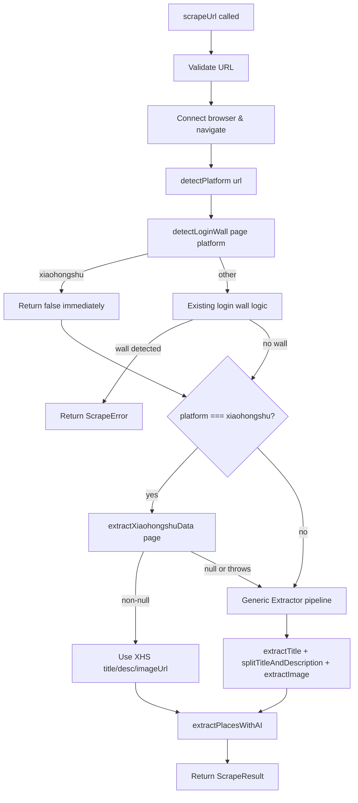

# Design Document: Xiaohongshu Extraction Bypass

## Overview

This feature adds a Xiaohongshu-specific extraction path to the existing `scrapeUrl` server action. Xiaohongshu (小红书/RED) embeds post data inside a `window.__INITIAL_STATE__` JavaScript object and shows aggressive login modals that trip the current `detectLoginWall` heuristic. The bypass has three parts:

1. Make `detectLoginWall` platform-aware so it short-circuits for Xiaohongshu pages.
2. Add an `extractXiaohongshuData` function that reads `window.__INITIAL_STATE__.note.noteDetailMap` with a DOM-selector fallback.
3. Route Xiaohongshu URLs through the specialized extractor in `scrapeUrl`, falling back to the generic pipeline on failure.

All changes are scoped to `src/actions/scrapeUrl.ts`. No new files, dependencies, or database changes are required.

## Architecture



The change is additive — the existing generic extraction pipeline is untouched. The Xiaohongshu path is inserted as an early branch that either produces results or falls through.

## Components and Interfaces

### Modified: `detectLoginWall(page, platform)`

**Current signature:** `detectLoginWall(page: Page): Promise<boolean>`
**New signature:** `detectLoginWall(page: Page, platform?: Platform): Promise<boolean>`

The `platform` parameter is optional to maintain backward compatibility. When `platform` is `'xiaohongshu'`, the function returns `false` immediately without evaluating the page DOM. For all other values (including `undefined`), the existing logic runs unchanged.

### New: `extractXiaohongshuData(page)`

```typescript
export async function extractXiaohongshuData(
  page: Page
): Promise<{ title: string; description: string; imageUrl: string } | null>
```

Runs `page.evaluate()` to attempt two extraction strategies in order:

1. **Primary — `window.__INITIAL_STATE__`**: Access `note.noteDetailMap`, take the first entry's `note` object, read `title`, `desc`, and `imageList[0].urlDefault` (or `url`).
2. **Fallback — DOM selectors**: Query `#detail-title` for title, `#detail-desc` for description, and `.note-scroller img` for the first image `src`.

Returns the three-field object on success, or `null` if neither strategy produces complete data (all three fields required). The entire `page.evaluate` callback is wrapped in a try/catch so malformed `__INITIAL_STATE__` data never throws.

### Modified: `scrapeUrl(url)`

The orchestration changes are minimal:

1. Move `detectPlatform(url)` call before `detectLoginWall`.
2. Pass `platform` to `detectLoginWall(page, platform)`.
3. After login wall check, if `platform === 'xiaohongshu'`, call `extractXiaohongshuData(page)` inside a try/catch.
4. If the result is non-null, use its `title`, `description`, and `imageUrl` directly.
5. Otherwise, fall through to the existing generic extraction pipeline.

The `extractPlacesWithAI` call and `ScrapeResult` assembly remain the same regardless of which path produced the data.

## Data Models

No new data models are introduced. The existing `ScrapeResult`, `ScrapeError`, `Platform`, and `ExtractedPlace` types are sufficient.

The `extractXiaohongshuData` return type is an inline object type:

```typescript
{ title: string; description: string; imageUrl: string } | null
```

This is intentionally not a named type — it's an internal intermediate value consumed only by `scrapeUrl` and never exposed to callers.

### Xiaohongshu `__INITIAL_STATE__` Shape (relevant subset)

```typescript
interface XHSInitialState {
  note: {
    noteDetailMap: Record<string, {
      note: {
        title: string;
        desc: string;
        imageList: Array<{ urlDefault?: string; url?: string }>;
      };
    }>;
  };
}
```

This is not a type we define in code — it's the expected shape we defensively navigate at runtime with optional chaining and try/catch.

## Correctness Properties

*A property is a characteristic or behavior that should hold true across all valid executions of a system — essentially, a formal statement about what the system should do. Properties serve as the bridge between human-readable specifications and machine-verifiable correctness guarantees.*

### Property 1: Platform-aware login wall detection

*For any* HTML page content (with or without login wall indicators) and the platform value `'xiaohongshu'`, `detectLoginWall(page, 'xiaohongshu')` SHALL return `false`. *For any* HTML page content and a platform value other than `'xiaohongshu'`, `detectLoginWall` SHALL return the same result as the original login wall heuristic (title contains "log in" AND no `<article>` AND no `<main>` AND has login form).

**Validates: Requirements 1.1, 1.2**

### Property 2: `__INITIAL_STATE__` extraction correctness

*For any* valid `__INITIAL_STATE__` object containing a `noteDetailMap` with at least one entry that has `title`, `desc`, and a non-empty `imageList`, `extractXiaohongshuData` SHALL return an object whose `title` matches the first entry's `title`, whose `description` matches the first entry's `desc`, and whose `imageUrl` matches the first image URL from that entry.

**Validates: Requirements 2.1**

### Property 3: DOM fallback when `__INITIAL_STATE__` is unavailable or malformed

*For any* page where `window.__INITIAL_STATE__` is absent, has an empty `noteDetailMap`, or contains malformed data (missing fields, wrong types, null values), AND the DOM contains `#detail-title`, `#detail-desc`, and `.note-scroller img` with complete data, `extractXiaohongshuData` SHALL return the values from the DOM selectors without throwing an error.

**Validates: Requirements 2.2, 2.5, 4.2**

### Property 4: Partial DOM data returns null

*For any* page where `__INITIAL_STATE__` extraction fails AND the DOM selectors provide only partial data (any combination where at least one of title, description, or imageUrl is missing), `extractXiaohongshuData` SHALL return `null`.

**Validates: Requirements 2.3, 4.3**

## Error Handling

| Scenario | Behavior |
|---|---|
| `detectLoginWall` called with `platform='xiaohongshu'` | Returns `false` immediately — no DOM inspection, no chance of error |
| `__INITIAL_STATE__` is missing or has unexpected shape | Caught inside `page.evaluate` try/catch; falls through to DOM selectors |
| DOM selectors return partial data | `extractXiaohongshuData` returns `null`; scraper falls back to generic pipeline |
| `extractXiaohongshuData` throws an uncaught exception | Caught by try/catch in `scrapeUrl`; falls back to generic pipeline |
| Generic pipeline also fails after XHS fallback | Existing error handling in `scrapeUrl` returns `ScrapeError` |

The design ensures two layers of fallback: XHS extractor → generic extractor → error response. At no point does a Xiaohongshu-specific failure crash the scraper.

## Testing Strategy

### Property-Based Tests (fast-check, minimum 100 iterations each)

The project already uses `vitest` + `fast-check` with JSDOM-based mock pages (see `scrapeUrl.pbt.test.ts`). The new property tests follow the same pattern:

- **Property 1**: Generate random login-wall HTML scenarios × random platform values. Assert `detectLoginWall` returns `false` for `'xiaohongshu'` and the correct heuristic result for all other platforms.
  - Tag: `Feature: xiaohongshu-bypass, Property 1: Platform-aware login wall detection`

- **Property 2**: Generate random valid `__INITIAL_STATE__` objects (random titles, descriptions, image URLs). Inject into mock page via `<script>`. Assert extracted values match the generated input.
  - Tag: `Feature: xiaohongshu-bypass, Property 2: __INITIAL_STATE__ extraction correctness`

- **Property 3**: Generate random malformed/absent `__INITIAL_STATE__` + complete DOM selector content. Assert extraction returns DOM values without throwing.
  - Tag: `Feature: xiaohongshu-bypass, Property 3: DOM fallback when __INITIAL_STATE__ is unavailable or malformed`

- **Property 4**: Generate pages with absent `__INITIAL_STATE__` and random subsets of DOM selectors (at least one missing). Assert `null` is returned.
  - Tag: `Feature: xiaohongshu-bypass, Property 4: Partial DOM data returns null`

### Unit Tests (example-based)

- `scrapeUrl` with a Xiaohongshu URL calls `extractXiaohongshuData` before generic extractors (Req 3.1)
- `scrapeUrl` uses XHS extractor result when non-null, skipping generic pipeline (Req 3.2)
- `scrapeUrl` falls back to generic pipeline when XHS extractor returns `null` (Req 3.3)
- `scrapeUrl` does not call `extractXiaohongshuData` for non-Xiaohongshu URLs (Req 3.4)
- `scrapeUrl` catches exceptions from `extractXiaohongshuData` and falls back (Req 4.1)
- `scrapeUrl` passes description from either path to `extractPlacesWithAI` (Req 3.5)
- `scrapeUrl` includes correct `platform` in `ScrapeResult` (Req 3.6)
- `detectLoginWall` accepts optional `platform` parameter without breaking existing callers (Req 1.3)
